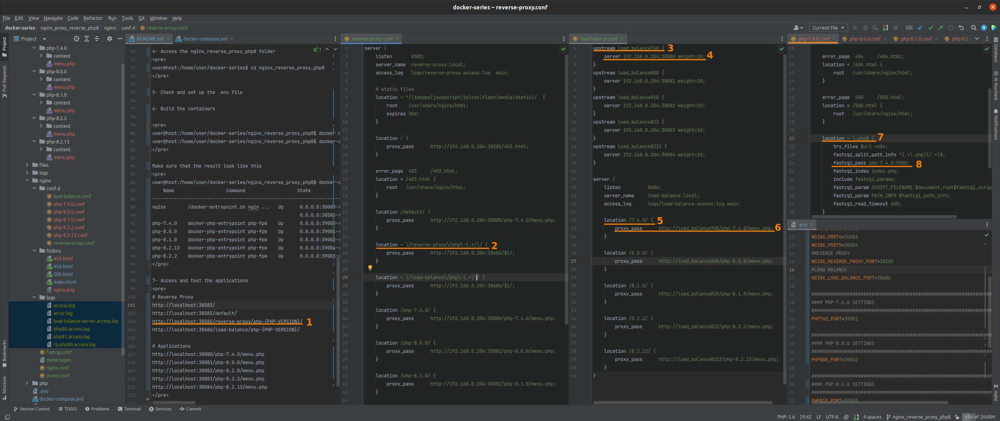

# NGINX + REVERSE PROXY + PHP-8.X.X (WITH PHP-7.4.0 AS WELL)
A quick and single repository to build an environment for PHP with NGINX

> IMPORTANT NOTE: Without database drivers (only MySQL include)

# About

This branch set up the complete environment to run PHP and NGINX as Webserver with reverse proxy included

- Project View

# Information

Please use the branch selector to access others environment configurations

The PHP available in this branch are:

- PHP-7.4.0
- PHP-8.0.0
- PHP-8.1.0
- PHP-8.2.2
- PHP-8.2.13

> In this case we are not using a restrict environment with a internal lan just for quickly 
> development and better understand about the Reverse Proxy on Nginx

# Usage

- Access the folder path in this project to run php8 together nginx, as below:

<pre>
user@host:/home/user$ git clone https://github.com/huntercodexs/docker-series.git .
user@host:/home/user$ cd docker-series
user@host:/home/user/docker-series$ git checkout nginx_reverse_proxy_php8
user@host:/home/user/docker-series$ cd nginx_reverse_proxy_php8
user@host:/home/user/docker-series/nginx_reverse_proxy_php8$ docker network create nginx_reverse_proxy_php8_open_network
user@host:/home/user/docker-series/nginx_reverse_proxy_php8$ docker-compose up --build (in first time)
user@host:/home/user/docker-series/nginx_reverse_proxy_php8$ [Ctrl+C]
user@host:/home/user/docker-series/nginx_reverse_proxy_php8$ docker-compose start (in the next times)
user@host:/home/user/docker-series/nginx_reverse_proxy_php8$ docker-compose ps (check the containers status)
</pre>

- Before build and start project set the following configurations files:

<pre>
- php.ini (nginx_reverse_proxy_php8/php/{PHP-VERSION}/conf/)
- nginx.conf (nginx_reverse_proxy_php8/nginx/)
- php-{PHP-VERSION}.conf (nginx_reverse_proxy_php8/nginx/conf.d/)
</pre>

# Step by Step

Follow the steps below to quick and easy environment creation

1- Clone the repository
<pre>
user@host:/home/user$ git clone https://github.com/huntercodexs/docker-series.git .
</pre>

2- Access the repository folder
<pre>
user@host:/home/user$ cd docker-series.git
</pre>

3- Change the current branch
<pre>
user@host:/home/user/docker-series$ git checkout nginx_reverse_proxy_php8
</pre>

4- Access the nginx_reverse_proxy_php8 folder
<pre>
user@host:/home/user/docker-series$ cd nginx_reverse_proxy_php8
</pre>

5- Check and set up the .env file

6- Build the containers

<pre>    
user@host:/home/user/docker-series/nginx_reverse_proxy_php8$ docker network create nginx_reverse_proxy_php8_open_network
user@host:/home/user/docker-series/nginx_reverse_proxy_php8$ docker-compose up --build
</pre>

Make sure that the result look like this
<pre>
user@host:/home/user/docker-series/nginx_reverse_proxy_php8$ docker-compose ps
    Name                   Command                   State                                                                                                             Ports                                                                                                      
----------------------------------------------------------------------------------------------------------------------------------------------------------------------------------------------------------------------------------------------------------------------------------
nginx        /docker-entrypoint.sh ngin ...   Up      0.0.0.0:30080->80/tcp,:::30080->80/tcp, 0.0.0.0:30081->81/tcp,:::30081->81/tcp, 0.0.0.0:30082->82/tcp,:::30082->82/tcp, 0.0.0.0:30083->83/tcp,:::30083->83/tcp, 0.0.0.0:30084->84/tcp,:::30084->84/tcp,                             
                                                      0.0.0.0:38585->8585/tcp,:::38585->8585/tcp, 0.0.0.0:38686->8686/tcp,:::38686->8686/tcp                                                                                                                                              
php-7.4.0    docker-php-entrypoint php-fpm    Up      0.0.0.0:39000->9000/tcp,:::39000->9000/tcp                                                                                                                                                                                          
php-8.0.0    docker-php-entrypoint php-fpm    Up      0.0.0.0:39001->9000/tcp,:::39001->9000/tcp                                                                                                                                                                                          
php-8.1.0    docker-php-entrypoint php-fpm    Up      0.0.0.0:39002->9000/tcp,:::39002->9000/tcp                                                                                                                                                                                          
php-8.2.13   docker-php-entrypoint php-fpm    Up      0.0.0.0:39004->9000/tcp,:::39004->9000/tcp                                                                                                                                                                                          
php-8.2.2    docker-php-entrypoint php-fpm    Up      0.0.0.0:39003->9000/tcp,:::39003->9000/tcp
</pre>

7- Access and test the applications
<pre>
# Reverse Proxy
http://localhost:38585/
http://localhost:38585/default/
http://localhost:38585/reverse-proxy/php-{PHP-VERSION}/
http://localhost:38686/load-balance/php-{PHP-VERSION}/

# Applications
http://localhost:30080/php-7.4.0/menu.php
http://localhost:30081/php-8.0.0/menu.php
http://localhost:30082/php-8.1.0/menu.php
http://localhost:30083/php-8.2.2/menu.php
http://localhost:30084/php-8.2.13/menu.php
</pre>

