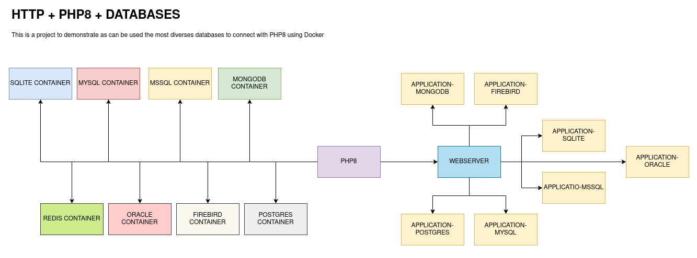
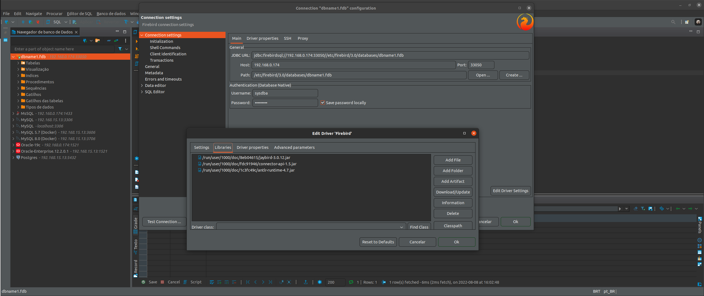

# HTTPD + PHP8 + DATABASES (USING DEDICATED CONTAINER)
Docker Series - A project to work with many docker container

# Information

Please use the branch selection to access others configurations to most need and purposes, this branch offers a complete
environment to development using HTTP(Apache2) + PHP + Databases(see bellow).

# About project

# Dockers Containers Databases

>  Available
>  Pending
>  Unavailable

- HTTPD 
- PHP8-FPM 
- DATABASES
  - MYSQL 
    - 5.7 
    - 8.0 
  - MSSQL 
  - PGSQL 
  - MONGO 
  - FIREBIRD 
  - INTERBASE 
  - ORACLELINUX 
  - SQLITE 
  - REDIS 

> 
IMPORTANT

See the file .env in the root path of this project

# About PHP8

> DOCKERFILE

Set up the php8.dockerfile in the header to refers an application or settings that should be used in all process, by 
example DIR_PHP_INI or DIR_WEBSERVER

> PHP INI FILES

Configuration file to PHP server shared between HOST and Container

<pre>
/usr/local/etc/php/php.ini
/usr/local/etc/php/conf.d/
</pre>

> EXTENSIONS

Extension directory shared between HOST and Container

<pre>
/usr/local/lib/php/extensions/no-debug-non-zts-20210902/
</pre>

> 
IMPORTANT

Edit the /usr/local/etc/php/php.ini file and restart the service or container php8, by example

from 
<pre>
;extension=pdo_oci
</pre>

to
<pre>
extension=pdo_oci
</pre>

# How to use Webserver HTTPD

The version of HTTP used in this project is:

<pre>
Server version: Apache/2.4.54 (Unix)
Server built:   Jul 12 2022 04:31:28
</pre>

> 
IMPORTANT

In the first time to run this container, execute the script "webserver.sh prepare" after docker-compose up -d

<pre>
docker exec -it webserver /bin/bash
/home/apache2/webserver.sh prepare
</pre>

Before run the previous step, please edit the files in /httpd_php8_separated/webserver/conf/ in this project 
path [conf|htdocs], these files are responsible to configure the webserver HTTP.

<pre>
httpd.conf
sites-available.conf
</pre>

After the first step (see above) execute again the script "webserver.sh" but pass the "restart" as parameter

<pre>
/home/webserver/webserver.sh restart
</pre>

# How to use Oracle

> 
IMPORTANT

- The builder of this container is very long and need a long time to finish correctly
- Use the command docker-compose up --build to run in first time
- After the first build use docker-compose up -d oraclelinux or docker-compose start oraclelinux

>** VERY IMPORTANT **
- The path oracle/oradata in current container instance "should be empty"
- Have sure that the oracle/oradata is empty or just have the dbconfig/ and ORCLCDB/ folders

> ORACLE EDITION (see .env file):

<pre>
ee - Enterprise Edition
se2 - Standard Edition
xe - Express Edition
</pre>

> 
REQUIRED

- Database file: LINUX.X64_193000_db_home.zip
- This file can be downloaded in https://www.oracle.com/database/technologies/oracle-database-software-downloads.html
- Put the LINUX.X64_193000_db_home.zip inside oracle/database before run the docker-compose

> STEPS BEFORE BUILD

- Unzip the oraclelinux-database-scripts-19c.tar.bz2 file inside the oracle/database folder:
<pre>
tar -xvf oraclelinux-database-scripts-19c.tar.bz2
</pre>
- Check if oracle/oradata is empty or just have the dbconfig/ and ORCLCDB/ folders

> STEPS AFTER BUILD

- HOST(your machine):

Set Password Administration
<pre>
docker exec -it oraclelinux ./setPassword.sh ${YOUR_ORACLE_PASSWORD}
</pre>

- Access the database container
<pre>
docker exec -it oraclelinux /bin/bash
</pre>

- GUEST(inside oraclelinux):

Create User
<pre>
sqlplus sys/${YOUR_ORACLE_PASSWORD_@ORCLPDB1 as sysdb}
CREATE USER DEVEL IDENTIFIED BY ${YOUR_ORACLE_PASSWORD_}
GRANT CREATE SESSION, CREATE TABLE TO DEVEL;
ALTER USER DEVEL QUOTA 50m ON SYSTEM;
CREATE SMALLFILE TABLESPACE DEVEL DATAFILE '/opt/oracle/oradata/ORCLCDB/ORCLPDB1/devel.dbf' SIZE 1G;
ALTER DATABASE DEFAULT TABLESPACE DEVEL;
SELECT * FROM ALL_USERS au;
SELECT * FROM ALL_USERS au WHERE au.USERNAME = 'DEVEL';
EXIT;
</pre>

Connect on database using the new user
<pre>
sqlplus devel/${YOUR_ORACLE_PASSWORD_@ORCLPDB1}
</pre>

- Access the microservice Oracle Linux: 

<pre>
http://${WEBSERVER_ADDRESS}:38080/microservice-oraclelinux/
</pre>

> Database Connection Sample

> Enterprise Manager

- Access the Enterprise Manager:
 
<pre>
https://${WEBSERVER_ADDRESS}:5500/em
  > username: sys
  > password: ${YOUR_ORACLE_PASSWORD}
  > container name: ORCLPDB1
  ** to get this value exec in the current terminal:
  SQL> show pdbs;
  
  CON_ID CON_NAME			  OPEN MODE  RESTRICTED
  ---------- ------------------------------ ---------- ----------
   3 ORCLPDB1			  READ WRITE NO
  SQL> 
  
</pre>

All rights reserved to ORACLE - https://www.oracle.com/

# How to use MongoDB

> 
IMPORTANT

- Check if mongo module is available in /usr/local/etc/php/php.ini and /usr/local/etc/php/conf.d/mongodb.ini
- Restart the webserver using the command /home/webserver/webserver.sh restart

> AFTER BUILD

- Access the container php8 in application folder and run the command

<pre>
cd /var/www/webserver/microservice-mongodb composer require mongodb/mongodb or copy the file that are placed in 
/opt/mongodb to application root path or run the command inside container: /home/shared/setup.sh
</pre>

- Access the MongoDB Express

<pre>
http://${WEBSERVER_ADDRESS}:8090/
  username: devel
  password: _YOU_PASSWORD_MONGO_EXPRESS_
</pre>

- Create a database: dbname
- Create a collection: users
- Create a documents(index): id, name
- Finally, access the application local url:

<pre>
http://${WEBSERVER_ADDRESS}:38080/microservice-mongodb/
</pre>

# How to use Postgres

- Access the postgres container

<pre>
http://${WEBSERVER_ADDRESS}:38080/microservice-postgres/
</pre>

- Get the superuser postgres in CLI container postgres, and open the postgres database terminal:

<pre>
root@c63de647b32a:/# su - postgres
postgres@c63de647b32a:~$ psql 
psql (14.4 (Debian 14.4-1.pgdg110+1))
Type "help" for help.

postgres=# 
</pre>

- Create one user to manager the database:

<pre>
CREATE USER devel SUPERUSER INHERIT CREATEDB CREATEROLE;
ALTER USER devel PASSWORD '${POSTGRES_PASSWORD}';
</pre>

- List all users

<pre>
\du
</pre>

<pre>
postgres=# \du
                                   List of roles
 Role name |                         Attributes                         | Member of 
-----------+------------------------------------------------------------+-----------
 devel     | Superuser, Create role, Create DB                          | {}
 postgres  | Superuser, Create role, Create DB, Replication, Bypass RLS | {}
</pre>

- Create a table sample:

<pre>
CREATE TABLE users (
    id serial NOT NULL,
    name VARCHAR(250) NOT NULL,
    age INTEGER,
    PRIMARY KEY (id)
);

INSERT INTO users (id, name, age) VALUES ('94734987', 'John Smith Wiz', 33);
INSERT INTO users (id, name, age) VALUES ('12734983', 'Solange Smart Wow', 34);
</pre>

- Access the application test URL:

<pre>
http://${WEBSERVER_ADDRESS}:38080/microservice-postgres/
</pre>

# How to use MSSQL

- Access the docker container MSSQL-TOOLS service:

<pre>
docker exec -it mssql-tools /bin/bash
</pre>

- Access the command line SQL:

<pre>
sqlcmd -S ${WEBSERVER_ADDRESS} -U SA
</pre>

- Define a default database

<pre>
USE master
GO
</pre>

- Create a table sample in master database:

<pre>
CREATE TABLE master.dbo.users (
	id int NULL,
	name varchar(100) NULL
)
GO
</pre>

- Insert data values to test:

<pre>
INSERT INTO master.dbo.users(id, name)VALUES(0, 'John Smith Wiz')
GO
</pre>

- Select data sample from created table users:

<pre>
SELECT * FROM users
GO
</pre>

- Access the application test URL:

<pre>
http://${WEBSERVER_ADDRESS}:38080/microservice-mssql/
</pre>

# How to use Firebird

> NOTE: Firebird is not operating correctly, please don't use it

> VERSION

<pre>3.0.1</pre>

> SETTINGS

- Before build the firebird container, use the firebird/data folder path (in this project) to set up the configurations 
that should be used in the Server:

<pre>
databases.conf
fbintl.conf
fbtrace.conf
firebird.conf
plugins.conf
SYSDBA.password
</pre>

> CONNECTION AND RUN

- Install correct driver in your SGDB tool (example: DBeaver) get the driver in the follow address:

<pre>
https://firebirdsql.org/en/jdbc-driver/
</pre>

- Below is the visual sample to Firebird Connection from DBeaver

  

- Sample data connection

<pre>
host: 192.168.0.174
port: 33050
path: /etc/firebird/3.0/databases/dbname1.fdb
username: sysdba
password: ${FIREBIRD_PASSWORD} or masterkey
jdbc-url: jdbc:firebirdsql://192.168.0.174:33050//etc/firebird/3.0/databases/dbname1.fdb
Reference library file: Jaybird-3.0.12-JDK_1.8.zip (https://firebirdsql.org/en/jdbc-driver/)
  jaybird-3.0.12.jar
  connector-api-1.5.jar
  antlr-runtime-4.7.jar
</pre>

- Connect using terminal

<pre>
# isql-fb
</pre>

- Create a database and table

<pre>
SQL>CREATE DATABASE '/etc/firebird/3.0/databases/dbname1.fdb'
CON>user 'SYSDBA' password 'masterkey';

CREATE TABLE users (
id INT NOT NULL PRIMARY KEY,
name VARCHAR(250) NOT NULL
);

INSERT INTO users (id, name) VALUES ('94734987', 'John Smith Suisse');

SELECT * FROM users;
</pre>

- Access the application test URL:

<pre>
http://${WEBSERVER_ADDRESS}:38080/microservice-firebird/
</pre>

# How to use MYSQL 5.7

- After build container, drivers and application

<pre>
CREATE TABLE users (
    id serial NOT NULL,
    name VARCHAR(250) NOT NULL,
    age INTEGER,
    PRIMARY KEY (id)
);

INSERT INTO users (id, name, age) VALUES ('94734987', 'Amanda Barros', 33);
INSERT INTO users (id, name, age) VALUES ('12734983', 'Marcos Silva', 34);

SELECT * FROM users;
</pre>

- Access the application test URL:

<pre>
http://${WEBSERVER_ADDRESS}:38080/microservice-mysql57/
</pre>

# How to use MYSQL 8.0

- After build container, drivers and application

<pre>
CREATE TABLE users (
    id serial NOT NULL,
    name VARCHAR(250) NOT NULL,
    age INTEGER,
    PRIMARY KEY (id)
);

INSERT INTO users (id, name, age) VALUES ('94734987', 'Amanda Barros', 33);
INSERT INTO users (id, name, age) VALUES ('12734983', 'Marcos Silva', 34);

SELECT * FROM users;
</pre>

- Access the application test URL:

<pre>
http://${WEBSERVER_ADDRESS}:38080/microservice-mysql80/
</pre>

# How to use SQLITE

- Prepare sqlite database

<pre>
root@0fe895af4841:/opt# cd sqlite/
root@0fe895af4841:/opt/sqlite# sqlite3 dbname1.db
SQLite version 3.34.1 2021-01-20 14:10:07
Enter ".help" for usage hints.
sqlite> CREATE TABLE users(
    id INT PRIMARY KEY NOT NULL UNIQUE,
    name TEXT NOT NULL
);
sqlite> INSERT INTO users(id, name) VALUES (1, 'John Smith Wiz');
sqlite> SELECT * FROM users;
1|John Smith Wiz
sqlite> .quit
</pre>

- Access the application test URL:

<pre>
http://${WEBSERVER_ADDRESS}:38080/microservice-sqlite/
</pre>

# How to use REDIS

> IMPORTANT: Redis is not a database engine, it is used to make a cache when the application require

- Access the application test URL:

<pre>
http://${WEBSERVER_ADDRESS}:38080/microservice-redis/
</pre>
