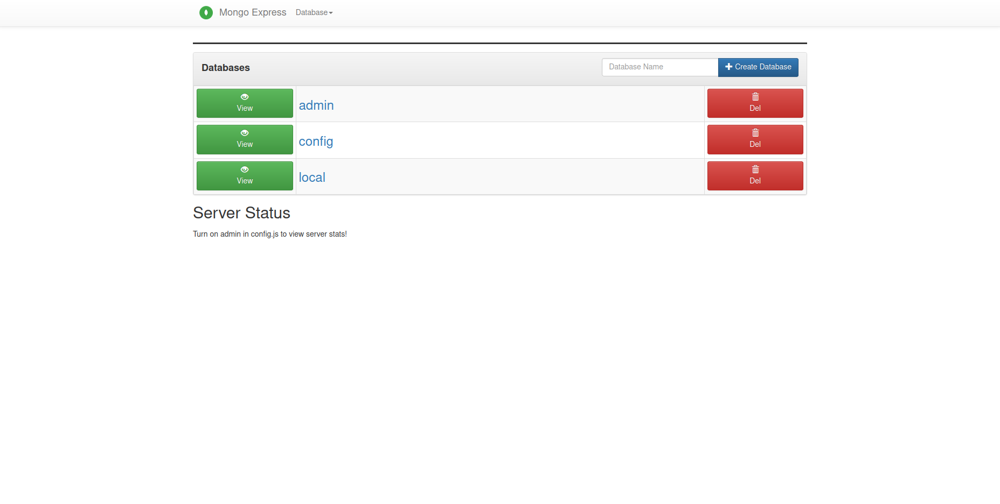

# JAVA + MONGODB
Simple environment to simulate a workflow integrating Java + MongoDB

# Requisites

- Java 8
- MongoDB

# Usage

Firstly get the project and checkout the correct branch

> NOTE: Check if folder java_mongodb/mongodb/mongo/MongoDB exists and is empty

> NOTE: Set up the .env file and after make a builder to mongo database and openjdk (java)

<pre>
user@host:/home/user$ git clone https://github.com/huntercodexs/docker-series.git .
user@host:/home/user$ cd docker-series
user@host:/home/user/docker-series$ git checkout java_mongodb
user@host:/home/user/docker-series$ cd java_mongodb
user@host:/home/user/docker-series/java_mongodb$ mkdir -p mongodb/mongo/MongoDB
user@host:/home/user/docker-series/java_mongodb$ docker network create open_network (if required)
user@host:/home/user/docker-series/java_mongodb$ docker-compose up --build
user@host:/home/user/docker-series/java_mongodb$ Ctrl+C
user@host:/home/user/docker-series/java_mongodb$ docker-compose start
</pre>

Output sample

<pre>
user@host:/home/user/docker-series/java_mongodb docker-compose ps
    Name                   Command               State                      Ports                    
-----------------------------------------------------------------------------------------------------
mongo           docker-entrypoint.sh mongod      Up      0.0.0.0:27017->27017/tcp,:::27017->27017/tcp
mongo-express   tini -- /docker-entrypoint ...   Up      0.0.0.0:38091->8081/tcp,:::38091->8081/tcp  
openjdk-8u212   bash                             Up      0.0.0.0:38001->38001/tcp,:::38001->38001/tcp
</pre>

- MongoDB

> NOTE: Edit the .env file to create correctly to Mongo Express and MongoDB access.

- Access the MongoDB Express

<pre>
http://${WEBSERVER_ADDRESS}:38091/
username: ${MONGO_EXPRESS_USERNAME}
password: ${MONGO_EXPRESS_PASSWORD}
</pre>

- Create a database: demodemo

- Create a collection: customers
- Create a documents(index): id, name, email, age

# About the sample project

> Remember, the sample project is just to demonstration how work this project JAVA + MONGODB

To run the sample projects contained in this project get the project files into folder sample-project, and follow the bellow:

- open the project in your prefer IDE
- run the "mvn package"
- take the generated jar file
- edit the application.properties file with the correct settings
- finally put the resulted jar file and application.properties in the folder app/

> TIPS: Use the "JAVA_MONGODB.postman_collection.json" POSTMAN file to make tests

<pre>
./java_mongodb/sample-project/java-mongodb/JAVA_MONGODB.postman_collection.json
</pre>
