# EC2 (Amazonlinux) + JAVA + MYSQL + RABBITMQ
Simple Environment to simulate a messenger service workflow

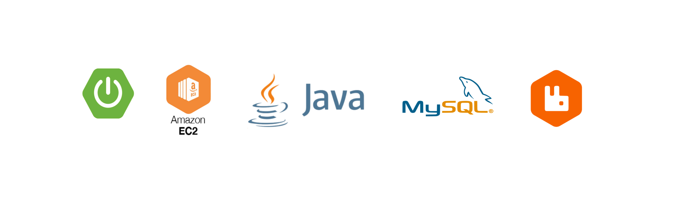

> ADVICE: please read this documentation with attention and careful before begin the use of it or to apply 
> this solution in your needed or routine

> IMPORTANT NOTE: The RabbitMQ is not working by the docker-compose, so you need to pay attention in this topic

# Resources

- Amazonlinux 2
- Java 8
- RabbitMQ 3.6.10
- Mysql 8

# About RabbitMQ

You may use the RabbitMQ simulator to get a better understand how to work the Producers, Exchanges Types, Queues, 
Routing Keys and Consumers. Give a look in the http://tryrabbitmq.com web address and play as you want.

- Exchange Types

The exchange type presented in this project are: Direct, Fanout and Topic. You can see bellow each one in the simple 
diagram workflow:

> Direct

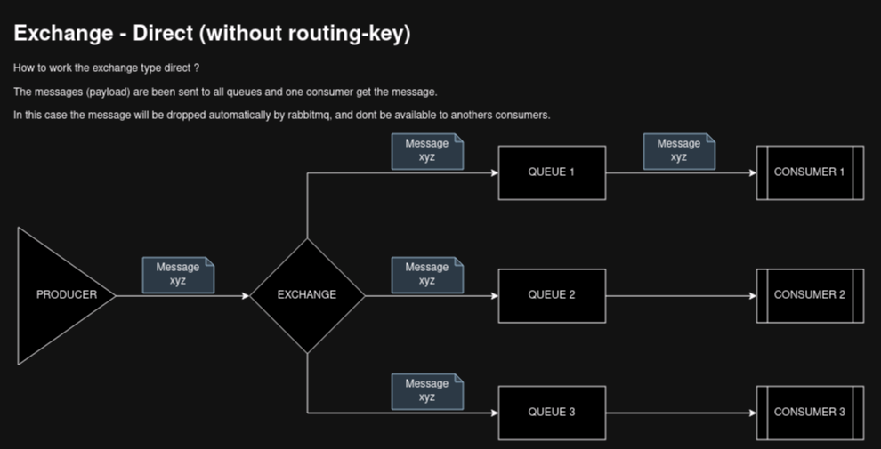

> Fanout

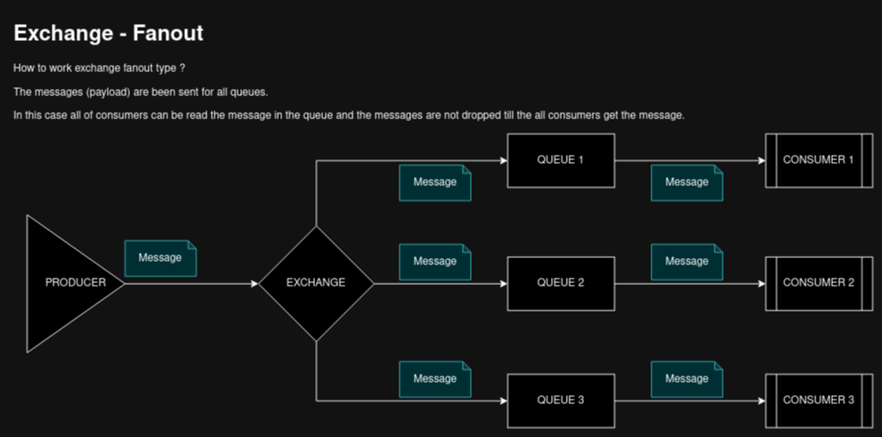

> Topic

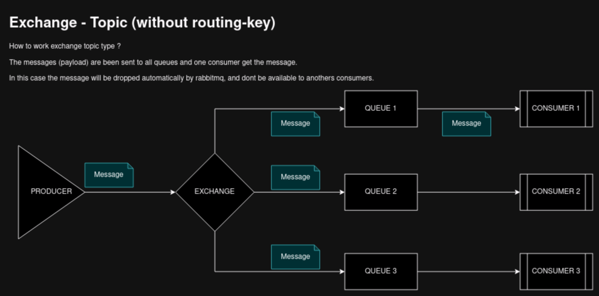

> IMPORTANT: Ever when using the Messenger Service like the RabbitMQ, it's recommended to send the message (payload) 
> for the specific exchange and then the exchange will be forward the message to correct queue thought the routing-key 
> informed in the request. It's not a good way/practice to send messages direct for the queue.

One complex scenario using RabbitMQ concepts is showed below

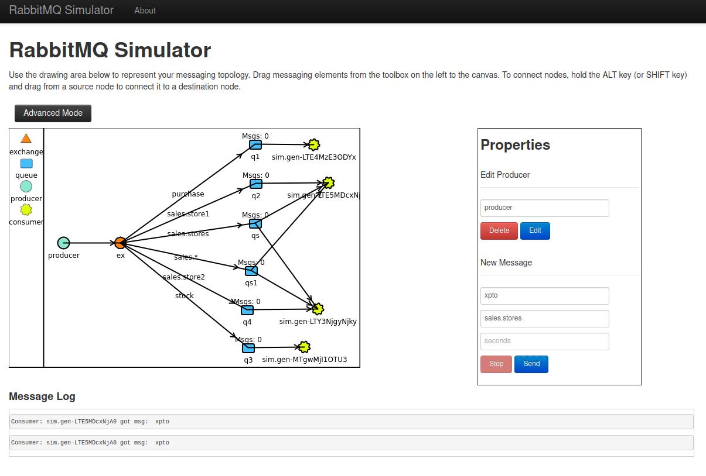

# Repository Overview

All the sample projects used in this little work are been placed on the huntercodexs GitHub account, you can download
the latest version for each one from the respective address bellow:

- Service Discovery: https://github.com/huntercodexs/service-discovery (branch: master)
- Api Gateway: https://github.com/huntercodexs/api-gateway (branch: master)
- Producer Demo: https://github.com/huntercodexs/producer-demo 
- Producer2 Demo: https://github.com/huntercodexs/producer2-demo (branch: ec2_java_mysql_rabbitmq-producer)
- Consumer Demo: https://github.com/huntercodexs/consumer-demo
- Consumer2 Demo: https://github.com/huntercodexs/consumer2-demo (branch: ec2_java_mysql_rabbitmq-consumer)

> IMPORTANT NOTES
> - The project called "Producer2 Demo" will be used as APPLICATION-DEMO in this project
> - The project called "Consumer2 Demo" will be used as RABBITMQ-READER in this project 
> 
> Therefore, you need to copy both project into app folder replacing their names, just for an easy explanation and
> clarify the ideas

Ih these projects we used the following resources:

- Eureka (Service Discovery)
- Spring Boot Admin (Service Admin)
- Zuul Proxy Server (Api Gateway)
- RabbitMQ (Message Broker)

The complete workflow including all the exchange types are been placed in the path files/media from this repository 
and can be checked [here](ec2_java_mysql_rabbitmq/files/media/scheme-diagram-full.drawio)

Below we can see the diagrams that shown the flows contained in the samples projects (just an overview)

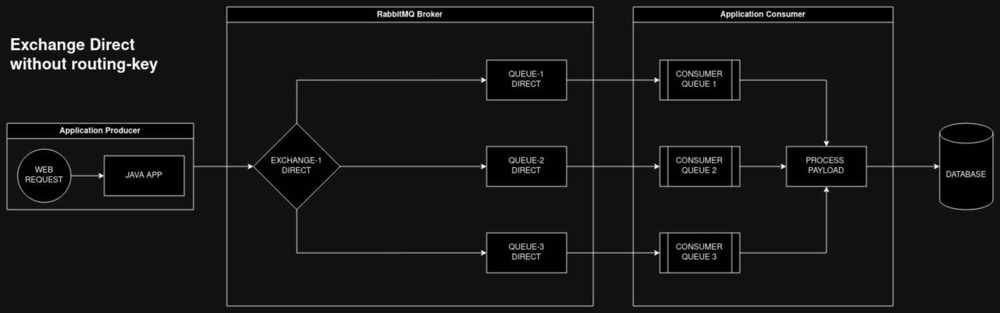

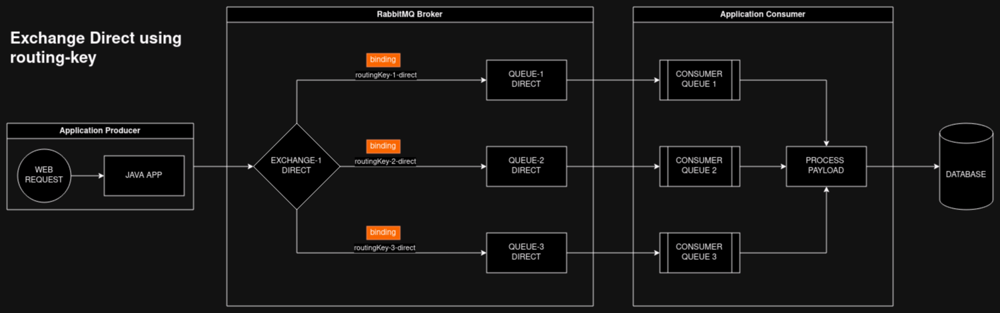

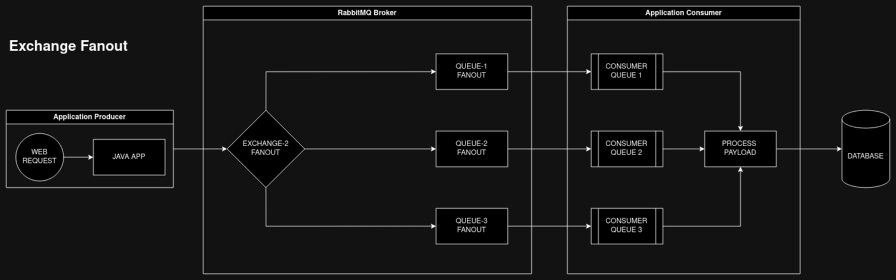

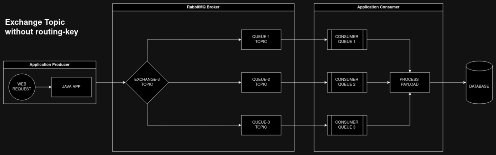

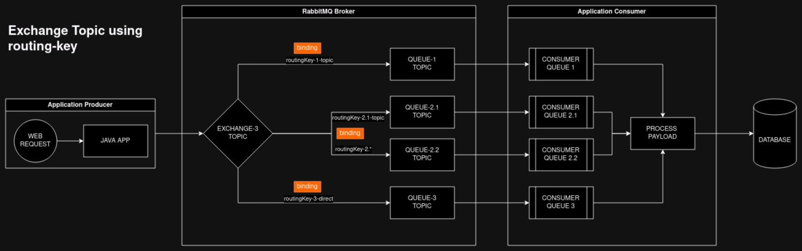

# Real Use Cases

**USE CASE 1**

Lets to get started to illustrate in the practice how to work the RabbitMQ message broker system. 
The proposal of this simple real use case is present one scenario with the following features:

> NOTE: This real use case, will be use the exchange direct type, and using RoutingKeys 
> [routingKey-purchase,routingKey-orders,routingKey-dispatch]

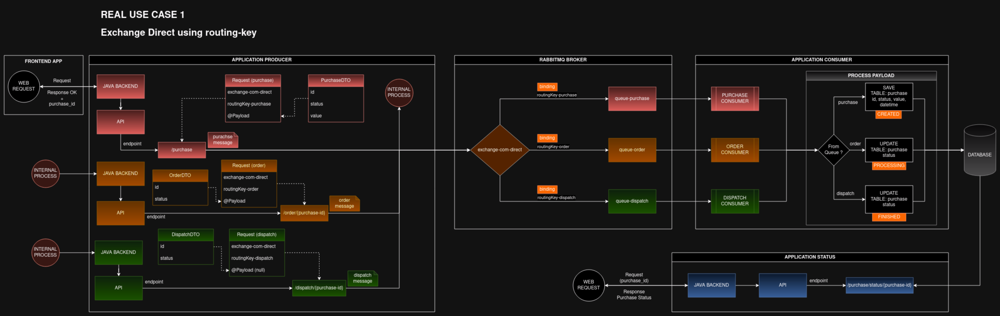

In the above image we can see one APPLICATION PRODUCER, one RABBITMQ BROKER that contains the exchange type direct and 
have three routing keys (bindings) to forward messages to specific queues, as example: routingKey-purchase -> queue-purchase, 
one APPLICATION CONSUMER that get messages from specific queue contained in the exchange and make the correct process for 
each type of message. Finally, the message are been saved in the database with the following settings:

When purchase endpoint is requested:
<pre>
TABLE: purchase
COLUMNS: id, status, message, datetime
SQL: INSERT INTO purchase (id, status, message, datetime) VALUES (1, "CREATED", "Message", "2022-01-01 10:00:00");
</pre>

When order endpoint is requested (this is an INTERNAL PROCESS):
<pre>
TABLE: purchase
COLUMNS: status
SQL: UPDATE TABLE purchase SET status = 'PROCESSING' WHERE id = '1';
</pre>

When dispatch endpoint is requested (this is an INTERNAL PROCESS):
<pre>
TABLE: purchase
COLUMNS: status
SQL: UPDATE TABLE purchase SET status = 'FINISHED' WHERE id = '1';
</pre>

In another way there are one application called APPLICATION STATUS that offers one endpoint /purchase/status/{purchase_id}, 
where it is possible to consult/query one purchase status, just requesting the endpoint /purchase/status passing the 
correct purchase_id.

Bellow we can see one abstract illustration about the operation between users and system through the web browser.

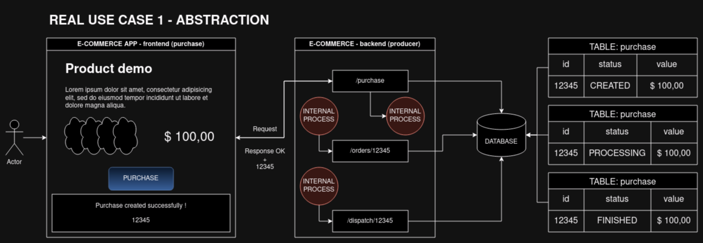

> NOTE: The INTERNAL PROCESS in the above illustration means that have a one, several or many others process that has been 
> executed by the system on background mode, as example, inform the others responsible departments (order and dispatch) 
> about the ID purchase order, but the important here is show the user interaction with the system using a web browser

To continue the explanation, follow below the complete and abstract e-commerce environment about the "Use Case 1"

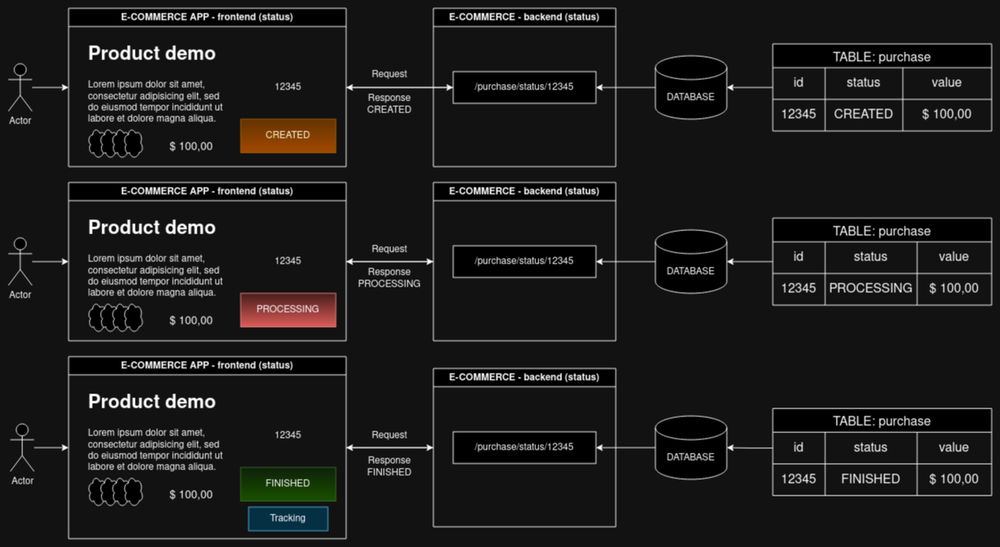

Just to be more clearly and offer technical details, follow the sequence diagram that shown the flow in the system

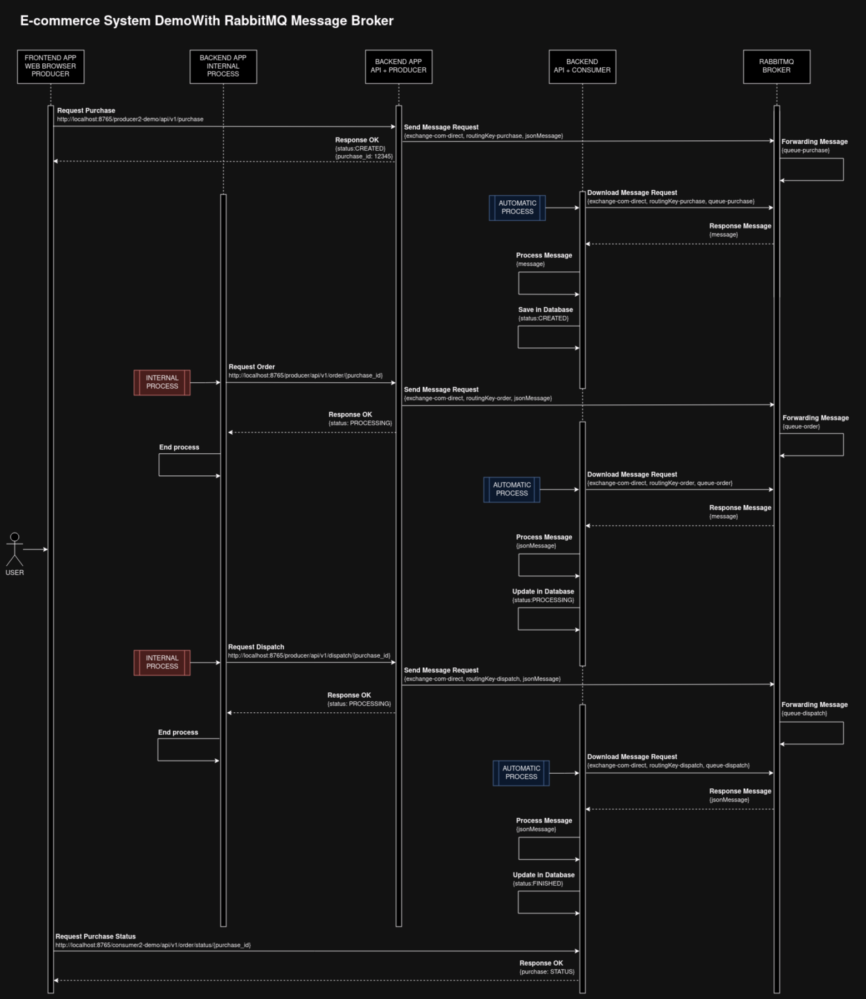

# Sample Projects

> NOTE: these projects are just a sample to demonstrate how to work this project: EC2 + JAVA + MYSQL + RABBITMQ

To run the sample projects contained in this project get the project files into folder sample-projects,
and follow the bellow actions for each project:

- open the project in your prefer IDE
- run the "mvn package"
- grab the generated jar file
- edit the application.properties file with the correct settings
- finally use the result files in the folder app/project-name (example: app/service_discovery)

# How to use this repository

- Run (Summarizing)

<pre>
user@host:/home/user$ docker run -d --hostname rabbit-3.6.10 --name rabbit-3.6.10 -p 5672:5672 -p 15672:15672 rabbitmq:3.6.10-management
user@host:/home/user$ git clone https://github.com/huntercodexs/docker-series.git .
user@host:/home/user$ cd docker-series
user@host:/home/user/docker-series$ git checkout ec2_java_mysql_rabbitmq
user@host:/home/user/docker-series$ cd ec2_java_mysql_rabbitmq
user@host:/home/user/docker-series/ec2_java_mysql_rabbitmq$ docker network create ec2_java_mysql_rabbitmq_open_network
user@host:/home/user/docker-series/ec2_java_mysql_rabbitmq$ docker-compose up --build
user@host:/home/user/docker-series/ec2_java_mysql_rabbitmq$ [Ctrl+C]
user@host:/home/user/docker-series/ec2_java_mysql_rabbitmq$ docker-compose start
</pre>

- Mysql

If you get the follow error

> ERROR 2059 (HY000): Authentication plugin 'caching_sha2_password' cannot be loaded: 
> /usr/lib64/mysql/plugin/caching_sha2_password.so: cannot open shared object file: No such file or directory

use the following instructions

<pre>
USE mysql;
ALTER USER 'root'@'%' IDENTIFIED WITH mysql_native_password BY 'root123';
FLUSH PRIVILEGES;
</pre>

- RabbitMQ

In the rabbitmq container you can run the following commands

<pre>
rabbitmq-plugins enable rabbitmq_management &
rabbitmq-server start &
rabbitmqctl list_users
rabbitmqctl authenticate_user guest guest
</pre>

In the rabbitmq container everything is fine, so you can use as is, however you can still enable few plugins, as example: 

<pre>
rabbitmq-plugins enable rabbitmq_management
</pre>

Use "rabbitmq-plugins list" commando to view a complete list of plugins

# Step by Step

Follow the steps below to quick and easy environment creation

1- Create the rabbitmq container

> NOTE: You also can try to use the docker-compose.yml to do it, but in the date it isn't working...
 
<pre>
user@host:/home/user$ docker run -d --hostname rabbit-3.6.10 --name rabbit-3.6.10 -p 5672:5672 -p 15672:15672 rabbitmq:3.6.10-management
</pre>

2- Clone the repository
<pre>
user@host:/home/user$ git clone https://github.com/huntercodexs/docker-series.git .
</pre>

3- Access the repository folder
<pre>
user@host:/home/user$ cd docker-series
</pre>

4- Change the current branch
<pre>
user@host:/home/user/docker-series$ git checkout ec2_java_mysql_rabbitmq
</pre>

5- Access the ec2_java_mysql_rabbitmq folder
<pre>
user@host:/home/user/docker-series$ cd ec2_java_mysql_rabbitmq
</pre>

6- Check and set up the .env

7- Build the sample Java projects

> TIP: use your preferred IDE to make it, see the section # Sample projects

> NOTE: see more details in the above section called "Repository Overview"

<pre>
sample-projects/api-gateway
sample-projects/application-demo
sample-projects/rabbitmq-reader
sample-projects/service-discovery
</pre>

8- Put each jar file generated and the application.properties file in the folder path ec2_java_mysql_rabbitmq/app as shown below

> NOTE: These projects should be used only an example

<pre>
ec2_java_mysql_rabbitmq/app/api_gateway/API-GATEWAY-22.01.1-SNAPSHOT.jar
ec2_java_mysql_rabbitmq/app/api_gateway/application.properties
ec2_java_mysql_rabbitmq/app/service_discovery/SERVICE-DISCOVERY-22.01.1-SNAPSHOT.jar
ec2_java_mysql_rabbitmq/app/service_discovery/application.properties
ec2_java_mysql_rabbitmq/app/application_demo/APPLICATION-DEMO-22.01.1-SNAPSHOT.jar
ec2_java_mysql_rabbitmq/app/application_demo/application.properties
ec2_java_mysql_rabbitmq/app/rabbitmq_reader/RABBITMQ-READER-22.01.1-SNAPSHOT.jar
ec2_java_mysql_rabbitmq/app/rabbitmq_reader/application.properties
</pre>

The folder app should be like as below

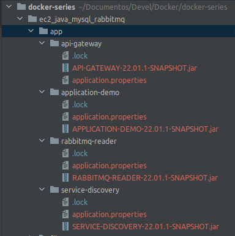

9- Build the containers
<pre>    
user@host:/home/user/docker-series/ec2_java_mysql_rabbitmq$ docker network create ec2_java_mysql_rabbitmq_open_network
user@host:/home/user/docker-series/ec2_java_mysql_rabbitmq$ docker-compose up --build
</pre>

10- Check the mysql container service

If you get the follow error
<pre>
ERROR 2059 (HY000): Authentication plugin 'caching_sha2_password' cannot be loaded: 
/usr/lib64/mysql/plugin/caching_sha2_password.so: cannot open shared object file: No such file or directory
</pre>

use the following instructions

> TIP: You can use the SGDB too.

<pre>
user@host:/home/user/docker-series/ec2_java_mysql_rabbitmq$ [Ctrl+C] [Ctrl+D]
user@host:/home/user/docker-series/ec2_java_mysql_rabbitmq$ docker-compose start mysql8
user@host:/home/user/docker-series/ec2_java_mysql_rabbitmq$ docker exec -it mysql8 /bin/bash
bash-4.4# mysql -h localhost -u root -p
Enter password: 
Welcome to the MySQL monitor.  Commands end with ; or \g.
Your MySQL connection id is 11
Server version: 8.0.35 MySQL Community Server - GPL

Copyright (c) 2000, 2023, Oracle and/or its affiliates.

Oracle is a registered trademark of Oracle Corporation and/or its
affiliates. Other names may be trademarks of their respective
owners.

Type 'help;' or '\h' for help. Type '\c' to clear the current input statement.

mysql> USE mysql;
Reading table information for completion of table and column names
You can turn off this feature to get a quicker startup with -A

Database changed
mysql> ALTER USER 'root'@'%' IDENTIFIED WITH mysql_native_password BY 'root123';
Query OK, 0 rows affected (0.01 sec)

mysql> FLUSH PRIVILEGES;
Query OK, 0 rows affected (0.02 sec)

mysql> exit;
</pre>

11- Check the rabbitmq container service

Run rabbitmq commands inside rabbitmq container

> TIP: Use "rabbitmq-plugins list" command to view a complete list of plugins

> TIP: Whether any error occurs during initialize container service check if the service status is running

<pre>
user@host:/home/user/docker-series/ec2_java_mysql_rabbitmq$ docker exec -it rabbit-3.6.10 /bin/bash
root@rabbit-3:/# rabbitmqctl list_users
root@rabbit-3:/# rabbitmqctl authenticate_user guest guest
</pre>

In the rabbitmq container everything is fine, so you can use as is, however you can still enable few plugins, as example:

<pre>
root@rabbit-3:/# rabbitmq-plugins enable rabbitmq_management
</pre>

12- If everything is ok and all steps until here was concluded, make these commands

<pre>
user@host:/home/user/docker-series/ec2_java_mysql_rabbitmq$ [Ctrl+C]
user@host:/home/user/docker-series/ec2_java_mysql_rabbitmq$ docker-compose stop
user@host:/home/user/docker-series/ec2_java_mysql_rabbitmq$ docker-compose start
user@host:/home/user/docker-series/ec2_java_mysql_rabbitmq$ docker-compose ps
</pre>

the result should be look like this

<pre>
        Name                       Command               State                                                                       Ports                                                                    
--------------------------------------------------------------------------------------------------------------------------------------------------------------------------------------------------------------
ec2_api_gateway         /usr/bin/java -jar /home/s ...   Up      0.0.0.0:58081->8081/tcp,:::58081->8081/tcp, 0.0.0.0:58765->8765/tcp,:::58765->8765/tcp                                                       
ec2_application_demo    /usr/bin/java -jar /home/s ...   Up                                                                                                                                                   
ec2_rabbitmq_reader     /usr/bin/java -jar /home/s ...   Up                                                                                                                                                   
ec2_service_discovery   /usr/bin/java -jar /home/s ...   Up      0.0.0.0:58761->8761/tcp,:::58761->8761/tcp                                                                                                   
mysql8                  docker-entrypoint.sh mysqld      Up      0.0.0.0:3708->3306/tcp,:::3708->3306/tcp, 33060/tcp                                                                                          
</pre>

13- Check the discovery service - EUREKA

<pre>
http://192.168.0.204:8761/
</pre>
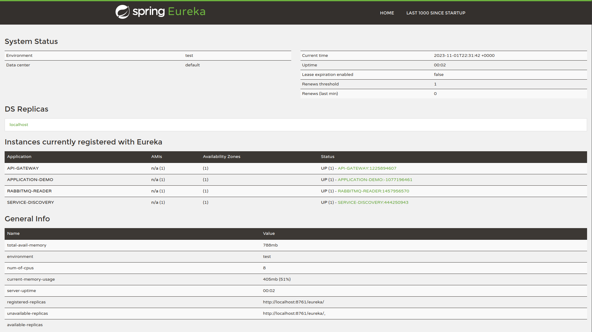

14- Check the spring boot admin service - ADMIN SERVER

<pre>
http://192.168.0.204:8765/admin#/applications
</pre>
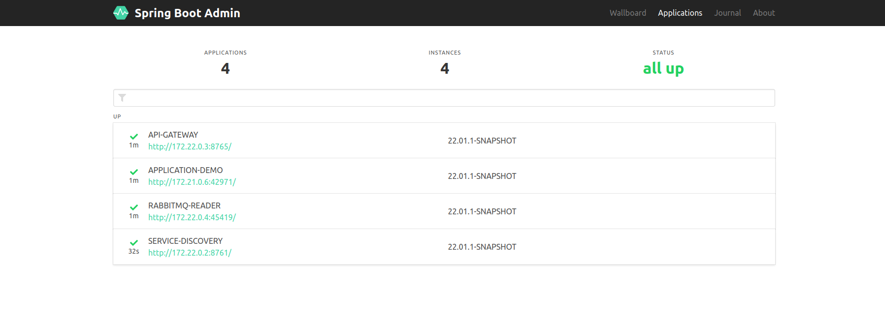

15- Check the rabbitmq functions inside each container

Connect in the rabbitmq container, for example:

<pre>
docker exec -it rabbit-3.6.10 /bin/bash
</pre>

List connections

<pre>
root@a0041d37a393:/# rabbitmqctl list_connections
Listing connections ...
user	peer_host	peer_port	state
guest	172.28.0.1	51062	running
guest	172.28.0.1	51072	running
</pre>

Start the rabbit manager

<pre>
root@rabbit-3:/# rabbitmq-plugins enable rabbitmq_management
</pre>

Access the service manager

<pre>
http://192.168.0.204:15672/
</pre>
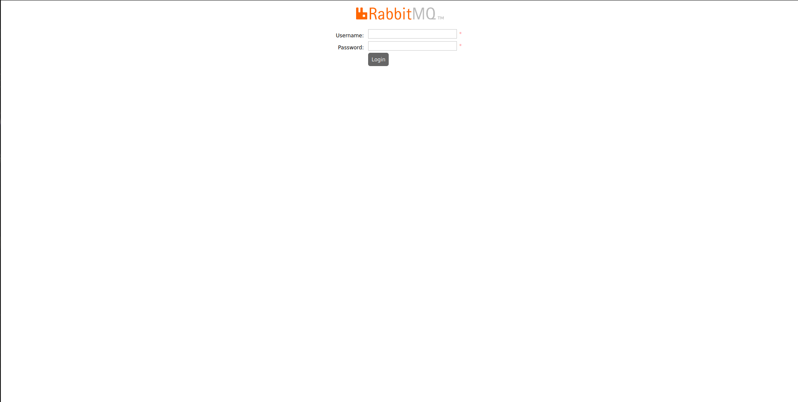

<pre>
User: guest
Password: guest
</pre>
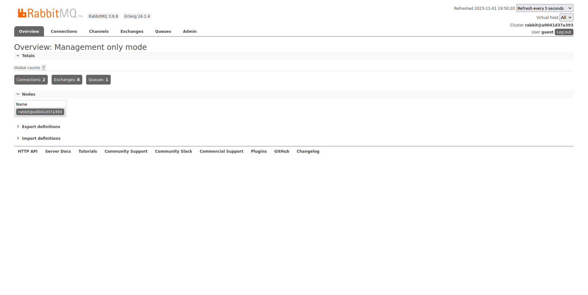

16- Make tests

You can use the file ec2_java_mysql_rabbitmq/files/postman/EC2_JAVA_MYSQL_RABBITMQ.postman_collection.json to make 
tests, however the best way to make it and get more close with the real use case, I recommend that you use the web 
browser executing the following endpoints

Create Purchase
<pre>
# Please use the correct IP or localhost
http://192.168.0.204:8765/producer2-demo/api/v1/purchase
</pre>

Generate Order
<pre>
# Please use the correct IP or localhost
http://192.168.0.204:8765/producer2-demo/api/v1/order/{purchase_id}
</pre>

Dispatch Order
<pre>
# Please use the correct IP or localhost
http://192.168.0.204:8765/producer2-demo/api/v1/dispatch/{purchase_id}
</pre>

Status Order
<pre>
# Please use the correct IP or localhost
http://192.168.0.204:8765/consumer2-demo/api/v1/order/status/{purchase_id}
</pre>

# Support and Information

The information below support you in some issue that refers to any resources presented in this project

> HEALTH CHECK

- http://localhost:58081/actuator/health

> ADMIN SERVER - SERVICES

- http://localhost:58761/admin#/applications

> UPDATE

- sudo yum update

> MYSQL

- sudo yum install mysql

> RABBITMQ

- sudo yum install -y https://dl.fedoraproject.org/pub/epel/epel-release-latest-7.noarch.rpm
- sudo yum-config-manager --enable epel
- sudo yum install erlang --enablerepo=epel
- sudo yum install yum-plugin-versionlock
- sudo yum versionlock gcc-*
- sudo yum install -y socat
- sudo yum install logrotate
- curl -s https://packagecloud.io/install/repositories/rabbitmq/erlang/script.rpm.sh | sudo bash
- curl -s https://packagecloud.io/install/repositories/rabbitmq/rabbitmq-server/script.rpm.sh | sudo bash
- wget https://github.com/rabbitmq/rabbitmq-server/releases/download/rabbitmq_v3_6_10/rabbitmq-server-3.6.10-1.el6.noarch.rpm
- sudo rpm -Uvh rabbitmq-server-3.6.10-1.el6.noarch.rpm
- sudo rabbitmq-plugins enable rabbitmq_management
- sudo chkconfig rabbitmq-server on

or

- Specific version:
<pre>
docker run -d --hostname rabbit-3.6.10 --name rabbit-3.6.10 -p 5672:5672 -p 15672:15672 rabbitmq:3.6.10-management
</pre>

- Latest version:
<pre>
docker run -d --hostname my-rabbit --name some-rabbit -p 38080:15672 rabbitmq:3-management
</pre>

> JAVA

> see https://www.oracle.com/sa/java/technologies/javase/javase8u211-later-archive-downloads.html

- sudo rpm -ivh jre-8u212-linux-x64.rpm [jre-8u212-linux-x64.rpm](ec2_java_mysql_rabbitmq/jre/jre-8u212-linux-x64.rpm)
