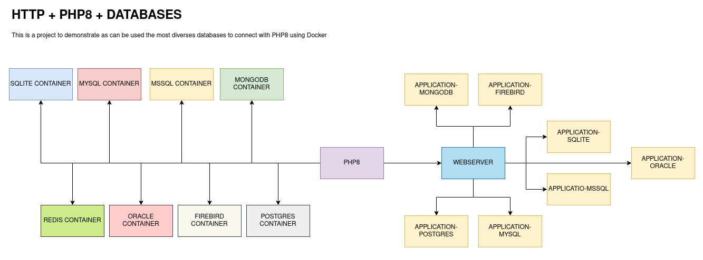

# HTTPD + PHP8 + DATABASES (USING DEDICATED CONTAINER)
Using PHP8 together NGINX connected with the most used databases

# Information

Please use the branch selection to access others configurations for your need and purposes, this branch offers 
a complete environment to development using HTTPD(Apache2) + PHP8 + Databases(see bellow).

> IMPORTANT: See the file .env in the root path of this repository to see all details about the application settings

# About project

> IMPORTANT: This repository have a lot of files that has been downloaded from the responsible sources, compiled and 
> tested in the environments contained in this repository. You can see these files in the folder 
> httpd_php8_databases_separated/php/{PHP-VERSION}/conf/extensions/php-{PHP-VERSION}-compiled-extensions.zip 
> witch will be copied to inside PHP container, unzipped and applied in the container targeted.

> Give a look in the section #References to get more details (don't mess the workdir called extensions)

# Docker Containers Databases

>  Available
>  Pending
>  Unavailable

- HTTPD - APACHE2 

- DATABASES
  - ORACLELINUX 
  - MONGO 
  - MSSQL 
  - MYSQL 
    - 5.7 
    - 8.0 
  - REDIS 
  - SQLITE 
  - POSTGRES 
  - FIREBIRD 

- PHP-7.4.0-FPM 
  - DATABASE CONNECTIONS
    - ORACLELINUX 
    - MONGO 
    - MYSQL 
    - MSSQL 
      - 5.7 
      - 8.0 
    - REDIS 
    - SQLITE 
    - POSTGRES 
    - FIREBIRD 

- PHP-8.0.0-FPM 
  - DATABASE CONNECTIONS
    - ORACLELINUX 
    - MONGO 
    - MSSQL 
    - MYSQL 
      - 5.7 
      - 8.0 
    - REDIS 
    - SQLITE 
    - POSTGRES 
    - FIREBIRD 

- PHP-8.1.0-FPM 
  - DATABASE CONNECTIONS
    - ORACLELINUX 
    - MONGO 
    - MSSQL 
    - MYSQL 
      - 5.7 
      - 8.0 
    - REDIS 
    - SQLITE 
    - POSTGRES 
    - FIREBIRD 

- PHP-8.2.2-FPM 
  - DATABASE CONNECTIONS
    - ORACLELINUX 
    - MONGO 
    - MSSQL 
    - MYSQL 
      - 5.7 
      - 8.0 
    - REDIS 
    - SQLITE 
    - POSTGRES 
    - FIREBIRD 

# About PHP8

- DOCKERFILE

Set up the php8.dockerfile in the header to refers an application or settings that should be used in all 
process, by example DIR_PHP_INI or DIR_WEBSERVER

- PHP INI FILES

Configuration file to PHP server shared between HOST and Container

<pre>
./httpd_php8_databases_separated/php8/shared/ini/php/php.ini
/usr/local/etc/php/conf.d/
</pre>

- EXTENSIONS FILES (Library)

Extension directory shared between HOST and Container

<pre>
/usr/local/lib/php/extensions/no-debug-non-zts-20210902/
</pre>

> IMPORTANT: Edit the /usr/local/etc/php/php.ini file and restart the service or container php8, by example

from 
<pre>
;extension=pdo_oci
</pre>

to
<pre>
extension=pdo_oci
</pre>

- Access the information from PHP version installed:
<pre>
http://localhost:{WEBSERVER-PORT}/info/
</pre>

# About Webserver HTTPD

The version of HTTP used in this project is:

<pre>
Server version: Apache/2.4.54 (Unix)
Server built:   Jul 12 2022 04:31:28
</pre>

> IMPORTANT: In the first time to run this container, execute the script "webserver.sh prepare" after docker-compose up -d

<pre>
docker exec -it webserver /bin/bash
/home/apache2/webserver.sh prepare
</pre>

Before run the previous step, please edit the files in /httpd_php8_separated/webserver/conf/ in this project 
path [conf|htdocs], these files are responsible to configure the webserver HTTP.

<pre>
httpd.conf
sites-available.conf
</pre>

After the first step (see above) execute again the script "webserver.sh" but pass the "restart" as parameter

<pre>
/home/webserver/webserver.sh restart
</pre>

# Usage

<pre>
user@host:/home/user$ git clone https://github.com/huntercodexs/docker-series.git .
user@host:/home/user$ cd docker-series
user@host:/home/user/docker-series$ git checkout httpd_php8_databases_separated
user@host:/home/user/docker-series$ cd httpd_php8_databases_separated
user@host:/home/user/docker-series/httpd_php8_databases_separated$ docker network create webserver_network
user@host:/home/user/docker-series/httpd_php8_databases_separated$ docker-compose up --build (in first time)
user@host:/home/user/docker-series/httpd_php8_databases_separated$ [Ctrl+C]
user@host:/home/user/docker-series/httpd_php8_databases_separated$ docker-compose start (in the next times)
user@host:/home/user/docker-series/httpd_php8_databases_separated$ docker-compose ps (check the containers status)
</pre>

# Oracle

https://github.com/huntercodexs/docker-series/tree/databases#oracle

- Access the application sample to Oracle Linux Database:
<pre>
http://localhost:{WEBSERVER-PORT}/application-oraclelinux/
</pre>

# MongoDB

https://github.com/huntercodexs/docker-series/tree/databases#mongodb

- Access the application sample to MongoDB Database:
<pre>
http://localhost:{WEBSERVER-PORT}/application-mongodb/
</pre>

# MSSQL

https://github.com/huntercodexs/docker-series/tree/databases#mssql

- Access the application sample to MsSQL Database:
<pre>
http://localhost:{WEBSERVER-PORT}/application-mssql/
</pre>

# MYSQL 5.7

https://github.com/huntercodexs/docker-series/tree/databases#mysql-57

- Access the application sample to MySQL 5.7 Database:
<pre>
http://localhost:{WEBSERVER-PORT}/application-mysql57/
</pre>

# MYSQL 8.0

https://github.com/huntercodexs/docker-series/tree/databases#mysql-80

- Access the application sample to MySQL 8.0 Database:
<pre>
http://localhost:{WEBSERVER-PORT}/application-mysql80/
</pre>

# REDIS

> IMPORTANT: Redis is not a database engine, it is used to make a data cache

https://github.com/huntercodexs/docker-series/tree/databases#redis

- Access the application sample to Redis System Cache:
<pre>
http://localhost:{WEBSERVER-PORT}/application-redis/
</pre>

# SQLITE

https://github.com/huntercodexs/docker-series/tree/databases#sqlite3

- Access the application sample to Sqlite3 Database:
<pre>
http://localhost:{WEBSERVER-PORT}/application-sqlite/
</pre>

# Postgres

https://github.com/huntercodexs/docker-series/tree/databases#postgres

- Access the application sample to Postgres Database:
<pre>
http://localhost:{WEBSERVER-PORT}/application-postgres/
</pre>

# Firebird

https://github.com/huntercodexs/docker-series/tree/databases#firebird

> NOTE: IS NOT WORKING CORRECTLY YET !!!

- Access the application sample to Firebird Database:
<pre>
http://localhost:{WEBSERVER-PORT}/application-firebird/
</pre>

# Step by Step

1- Clone the repository
<pre>
user@host:/home/user$ git clone https://github.com/huntercodexs/docker-series.git .
</pre>

2- Access the repository folder
<pre>
user@host:/home/user$ cd docker-series
</pre>

3- Change the current branch
<pre>
user@host:/home/user/docker-series$ git checkout httpd_php8_databases_separated
</pre>

4- Access the httpd_php8_databases_separated folder
<pre>
user@host:/home/user/docker-series$ cd httpd_php8_databases_separated
</pre>

5- Check and set up the .env file, .ini PHP files and all files contained in the path php/{PHP-VERSION}/conf, and also 
check or set up the configurations for each database contained in the databases folder path 

6- Build the containers

> NOTE: Check the folder permissions mainly the databases/oracle/database and databases/oracle/oradata, if you 
> don't know what must be used, use 0x777

<pre>    
user@host:/home/user/docker-series/httpd_php8_databases_separated$ docker network create webserver_network
user@host:/home/user/docker-series/httpd_php8_databases_separated$ docker-compose up --build
</pre>

Make sure that the result look like this
<pre>
user@host:/home/user/docker-series/httpd_php8_databases_separated$ docker-compose ps
     Name                    Command                  State                                             Ports                                       
----------------------------------------------------------------------------------------------------------------------------------------------------
firebird          firebird                         Up             0.0.0.0:33050->3050/tcp,:::33050->3050/tcp                                        
mongo             docker-entrypoint.sh mongod      Up             0.0.0.0:27017->27017/tcp,:::27017->27017/tcp                                      
mongo-express     /sbin/tini -- /docker-entr ...   Up             0.0.0.0:8090->8081/tcp,:::8090->8081/tcp                                          
mssql             /opt/mssql/bin/permissions ...   Up             0.0.0.0:1433->1433/tcp,:::1433->1433/tcp                                          
mssql-tools       /bin/sh -c /bin/bash             Up             0.0.0.0:31812->10000/tcp,:::31812->10000/tcp                                      
mysql57           docker-entrypoint.sh mysqld      Up             0.0.0.0:3705->3306/tcp,:::3705->3306/tcp, 33060/tcp                               
mysql80           docker-entrypoint.sh mysqld      Up             0.0.0.0:3708->3306/tcp,:::3708->3306/tcp, 33060/tcp                               
oraclelinux       /bin/sh -c exec $ORACLE_BA ...   Up (healthy)   0.0.0.0:1521->1521/tcp,:::1521->1521/tcp, 0.0.0.0:5500->5500/tcp,:::5500->5500/tcp
php-7.4.0         docker-php-entrypoint php-fpm    Up             0.0.0.0:9000->9000/tcp,:::9000->9000/tcp                                          
php-8.0.0         docker-php-entrypoint php-fpm    Up             0.0.0.0:9001->9000/tcp,:::9001->9000/tcp                                          
php-8.1.0         docker-php-entrypoint php-fpm    Up             0.0.0.0:9002->9000/tcp,:::9002->9000/tcp                                          
php-8.2.2         docker-php-entrypoint php-fpm    Up             0.0.0.0:9003->9000/tcp,:::9003->9000/tcp                                          
postgres          docker-entrypoint.sh postgres    Up             0.0.0.0:5432->5432/tcp,:::5432->5432/tcp                                          
redis             redis-server --requirepass ...   Up             0.0.0.0:6379->6379/tcp,:::6379->6379/tcp                                          
sqlite3           bash                             Up             0.0.0.0:31050->5050/tcp,:::31050->5050/tcp                                        
webserver-7.4.0   httpd-foreground                 Up             0.0.0.0:40443->443/tcp,:::40443->443/tcp, 0.0.0.0:33074->80/tcp,:::33074->80/tcp  
webserver-8.0.0   httpd-foreground                 Up             0.0.0.0:41443->443/tcp,:::41443->443/tcp, 0.0.0.0:33800->80/tcp,:::33800->80/tcp  
webserver-8.1.0   httpd-foreground                 Up             0.0.0.0:42443->443/tcp,:::42443->443/tcp, 0.0.0.0:33810->80/tcp,:::33810->80/tcp  
webserver-8.2.2   httpd-foreground                 Up             0.0.0.0:43443->443/tcp,:::43443->443/tcp, 0.0.0.0:33822->80/tcp,:::33822->80/tcp
</pre>

7- Edit the webserver file settings in the path httpd_php8_databases_separated/webserver/{PHP-VERSION}/conf

> NOTE: See all the file in this folder to more details

<pre>
user@host:/home/user/docker-series/httpd_php8_databases_separated/webserver/{PHP-VERSION}/conf$ httpd.conf
user@host:/home/user/docker-series/httpd_php8_databases_separated/webserver/{PHP-VERSION}/conf$ webserver.conf
user@host:/home/user/docker-series/httpd_php8_databases_separated/webserver/{PHP-VERSION}/conf/htdocs$ index.html
</pre>

8- Restart the webserver targeted

> NOTE: Whether you need, change this script

<pre>
user@host:/home/user/docker-series/httpd_php8_databases_separated$ docker exec -it webserver-{PHP-VERSION} /bin/bash
root@9fdf75782c1e:/usr/local/apache2# /home/webserver/conf/webserver-apply-changes-and-restart.sh
</pre>

9- Apply the custom settings in the PHP container targeted

> NOTE: Whether you need, change this script

<pre>
user@host:/home/user/docker-series/httpd_php8_databases_separated$ docker exec -it php-{PHP-VERSION} /bin/bash
root@fdd2bcedb04f:/opt# /home/php/conf/custom.sh
</pre>

10- Test the applications to get info from each PHP version
<pre>
http://localhost:{WEBSERVER-PORT}/info/
</pre>

11- Test each sample application that are placed in the folder ./applications
<pre>
http://localhost:{WEBSERVER-PORT}/application-oraclelinux/
http://localhost:{WEBSERVER-PORT}/application-mongodb/
http://localhost:{WEBSERVER-PORT}/application-mssql/
http://localhost:{WEBSERVER-PORT}/application-mysql57/
http://localhost:{WEBSERVER-PORT}/application-mysql80/
http://localhost:{WEBSERVER-PORT}/application-redis/
http://localhost:{WEBSERVER-PORT}/application-sqlite/
http://localhost:{WEBSERVER-PORT}/application-postgres/
http://localhost:{WEBSERVER-PORT}/application-firebird/
</pre>

# References

> Here you can find the information where was obtained some libraries (.so) as example oci8.so, sqlsrv.so

Oraclelinux - OCI - Oracle 19c
- https://download.oracle.com
- https://oraclelinux.pkgs.org
- https://pecl.php.net/package/oci8

Mssql - SQLSRV - Microsoft Drivers
- https://github.com/Microsoft/msphpsql/releases/
- https://learn.microsoft.com/pt-br/sql/connect/php/download-drivers-php-sql-server?view=sql-server-ver16

Postgres - PGSQL - Drivers and Libraries
- https://packages.ubuntu.com/focal/
- https://archlinux.org/packages/extra/x86_64/php-pgsql
- https://linux-packages.com/ubuntu-focal-fossa/package/php80-pgsql

Firebird
- https://firebirdsql.org/en/php-driver/
