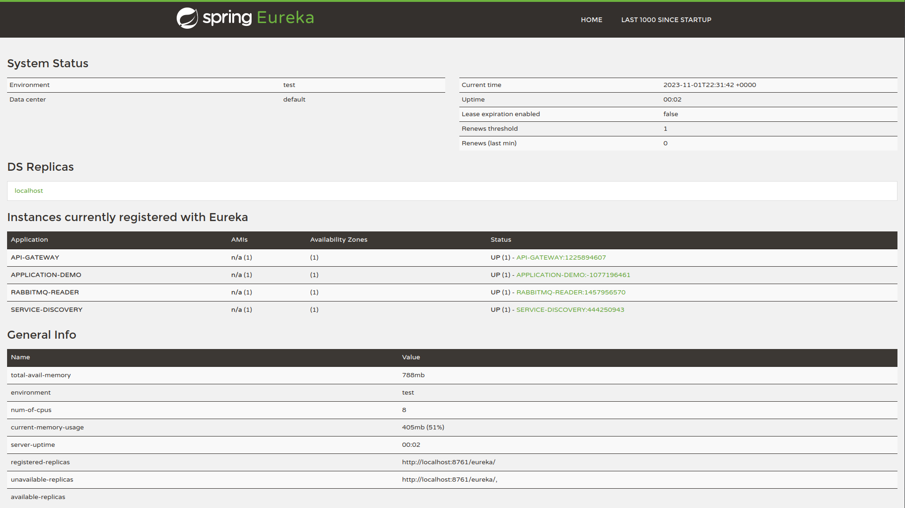
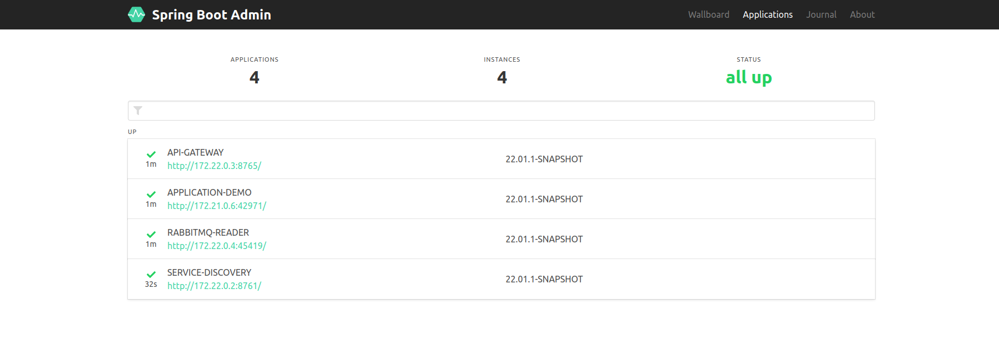
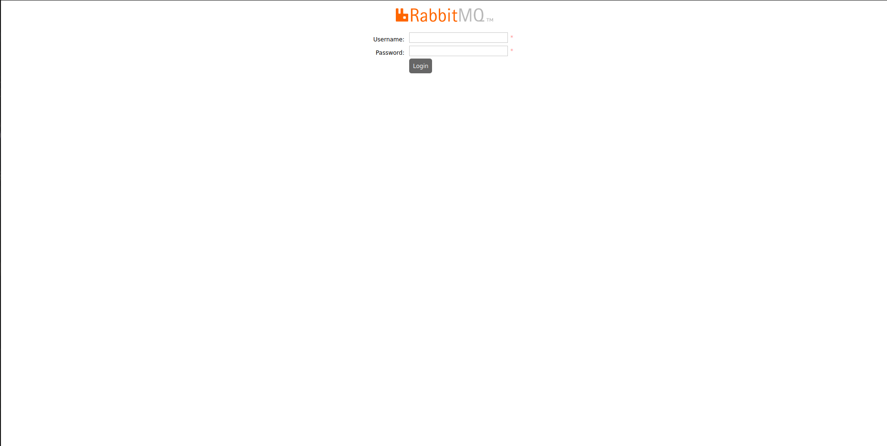
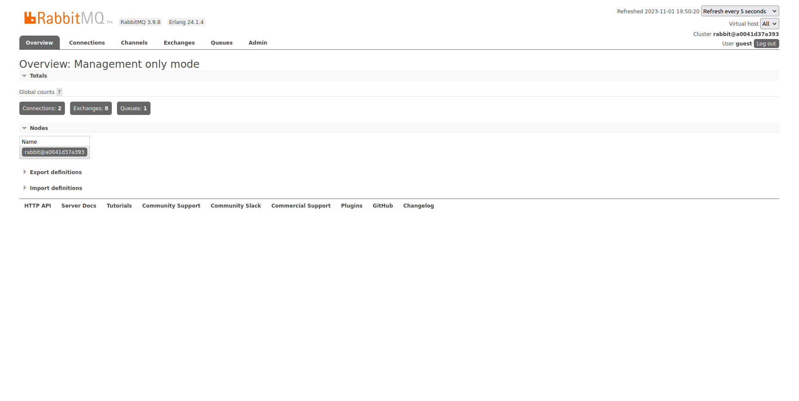

# EC2 (Amazonlinux) + JAVA + MYSQL + RABBITMQ
Simple Environment to simulate a messenger service workflow

# Requisites

- Amazonlinux 2
- Java 8
- RabbitMQ 3.9.8
- Mysql 8

# Overview

- Eureka - Service Discovery
- Spring Boot Admin Server
- Zuul Proxy Server - Api Gateway
- RabbitMQ - Messenger

[Diagram Draw IO]

# Usage

- Run

<pre>
user@host:/home/user$ git clone https://github.com/huntercodexs/docker-series.git .
user@host:/home/user$ cd docker-series
user@host:/home/user/docker-series$ git checkout ec2_java_mysql_rabbitmq
user@host:/home/user/docker-series$ cd ec2_java_mysql_rabbitmq
user@host:/home/user/docker-series/ec2_java_mysql_rabbitmq$ docker-compose up --build
user@host:/home/user/docker-series/ec2_java_mysql_rabbitmq$ [Ctrl+C]
user@host:/home/user/docker-series/ec2_java_mysql_rabbitmq$ docker-compose start
</pre>

- Mysql

If you get the follow error

> ERROR 2059 (HY000): Authentication plugin 'caching_sha2_password' cannot be loaded: 
> /usr/lib64/mysql/plugin/caching_sha2_password.so: cannot open shared object file: No such file or directory

use the following instructions

<pre>
USE mysql;
ALTER USER 'root'@'%' IDENTIFIED WITH mysql_native_password BY 'root123';
FLUSH PRIVILEGES;
</pre>

- RabbitMQ

Next step to run rabbitmq inside rabbitmq container

<pre>
rabbitmq-plugins enable rabbitmq_management &
rabbitmq-server start &
rabbitmqctl list_users
rabbitmqctl authenticate_user guest guest
</pre>

In the rabbitmq container everything is fine, so you can use as is, however you can still enable few plugins, as example: 

<pre>
rabbitmq-plugins enable rabbitmq_management
</pre>

Use "rabbitmq-plugins list" commando to view a complete list of plugins

# Sample projects

> NOTE: these projects are just a sample to demonstrate how to work this project: EC2 + JAVA + MYSQL + RABBITMQ

To run the sample projects contained in this project get the project files into folder sample-projects, 
and follow the bellow for each project:

- open each project in your prefer IDE
- run the "mvn package"
- take the generated jar file
- edit the application.properties file with the correct settings
- finally use the result files in the folder app/project-name (example: app/service_discovery)

# Step by Step

Follow the steps below to quick and easy environment creation

1- Clone the repository
<pre>
user@host:/home/user$ git clone https://github.com/huntercodexs/docker-series.git .
</pre>

2- Access the repository folder
<pre>
user@host:/home/user$ cd docker-series
</pre>

3- Change the current branch
<pre>
user@host:/home/user/docker-series$ git checkout ec2_java_mysql_rabbitmq
</pre>

4- Access the ec2_java_mysql_rabbitmq folder
<pre>
user@host:/home/user/docker-series$ cd ec2_java_mysql_rabbitmq
</pre>

5- Check and set up the .env file and rabbitmq.conf file placed on ec2_java_mysql_rabbitmq/rabbitmq/rabbitmq.conf

The rabbitmq.conf should have the follow context:
<pre>
default_vhost = /
default_user = guest
default_pass = guest
</pre>

6- Build the sample projects

> TIP: use your preferred IDE to make it, see the section # Sample projects

<pre>
sample-projects/api-gateway
sample-projects/application-demo
sample-projects/rabbitmq-reader
sample-projects/service-discovery
</pre>

7- Put each jar file generated and the application.properties file in the folder path ec2_java_mysql_rabbitmq/app as shown below

> NOTE: These projects should be used only an example

<pre>
ec2_java_mysql_rabbitmq/app/service_discovery/SERVICE-DISCOVERY-22.01.1-SNAPSHOT.jar
ec2_java_mysql_rabbitmq/app/service_discovery/application.properties
ec2_java_mysql_rabbitmq/app/api_gateway/API-GATEWAY-22.01.1-SNAPSHOT.jar
ec2_java_mysql_rabbitmq/app/api_gateway/application.properties
ec2_java_mysql_rabbitmq/app/application_demo/APPLICATION-DEMO-22.01.1-SNAPSHOT.jar
ec2_java_mysql_rabbitmq/app/application_demo/application.properties
ec2_java_mysql_rabbitmq/app/rabbitmq_reader/RABBITMQ-READER-22.01.1-SNAPSHOT.jar
ec2_java_mysql_rabbitmq/app/rabbitmq_reader/application.properties
</pre>

8- Build the containers
<pre>    
user@host:/home/user/docker-series/ec2_java_mysql_rabbitmq$ docker network create open_network
user@host:/home/user/docker-series/ec2_java_mysql_rabbitmq$ docker-compose up --build
</pre>

Case any error occurs, check the permissions in the current folder, mainly for rabbitmq service, 
that should have the following user:group

<pre>
systemd-coredump group-name
</pre>

9- Check the mysql container service

If you get the follow error
<pre>
ERROR 2059 (HY000): Authentication plugin 'caching_sha2_password' cannot be loaded: 
/usr/lib64/mysql/plugin/caching_sha2_password.so: cannot open shared object file: No such file or directory
</pre>

use the following instructions

> TIP: You can use the SGDB too.

<pre>
user@host:/home/user/docker-series/ec2_java_mysql_rabbitmq$ [Ctrl+C] [Ctrl+D]
user@host:/home/user/docker-series/ec2_java_mysql_rabbitmq$ docker-compose start mysql8
user@host:/home/user/docker-series/ec2_java_mysql_rabbitmq$ docker exec -it mysql8 /bin/bash
bash-4.4# mysql -h localhost -u root -p
Enter password: 
Welcome to the MySQL monitor.  Commands end with ; or \g.
Your MySQL connection id is 11
Server version: 8.0.35 MySQL Community Server - GPL

Copyright (c) 2000, 2023, Oracle and/or its affiliates.

Oracle is a registered trademark of Oracle Corporation and/or its
affiliates. Other names may be trademarks of their respective
owners.

Type 'help;' or '\h' for help. Type '\c' to clear the current input statement.

mysql> USE mysql;
Reading table information for completion of table and column names
You can turn off this feature to get a quicker startup with -A

Database changed
mysql> ALTER USER 'root'@'%' IDENTIFIED WITH mysql_native_password BY 'root123';
Query OK, 0 rows affected (0.01 sec)

mysql> FLUSH PRIVILEGES;
Query OK, 0 rows affected (0.02 sec)

mysql> exit;
</pre>

10- Check the rabbitmq container service

Run rabbitmq inside rabbitmq container

> TIP: Use "rabbitmq-plugins list" command to view a complete list of plugins

> TIP: Whether any error occurs during initialize container service check if the service status is running

<pre>
user@host:/home/user/docker-series/ec2_java_mysql_rabbitmq$ [Ctrl+C] [Ctrl+D]
user@host:/home/user/docker-series/ec2_java_mysql_rabbitmq$ docker-compose start rabbitmq
user@host:/home/user/docker-series/ec2_java_mysql_rabbitmq$ docker exec -it rabbitmq /bin/bash
root@1fb69d7ccc23:/# rabbitmq-plugins enable rabbitmq_management &
root@1fb69d7ccc23:/# rabbitmq-server start &
root@1fb69d7ccc23:/# rabbitmqctl list_users
root@1fb69d7ccc23:/# rabbitmqctl authenticate_user guest guest
</pre>

In the rabbitmq container everything is fine, so you can use as is, however you can still enable few plugins, as example:

<pre>
root@1fb69d7ccc23:/# rabbitmq-plugins enable rabbitmq_management
</pre>

11- If everything is ok and all steps until here was concluded, make these commands

<pre>
user@host:/home/user/docker-series/ec2_java_mysql_rabbitmq$ [Ctrl+C]
user@host:/home/user/docker-series/ec2_java_mysql_rabbitmq$ docker-compose stop
user@host:/home/user/docker-series/ec2_java_mysql_rabbitmq$ docker-compose start
user@host:/home/user/docker-series/ec2_java_mysql_rabbitmq$ docker-compose ps
</pre>

the result should be look like this

<pre>
        Name                       Command               State                                                                       Ports                                                                    
--------------------------------------------------------------------------------------------------------------------------------------------------------------------------------------------------------------
ec2_api_gateway         /usr/bin/java -jar /home/s ...   Up      0.0.0.0:58081->8081/tcp,:::58081->8081/tcp, 0.0.0.0:58765->8765/tcp,:::58765->8765/tcp                                                       
ec2_application_demo    /usr/bin/java -jar /home/s ...   Up                                                                                                                                                   
ec2_rabbitmq_reader     /usr/bin/java -jar /home/s ...   Up                                                                                                                                                   
ec2_service_discovery   /usr/bin/java -jar /home/s ...   Up      0.0.0.0:58761->8761/tcp,:::58761->8761/tcp                                                                                                   
mysql8                  docker-entrypoint.sh mysqld      Up      0.0.0.0:3708->3306/tcp,:::3708->3306/tcp, 33060/tcp                                                                                          
rabbitmq                docker-entrypoint.sh rabbi ...   Up      0.0.0.0:15672->15672/tcp,:::15672->15672/tcp, 15691/tcp, 15692/tcp, 25672/tcp, 4369/tcp, 5671/tcp, 0.0.0.0:55672->5672/tcp,:::55672->5672/tcp
</pre>

12- Check the discovery service - EUREKA

<pre>
http://192.168.0.204:58761/
</pre>

13- Check the spring boot admin service - ADMIN SERVER

<pre>
http://192.168.0.204:8765/admin#/applications
</pre>

14- Check the rabbit container service

List connections

<pre>
user@host:/home/user/docker-series/ec2_java_mysql_rabbitmq$ docker exec -it rabbitmq /bin/bash
root@a0041d37a393:/# rabbitmqctl list_connections
Listing connections ...
user	peer_host	peer_port	state
guest	172.28.0.1	51062	running
guest	172.28.0.1	51072	running
</pre>

Start the rabbit manager

<pre>
root@1fb69d7ccc23:/# rabbitmq-plugins enable rabbitmq_management
</pre>

Access the service manager

<pre>
http://192.168.0.204:15672/
</pre>

<pre>
User: guest
Password: guest
</pre>

15- Make tests using POSTMAN EC2_JAVA_MYSQL_RABBITMQ.postman_collection.json
<pre>
GET http://192.168.0.204:58765/application-demo/api/v1/welcome
POST http://192.168.0.204:58765/application-demo/api/v1/order/create
{
    "order": "XYZ0909-001-B2"
}
GET http://192.168.0.204:58765/application-demo/api/v1/order/read/XYZ0909-001-B2
</pre>

# Help and Information

HEALTH CHECK

- http://localhost:58081/actuator/health

ADMIN SERVER - SERVICES

- http://localhost:58761/admin#/applications

UPDATE

- sudo yum update

MYSQL

- sudo yum install mysql

RABBITMQ

- sudo yum install -y https://dl.fedoraproject.org/pub/epel/epel-release-latest-7.noarch.rpm
- sudo yum-config-manager --enable epel
- sudo yum install erlang --enablerepo=epel
- sudo yum install yum-plugin-versionlock
- sudo yum versionlock gcc-*
- sudo yum install -y socat
- sudo yum install logrotate
- curl -s https://packagecloud.io/install/repositories/rabbitmq/erlang/script.rpm.sh | sudo bash
- curl -s https://packagecloud.io/install/repositories/rabbitmq/rabbitmq-server/script.rpm.sh | sudo bash
- wget https://github.com/rabbitmq/rabbitmq-server/releases/download/rabbitmq_v3_6_10/rabbitmq-server-3.6.10-1.el6.noarch.rpm
- sudo rpm -Uvh rabbitmq-server-3.6.10-1.el6.noarch.rpm
- sudo rabbitmq-plugins enable rabbitmq_management
- sudo chkconfig rabbitmq-server on

JAVA

> see https://www.oracle.com/sa/java/technologies/javase/javase8u211-later-archive-downloads.html

- sudo rpm -ivh jre-8u212-linux-x64.rpm [jre-8u212-linux-x64.rpm](ec2_java_mysql_rabbitmq/jre/jre-8u212-linux-x64.rpm)
