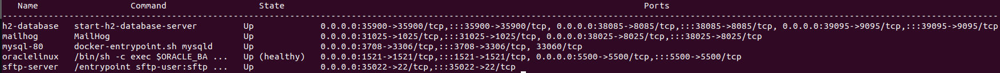
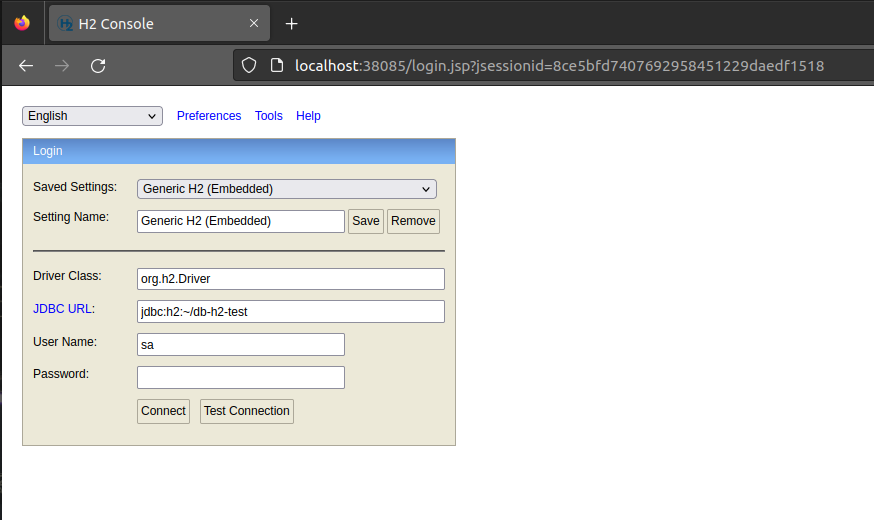
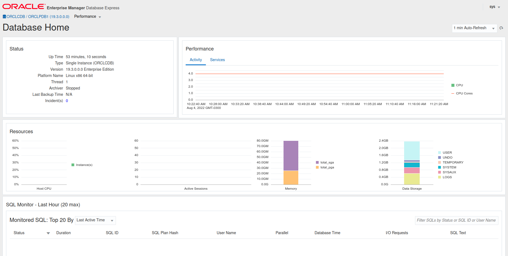
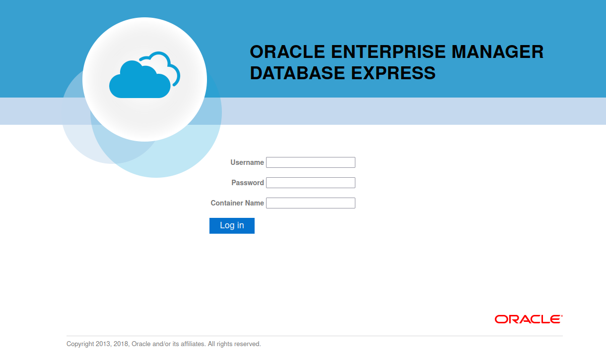
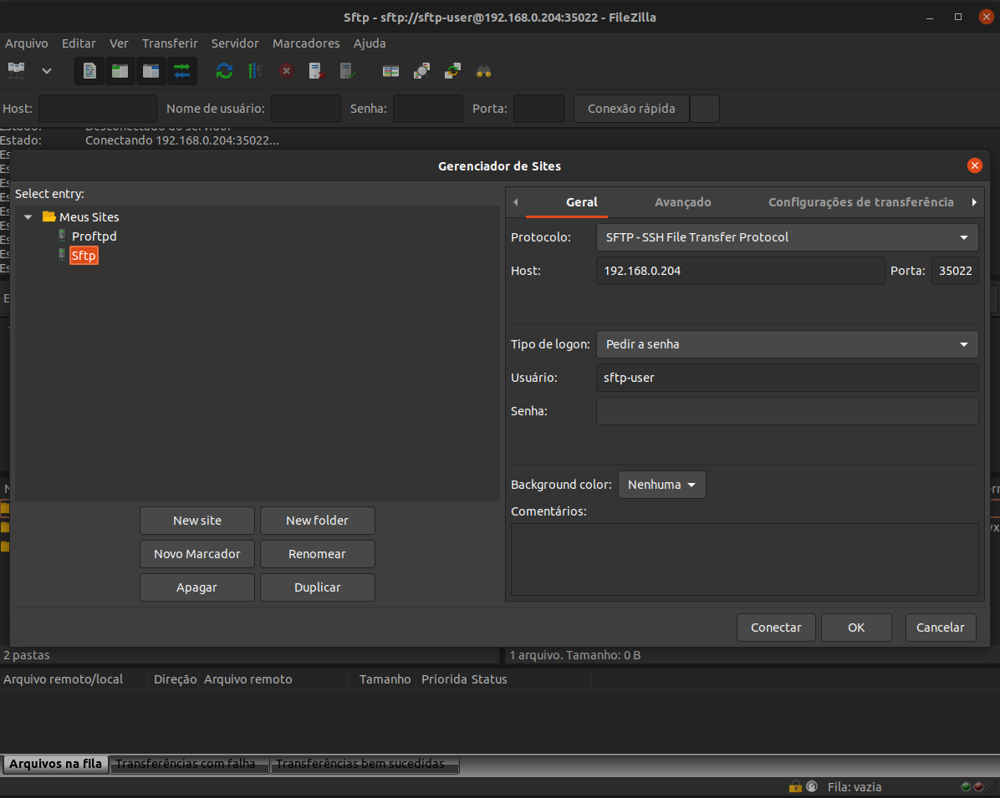
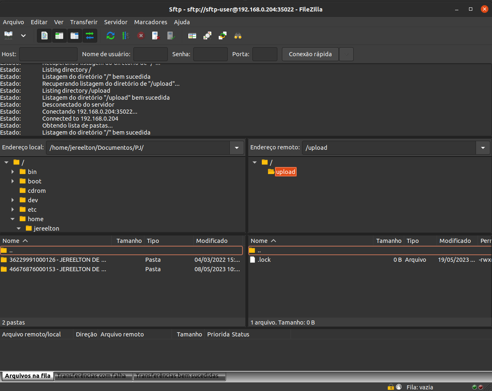

# H2 + MYSQL + ORACLE LINUX + SFTP + MAIL HOG
Base project to use in sandbox or tests environment

# REQUISITES

- H2 DATABASE
- Mysql 8
- ORACLELINUX
- SFTP
- MAILHOG

# USAGE

<pre>
user@host:/home/user$ git clone https://github.com/huntercodexs/docker-series.git .
user@host:/home/user$ cd docker-series
user@host:/home/user/docker-series$ git checkout h2_mysql_oracle_sftp_mailhog
user@host:/home/user/docker-series$ cd h2_mysql_oracle_sftp_mailhog
user@host:/home/user/docker-series/h2_mysql_oracle_sftp_mailhog$ docker-compose up --build (in first time)
user@host:/home/user/docker-series/h2_mysql_oracle_sftp_mailhog$ [Ctrl+C]
user@host:/home/user/docker-series/h2_mysql_oracle_sftp_mailhog$ docker-compose start (in the next times)
user@host:/home/user/docker-series/h2_mysql_oracle_sftp_mailhog$ docker-compose ps (check the containers status)
</pre>

Result should be

# H2 DATABASE (JAVA)

> TIP: To use more easily this project you can use together the Spring H2 Database Demo from
> https://github.com/huntercodexs/spring-h2-database-demo

Settings to do before run this project

- Configure the file .env as bellow

> NOTE: Get the version and zip filename in the https://www.h2database.com/html/download.html

<pre>
H2DATABASE_VERSION=version-2.1.214
H2DATABASE_ZIPFILE=h2-2022-06-13.zip
</pre>

- Set up the ports

<pre>
H2DATABASE_HOST_PORT=35900
H2DATABASE_HOST_ADDITIONAL_PORT=35900

H2DATABASE_HOST_TCP_PORT=39095
H2DATABASE_TCP_SERVER_PORT=9095

H2DATABASE_HOST_HTTP_PORT=38085
H2DATABASE_HTTP_SERVER_PORT=8085
</pre>

- Access the H2 Database via HTTP (console)

<pre>
http://{server-address}:38085
</pre>

- Access the H2 Database via TCP/IP

<pre>
tcp://localhost:39095/~/db-h2-test
</pre>

- Access the H2 Database via Java Application

<pre>
spring.datasource.url=jdbc:h2:tcp://localhost:39095/~/db-h2-test
spring.datasource.jdbcUrl=jdbc:h2:tcp://localhost:39095/~/db-h2-test
</pre>

> You can customize the script bin/start-h2-database-server to have control in your environment

> You can also create an initializer sql commands into bin/db-init.sql to charge database from tests in your
> application as showed bellow

<pre>
spring.datasource.url=jdbc:h2:tcp://localhost:39095/~/db-h2-test;INIT=RUNSCRIPT FROM '~/db-init.sql'
spring.datasource.jdbcUrl=jdbc:h2:tcp://localhost:39095/~/db-h2-test;INIT=RUNSCRIPT FROM '~/db-init.sql'
</pre>

# MYSQL-80

- Access the database

<pre>
server: 192.168.0.174 (Use the current IP from your machine: localhost, 192.168.0.200 ...)
port: 3708
user: root
pass: root123
</pre>

# ORACLELINUX 19c INSTANCE

<h3>Oracle</h3>

- Definitions and Variables

<pre>
ORACLELINUX_USERNAME: DEVEL (if error, try SYS or SYSTEM)
ORACLELINUX_USERNAME_LOWERCASE: devel
ORACLELINUX_PDB: ORCLPDB1
ORACLELINUX_PASSWORD: oracle1Ipw
ORACLELINUX_DATABASE_ROLE: Normal (in many cases can be SYSDBA)
ORACLELINUX_DATABASE_AUTH_MODE: Oracle Database Native
ORACLELINUX_DATABASE_PORT: 1521
ORACLELINUX_TABLESPACE_NAME: DEVEL
ORACLELINUX_DATABASE_TABLESPACE: /opt/oracle/oradata/ORCLCDB/{ORACLELINUX_PDB}/{ORACLELINUX_USERNAME_LOWERCASE}.dbf
</pre>

> IMPORTANT:
> Use the command docker-compose up --build to run on first time
> After the first build use docker-compose up -d oraclelinux or docker-compose start oraclelinux

> VERY IMPORTANT:
> The path oracle/oradata in current container instance "should be empty"
> Ensure that the oracle/oradata is empty or just have the dbconfig/ and ORCLCDB/ folders

- ORACLE EDITION (see the .env file):

<pre>
ee - Enterprise Edition
se2 - Standard Edition
xe - Express Edition
</pre>

> REQUIRED

<pre>
Database file: LINUX.X64_193000_db_home.zip (in this case)
This file can be downloaded in https://www.oracle.com/database/technologies/oracle-database-software-downloads.html
</pre>

- BEFORE BUILD

Put the LINUX.X64_193000_db_home.zip inside oracle/database before run the docker-compose

Set up the .env file on section ORACLELINUX SETTINGS

Unzip the oraclelinux-database-scripts-19c.tar.bz2 file inside the oracle/database folder:
<pre>
user@host:/home/user/docker-series/h2_mysql_oracle_sftp_mailhog/oracle/database$ tar -xvf oraclelinux-database-scripts-19c.tar.bz2
</pre>

Create the oradata folder in oracle path
Check if oracle/oradata is empty or just have the dbconfig/ and ORCLCDB/ folders

Final results from build
<pre>
oraclelinux    | Version 19.3.0.0.0
oraclelinux    | The Oracle base remains unchanged with value /opt/oracle
oraclelinux    | The Oracle base remains unchanged with value /opt/oracle
oraclelinux    | #########################
oraclelinux    | DATABASE IS READY TO USE!
oraclelinux    | #########################
oraclelinux    | The following output is now a tail of the alert.log:
oraclelinux    | ORCLPDB1(3):Completed: ALTER DATABASE DEFAULT TABLESPACE "USERS"
oraclelinux    | 2023-10-12T14:59:47.143786+00:00
oraclelinux    | ALTER SYSTEM SET control_files='/opt/oracle/oradata/ORCLCDB/control01.ctl' SCOPE=SPFILE;
oraclelinux    | 2023-10-12T14:59:47.148098+00:00
oraclelinux    | ALTER SYSTEM SET local_listener='' SCOPE=BOTH;
oraclelinux    |    ALTER PLUGGABLE DATABASE ORCLPDB1 SAVE STATE
oraclelinux    | Completed:    ALTER PLUGGABLE DATABASE ORCLPDB1 SAVE STATE
oraclelinux    | 2023-10-12T14:59:47.721280+00:00
oraclelinux    | 
oraclelinux    | XDB initialized.
</pre>

- AFTER BUILD

Make the follow commands in the HOST(the machine where is installed the instance oraclelinux via docker):

Set Password Administration
<pre>
user@host:/home/user/docker-series/h2_mysql_oracle_sftp_mailhog$ docker-compose start oraclelinux
user@host:/home/user/docker-series/h2_mysql_oracle_sftp_mailhog$ docker exec -it oraclelinux ./setPassword.sh {YOUR_ORACLE_PASSWORD}
</pre>

Result
<pre>
user@host:/home/user/docker-series/h2_mysql_oracle_sftp_mailhog$ docker exec -it oraclelinux ./setPassword.sh oracle1Ipw
The Oracle base remains unchanged with value /opt/oracle

SQL*Plus: Release 19.0.0.0.0 - Production on Thu Oct 12 15:09:12 2023
Version 19.3.0.0.0

Copyright (c) 1982, 2019, Oracle.  All rights reserved.

Connected to:
Oracle Database 19c Enterprise Edition Release 19.0.0.0.0 - Production
Version 19.3.0.0.0

SQL> 
User altered.

SQL> 
User altered.

SQL> 
Session altered.

SQL> 
User altered.

SQL> Disconnected from Oracle Database 19c Enterprise Edition Release 19.0.0.0.0 - Production
Version 19.3.0.0.0
</pre>

Access the database container
<pre>
user@host:/home/user/docker-series/h2_mysql_oracle_sftp_mailhog$ docker exec -it oraclelinux /bin/bash
</pre>

- Make the follow commands inside oraclelinux instance via docker (GUEST):

Create User
<pre>
sqlplus sys/{ORACLELINUX_PASSWORD}@{ORACLELINUX_PDB} as sysdba
CREATE USER {ORACLELINUX_USERNAME} IDENTIFIED BY {ORACLELINUX_PASSWORD};
GRANT CREATE SESSION, CREATE TABLE, CREATE SEQUENCE TO {ORACLELINUX_USERNAME};
ALTER USER {ORACLELINUX_USERNAME} QUOTA 50m ON SYSTEM;
CREATE SMALLFILE TABLESPACE {ORACLELINUX_USERNAME} DATAFILE '{ORACLELINUX_DATABASE_TABLESPACE}' SIZE 1G;
ALTER DATABASE DEFAULT TABLESPACE {ORACLELINUX_USERNAME};
ALTER USER {ORACLELINUX_USERNAME} QUOTA UNLIMITED ON SYSTEM;
ALTER USER {ORACLELINUX_USERNAME} QUOTA UNLIMITED ON {ORACLELINUX_TABLESPACE_NAME};
SELECT * FROM ALL_USERS au;
SELECT * FROM ALL_USERS au WHERE au.USERNAME = '{ORACLELINUX_USERNAME}';
EXIT;
</pre>

> TIP: User the script init.sql to make a test in the current oraclelinux instance via docker

[init.sql](./h2_mysql_oracle_sftp_mailhog/oracle/scripts/init.sql)

Get ORACLELINUX_PDB available from oracle
<pre>
** to get this value exec in the current terminal:
SQL> show pdbs;

    CON_ID CON_NAME			  OPEN MODE  RESTRICTED
---------- ------------------------------ ---------- ----------
	 3 ORCLPDB1			  READ WRITE NO

SQL>EXIT;
</pre>

Connect on database using the new user
<pre>
sqlplus {ORACLELINUX_USERNAME}/{ORACLELINUX_PASSWORD}@{ORACLELINUX_PDB}
</pre>

- Configuration to access the Database Oracle Linux:

<pre>
Host: {DATABASE_ORACLE_SERVER_IP}
Port: {ORACLELINUX_DATABASE_PORT}
Database: {ORACLELINUX_PDB} [Service Name]
Authentication:{ORACLELINUX_DATABASE_AUTH_MODE}
Username: {ORACLELINUX_USERNAME}
Role: {ORACLELINUX_DATABASE_ROLE}
Password: {ORACLELINUX_PASSWORD}
</pre>

- Database Connection Sample (User: SYS, SYSDBA)

- Database Connection Sample (User: DEVEL)

- Enterprise Manager

- Access the Enterprise Manager:

<pre>
https://{WEBSERVER_ADDRESS}:5500/em
  > username: sys
  > password: {ORACLELINUX_PASSWORD}
  > container name: {ORACLELINUX_PDB}
</pre>

All rights reserved to ORACLE - https://www.oracle.com/

# SFTP SERVER

- Filezilla Connection Example

# MAILHOG

- How to make access in the MailHog Http Webserver

<pre>
http://{MAIL_SERVER_IP}:{MAILHOG_PORT}

[Example]
http://{WEBSERVER-ADDRESS-IP}:38025 (mailhog)
http://{WEBSERVER-ADDRESS-IP}:48025 (mailhog-ubuntu2004)
</pre>

- How to use MailHog as Mail Server Tests

<pre>
[SMTP HOST]
{MAIL_SERVER_IP}

[SMTP PORT]
{MAILHOG_SMTP_PORT}

[Example (Java Mail Sender)]
spring.mail.host=localhost
spring.mail.port=31025
spring.mail.username=huntercodexs@mail.com
spring.mail.password=
spring.mail.properties.mail.smtp.auth=false
spring.mail.properties.mail.smtp.starttls.enable=true
spring.mail.properties.mail.smtp.connectiontimeout=5000
spring.mail.properties.mail.smtp.timeout=5000
spring.mail.properties.mail.smtp.writetimeout=5000
spring.mail.properties.mail.smtp.socketFactory.port=31025
spring.mail.properties.mail.smtp.socketFactory.class=javax.net.ssl.SSLSocketFactory
</pre>

# Step by Step

Follow the steps below to quick and easy environment creation

1- Clone the repository
<pre>
user@host:/home/user$ git clone https://github.com/huntercodexs/docker-series.git .
</pre>

2- Access the repository folder
<pre>
user@host:/home/user$ cd docker-series
</pre>

3- Change the current branch
<pre>
user@host:/home/user/docker-series$ git checkout h2_mysql_oracle_sftp_mailhog
</pre>

4- Access the h2_mysql_oracle_sftp_mailhog folder
<pre>
user@host:/home/user/docker-series$ cd h2_mysql_oracle_sftp_mailhog
</pre>

5- Check and set the .env file in the following sections
<pre>
#### MYSQL 8.0 SETTINGS
#### FTP SERVER SETTINGS
#### ORACLELINUX SETTINGS
#### MAILHOG SETTINGS
#### H2 DATABASE SETTINGS
</pre>

6- Prepare the oracle environment
<pre>
Put the LINUX.X64_193000_db_home.zip inside oracle/database before run the docker-compose
</pre>

7- Unzip the oraclelinux-database-scripts-19c.tar.bz2 file inside the oracle/database folder:
<pre>
user@host:/home/user/docker-series/h2_mysql_oracle_sftp_mailhog/oracle/database$ tar -xvf oraclelinux-database-scripts-19c.tar.bz2
</pre>

8- Create or check the oradata folder in oracle path

> IMPORTANT!
> Check if oracle/oradata is empty or just have the dbconfig/ and ORCLCDB/ folders, if the file .lock exists remove it
> Make the follow commands in the HOST(the machine where is installed the instance oraclelinux via docker):
> Check the oracle folder permissions ! If you don't know which permission should be used, use 777 (chmod 777)

9- Build the containers
<pre>
user@host:/home/user/docker-series/h2_mysql_oracle_sftp_mailhog$ docker network create open_network
user@host:/home/user/docker-series/h2_mysql_oracle_sftp_mailhog$ docker-compose up --build
</pre>

The result should be look like as below:

<pre>
oraclelinux    | Version 19.3.0.0.0
oraclelinux    | The Oracle base remains unchanged with value /opt/oracle
oraclelinux    | The Oracle base remains unchanged with value /opt/oracle
oraclelinux    | #########################
oraclelinux    | DATABASE IS READY TO USE!
oraclelinux    | #########################
oraclelinux    | The following output is now a tail of the alert.log:
oraclelinux    | ORCLPDB1(3):Completed: ALTER DATABASE DEFAULT TABLESPACE "USERS"
oraclelinux    | 2023-10-12T14:59:47.143786+00:00
oraclelinux    | ALTER SYSTEM SET control_files='/opt/oracle/oradata/ORCLCDB/control01.ctl' SCOPE=SPFILE;
oraclelinux    | 2023-10-12T14:59:47.148098+00:00
oraclelinux    | ALTER SYSTEM SET local_listener='' SCOPE=BOTH;
oraclelinux    |    ALTER PLUGGABLE DATABASE ORCLPDB1 SAVE STATE
oraclelinux    | Completed:    ALTER PLUGGABLE DATABASE ORCLPDB1 SAVE STATE
oraclelinux    | 2023-10-12T14:59:47.721280+00:00
oraclelinux    | 
oraclelinux    | XDB initialized.
</pre>

10- Stop containers and start only oraclelinux container
<pre>
user@host:/home/user/docker-series/h2_mysql_oracle_sftp_mailhog$ [Ctrl+C]
user@host:/home/user/docker-series/h2_mysql_oracle_sftp_mailhog$ docker-compose start oraclelinux
</pre>

11- Set Password Administration
<pre>
user@host:/home/user/docker-series/h2_mysql_oracle_sftp_mailhog$ docker exec -it oraclelinux ./setPassword.sh {YOUR_ORACLE_PASSWORD}
</pre>

The result should be look like below:

<pre>
user@host:/home/user/docker-series/h2_mysql_oracle_sftp_mailhog$ docker exec -it oraclelinux ./setPassword.sh oracle1Ipw
The Oracle base remains unchanged with value /opt/oracle

SQL*Plus: Release 19.0.0.0.0 - Production on Thu Oct 12 15:09:12 2023
Version 19.3.0.0.0

Copyright (c) 1982, 2019, Oracle.  All rights reserved.

Connected to:
Oracle Database 19c Enterprise Edition Release 19.0.0.0.0 - Production
Version 19.3.0.0.0

SQL> 
User altered.

SQL> 
User altered.

SQL> 
Session altered.

SQL> 
User altered.

SQL> Disconnected from Oracle Database 19c Enterprise Edition Release 19.0.0.0.0 - Production
Version 19.3.0.0.0
</pre>

12- Access the database container
<pre>
user@host:/home/user/docker-series/h2_mysql_oracle_sftp_mailhog$ docker exec -it oraclelinux /bin/bash
</pre>

13- Create User

> NOTE: Make the follow commands inside oraclelinux instance via docker (GUEST):

<pre>
sqlplus sys/{ORACLELINUX_PASSWORD}@{ORACLELINUX_PDB} as sysdba
CREATE USER {ORACLELINUX_USERNAME} IDENTIFIED BY {ORACLELINUX_PASSWORD};
GRANT CREATE SESSION, CREATE TABLE, CREATE SEQUENCE TO {ORACLELINUX_USERNAME};
ALTER USER {ORACLELINUX_USERNAME} QUOTA 50m ON SYSTEM;
CREATE SMALLFILE TABLESPACE {ORACLELINUX_USERNAME} DATAFILE '{ORACLELINUX_DATABASE_TABLESPACE}' SIZE 1G;
ALTER DATABASE DEFAULT TABLESPACE {ORACLELINUX_USERNAME};
ALTER USER {ORACLELINUX_USERNAME} QUOTA UNLIMITED ON SYSTEM;
ALTER USER {ORACLELINUX_USERNAME} QUOTA UNLIMITED ON {ORACLELINUX_TABLESPACE_NAME};
SELECT * FROM ALL_USERS au;
SELECT * FROM ALL_USERS au WHERE au.USERNAME = '{ORACLELINUX_USERNAME}';
EXIT;
</pre>

14- Get ORACLELINUX_PDB available from oracle
<pre>
** to get this value exec in the current terminal:
SQL> show pdbs;

    CON_ID CON_NAME			  OPEN MODE  RESTRICTED
---------- ------------------------------ ---------- ----------
	 3 ORCLPDB1			  READ WRITE NO

SQL>EXIT;
</pre>

15- Connect on database using the new user
<pre>
sqlplus {ORACLELINUX_USERNAME}/{ORACLELINUX_PASSWORD}@{ORACLELINUX_PDB}
SQL>EXIT;
</pre>

16- Check the configuration to access the Database Oracle Linux:

> HINT: Use a SGDB software to better manager, by example DBeaver.

<pre>
Host: {DATABASE_ORACLE_SERVER_IP}
Port: {ORACLELINUX_DATABASE_PORT}
Database: {ORACLELINUX_PDB} [Service Name]
Authentication:{ORACLELINUX_DATABASE_AUTH_MODE}
Username: {ORACLELINUX_USERNAME}
Role: {ORACLELINUX_DATABASE_ROLE}
Password: {ORACLELINUX_PASSWORD}
</pre>

17- Database Connection Sample (User: SYS, SYSDBA)
<pre>
Check the details above in ORACLE LINUX 19c section
</pre>

18- Database Connection Sample (User: DEVEL)
<pre>
Check the details above in ORACLE LINUX 19c section
</pre>

19- Create database tables

> TIP: User the script init.sql to make a test in the current oraclelinux instance via docker

[init.sql](./h2_mysql_oracle_sftp_mailhog/oracle/scripts/init.sql)

20- Access the Enterprise Manager:
<pre>
https://{WEBSERVER_ADDRESS}:5500/em
  > username: sys
  > password: {ORACLELINUX_PASSWORD}
  > container name: {ORACLELINUX_PDB}
</pre>

21- SFTP Connect
<pre>
user@host:/home/user/docker-series/h2_mysql_oracle_sftp_mailhog$ docker-compose stop
user@host:/home/user/docker-series/h2_mysql_oracle_sftp_mailhog$ docker-compose start
Check the details above in SFTP section
</pre>

22- Make connect to Mailhog
<pre>
http://{IP-ADDRESS}:{MAILHOG_PORT}

[Example]
http://{IP-ADDRESS}:38025
</pre>

23- Check and test the Mysql Connection
<pre>
server: {IP-ADDRESS} (Use the current IP from your machine: localhost, 192.168.0.200 ...)
port: 3708
user: root
pass: root123
</pre>

24- Access the H2 Database via HTTP (console)
<pre>
http://{IP-ADDRESS}:38085
</pre>
