# ELK PROMETHEUS GRAFANA ZIPKIN MYSQL
Complete trace environment

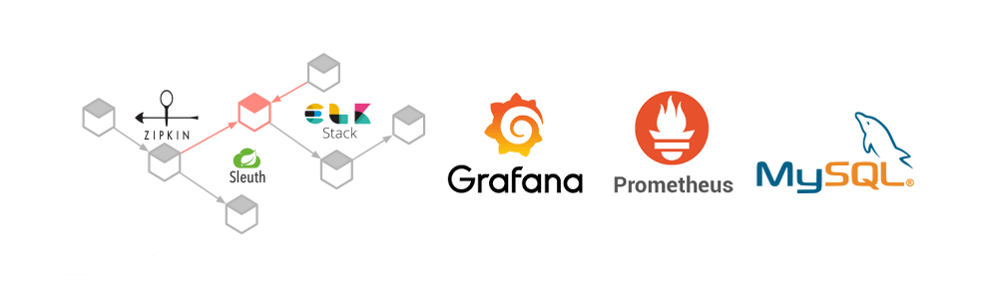

> NOTE: If you want to be more fast goto step by step in this documentation
> <a href="#step-by-step">Step by Step</a>

## 🔖 Component Versions

| Component        | Version   |
|------------------|-----------|
| OpenTelemetry    | 0.118.0   |
| Prometheus       | v3.3.1    |
| Grafana          | 12.0.0    |
| Loki             | 3.2.0     |
| Tempo            | 2.7.2     |
| OpenSearch       | 2.15.0    |
| Jaeger           | 1.69.0    |
| Zipkin           | 3.5.1     |
| Elasticsearch    | 7.9.2     |
| Logstash         | 7.9.2     |
| Kibana           | 7.9.2     |
| Browser          | v25.04.1  |

Summary

- <a href="#information">Information</a>
- <a href="#resources">Resources</a>
- <a href="#quick-usage">Quick Usage</a>
- <a href="#project-purpose">Project Purpose</a>
- <a href="#environment">Environment</a>
- <a href="#samples-microservices-Java-Project">Samples Microservices (Java Project)</a>
- <a href="#configurations">Configurations</a>
- <a href="#grafana">Grafana</a>
- <a href="#prometheus">Prometheus</a>
- <a href="#logstash">Logstash</a>
- <a href="#step-by-step">Step by Step</a>
- <a href="#helper-and-references">Helper and References</a>

exporters for opentelemetry:
  azuremonitor
  dataset
  otelarrow
  splunk_hec
  tencentcloud_logservice
  awss3
  awsemf
  coralogix
  doris
  influxdb
  logicmonitor
  mezmo
  prometheusremotewrite
  otlphttp
  sapm
  file
  googlecloudpubsub
  logzio
  prometheus
  syslog
  elasticsearch
  alibabacloud_logservice
  awsxray
  cassandra
  opencensus
  opensearch
  signalfx
  nop
  otlp
  loki
  pulsar
  debug
  honeycombmarker
  kafka
  azuredataexplorer
  googlecloud
  googlemanagedprometheus
  sentry
  zipkin
  awscloudwatchlogs
  carbon
  clickhouse
  datadog
  loadbalancing
  rabbitmq
  sumologic
  awskinesis

# Information

 
 

Please use the branch selector to access others configurations for your needed and purposes

# Resources

 
 

- Stack Version (ELK) : 7.9.2
- Elasticsearch
- Kibana
- Logstash
- Zipkin
- Prometheus
- Grafana
- Mysql 5.7
- Mysql 8.0
- Java 8 or later
- Amazonlinux 2 (EC2)

> NOTE: 
> - Its highly recommended to use the same stack version to ELK  
> - Please see the .env file to more details

# Quick Usage

 
 

<pre>
user@host:/home/user$ git clone https://github.com/huntercodexs/docker-series.git .
user@host:/home/user$ cd docker-series
user@host:/home/user/docker-series$ git checkout elk_prometheus_grafana_zipkin_mysql_v1
user@host:/home/user/docker-series$ cd elk_prometheus_grafana_zipkin_mysql_v1
user@host:/home/user/docker-series/elk_prometheus_grafana_zipkin_mysql_v1$ docker network create elk_prometheus_grafana_zipkin_mysql_v1_open_network
user@host:/home/user/docker-series/elk_prometheus_grafana_zipkin_mysql_v1$ docker-compose up --build (in first time)
user@host:/home/user/docker-series/elk_prometheus_grafana_zipkin_mysql_v1$ [Ctrl+C]
user@host:/home/user/docker-series/elk_prometheus_grafana_zipkin_mysql_v1$ docker-compose start (in the next times)
user@host:/home/user/docker-series/elk_prometheus_grafana_zipkin_mysql_v1$ docker-compose ps (check the containers status)
</pre>

# Project Purpose

 
 

This project aims to offer a development environment with production concepts for managing microservices. In this case, 
an example project made in Java will be offered, but nothing prevents the environment from being used for other languages 
such as Python, PHP, among others.

Like any microservices architecture, your size is scalable and depend on demand and, therefore, since this can be
very large, we need to have effective monitoring and management tools. At this point we have to separate these needs by
scope and functionality.

Starting from the point where we need to manage our architecture and its resources, we need to separate the needs into
specific subjects and at least to ask the following questions:

- How we go make the monitoring via log
- How we go make the monitoring of hardware resources
- How we go make the monitoring the health of applications

Therefore, we are aware that the environment must offer resources or tools that facilitate this work which actually 
refers more to DevOps than development itself. In situations like this we can then work with the tools presented here, 
namely: Zipkin, Prometheus, ELK and Grafana, being separated in the following topics:

- Log Monitoring
    - Elasticsearch
    - Logstash
    - Kibana

- Hardware Monitoring
    - Prometheus
    - Grafana

- Health Monitoring
    - Zipkin
    - Prometheus
    - Eureka Service Discovery

A flow diagram is presented below to illustrate this entire environment, notice how the tools are connected
between themselves and how they communicate for a well-controlled and stable environment.

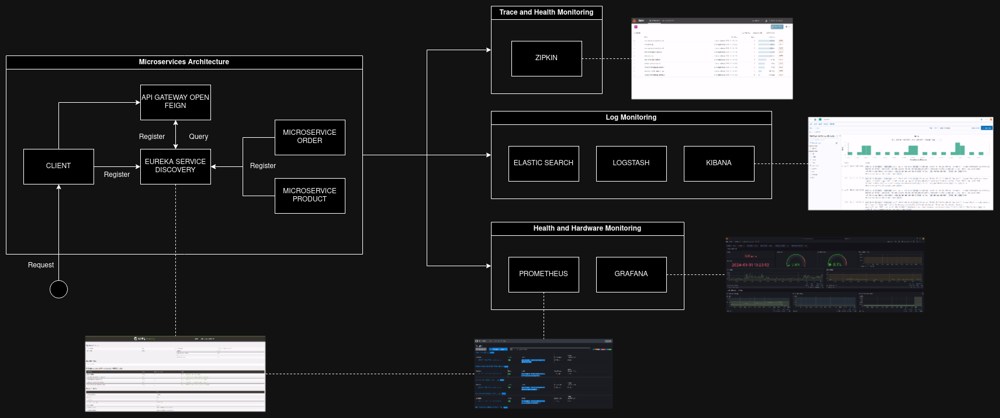

#  Environment

 
 

To simulate the Java microservices environment will be used one container for each service by amazonlinux 2 (EC2), the 
EC2-AWS machine, witch will be used to run the applications/microservices previously generated from each Java project, 
to be more clear and direct we are talking about the jar files. 

Only as an example will be presented and inserted in this project/repository 5 containers to exemplify how to work 
the environment "ELK + PROMETHEUS + GRAFANA + ZIPKIN + MYSQL" in the practice. These containers are Amazonlinux 2, and 
have a single and exclusive functionality to demonstrate a possible situation to use it.

Each Java project will be executed inside each container, which are listed below:

- ec2-service-discovery: EC2 Service Discovery
- ec2-api-gateway: EC2 Api Gateway
- ec2-client: EC2 Client
- ec2-microservice-order: EC2 Microservice Order
- ec2-microservice-product: EC2 Microservice Product

All the microservices will be registered in the Eureka as showed in the image below

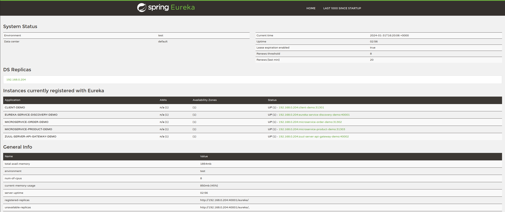

> IMPORTANT NOTE: 
> Each one of these EC2 machines (Amazonlinux 2) were added in the docker-compose.yml file, being each one a docker
> container, which in turn will run the jar files, that was previously generated and are already to run. Just for get 
> more organized and separate the repositories/projects, these java projects should be got in the GitHub repository
> https://github.com/huntercodexs/elk-prometheus-grafana-zipkin-demo, after that, compiled, built-in and deployed inside 
> each folder refer to each microservice. These folder can be viewed in the path ec2/app/{java-project-name}

#  Samples Microservices (Java Project)

 
 

Another important point for running and testing the environment of this project is to have an adequate set of services in
Java to demonstrate how it all works. To facilitate and speed up the learning process about how to operate
of this project I afford the repository https://github.com/huntercodexs/elk-prometheus-grafana-zipkin-demo which contains a
set of microservices to simulate the environment. This repository offers the following features:

- Eureka Server
- Eureka Client
- Zuul Server (Open Feign)
- Zuul Client
- Zipkin
- Logback Core
- Prometheus
- Mysql Connector
- JPA
- Hibernate

> NOTE: 
> All microservices need to be correctly configured in the log4j2.xml and application.properties files

# Configurations

 
 

To use this environment correctly, you must follow the rules below:

- Have a microservices environment in Java
- Use Netflix's EUREKA SERVICE DISCOVERY
- Use Netflix ZUUL API GATEWAY (Open Feign), there are two versions of the GATEWAY API, one with routes in the 
properties file and another through a client
- Have services registered in service discovery correctly
- Know the exact location where the EUREKA service discovery log is being generated, as it will be used 
to extract the details of each service registered in service discovery
- Use the correct settings for the properties file in the JAVA project
- Use the correct settings for the xml log file in the JAVA project

> IMPORTANT NOTE:
> Before running this project, make sure to place each one in the folders 
> 
> - elk_prometheus_grafana_zipkin_mysql_v1/ec2/app/api-gateway 
> - elk_prometheus_grafana_zipkin_mysql_v1/ec2/app/client 
> - elk_prometheus_grafana_zipkin_mysql_v1/ec2/app/microservice-order 
> - elk_prometheus_grafana_zipkin_mysql_v1/ec2/app/microservice-product 
> - elk_prometheus_grafana_zipkin_mysql_v1/ec2/app/service-discovery 
> 
> For each jar files generated from the project https://github.com/huntercodexs/elk-prometheus-grafana-zipkin-demo

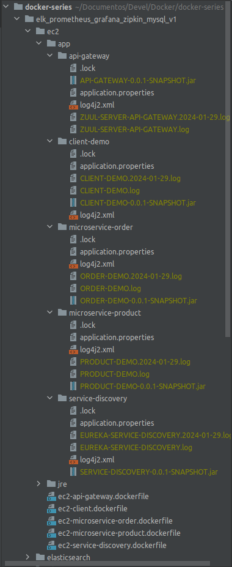

- To generate the jar files using IntelliJ IDE, follow the instructions below

1) File -> Project Structure -> Project Settings -> Artifacts -> Click in the "+" -> Jar -> From modules with dependencies... > select the main class > click Apply button
2) Once the artifact is configured, go to Build > Build Artifact > Build

- To generate the jar file in the IntelliJ IDE using Maven, following the image below

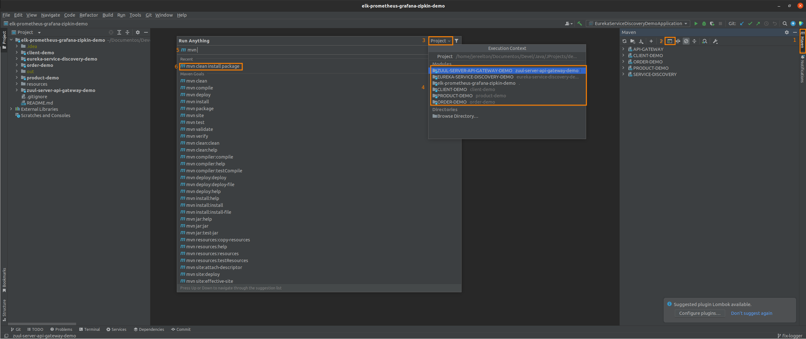

Below are the main configurations that should be made in this project to correctly usage

- Java Projects - application.properties

Each application has your own configuration, so you need pay attention in this point with more careful, however, follow 
below a simple example for one application called microservice-order that can be used as a parameter to others case.

All the configuration are very important, but the EUREKA SERVICE DISCOVERY has one delicate configuration that should be 
made with pretty attention. We are telling about the line "eureka.instance.instance-id", this line is very important 
because it says to EUREKA that the services will be registered using IP:APPLICATION-NAME:PORT, and this data will be 
used by Prometheus in another time to export and check the services health and performance, hence have an extremely 
careful with this.

<pre>
#-----------------------------------------------------------------------------------------------------------------------
# APPLICATION SERVER
#-----------------------------------------------------------------------------------------------------------------------
server.port=31302
api.prefix=
spring.main.allow-bean-definition-overriding=true
spring.application.name=microservice-order-demo

#-----------------------------------------------------------------------------------------------------------------------
# LOG
#-----------------------------------------------------------------------------------------------------------------------
logging.config=/home/ec2/app/log4j2.xml

#-----------------------------------------------------------------------------------------------------------------------
# DATABASE
#-----------------------------------------------------------------------------------------------------------------------
spring.datasource.url=jdbc:mysql://192.168.0.204:3606/elk-prometheus-grafana-zipkin-demo?useTimezone=true&serverTimezone=UTC&useSSL=false
spring.jpa.hibernate.ddl-auto=update
spring.jpa.database-platform=org.hibernate.dialect.MySQL5Dialect
spring.jpa.show-sql=true
spring.datasource.username=root
spring.datasource.password=root123
spring.datasource.driver-class-name=com.mysql.jdbc.Driver
spring.jpa.hibernate.naming.implicit-strategy=org.hibernate.boot.model.naming.ImplicitNamingStrategyLegacyJpaImpl
spring.jpa.hibernate.naming.physical-strategy=org.hibernate.boot.model.naming.PhysicalNamingStrategyStandardImpl
spring.jpa.properties.hibernate.id.new_generator_mappings=false
spring.datasource.hikari.maximum-pool-size=3

#-----------------------------------------------------------------------------------------------------------------------
# EUREKA
#-----------------------------------------------------------------------------------------------------------------------
eureka.instance.hostname=192.168.0.204
eureka.client.serviceUrl.defaultZone=http://${eureka.instance.hostname}:40001/eureka/
#eureka.instance.instance-id=${spring.application.name}:${random.int}
eureka.instance.instance-id=${eureka.instance.hostname}:${spring.application.name}:${server.port}
eureka.instance.preferIpAddress=true
eureka.client.registerWithEureka=true
#eureka.instance.lease-renewal-interval-in-seconds=15
#eureka.instance.lease-expiration-duration-in-seconds=45
eureka.instance.health-check-url-path=/actuator/health
eureka.client.fetchRegistry=true
eureka.client.registryFetchIntervalSeconds=15
eureka.server.response-cache-update-interval-ms=5000

#-----------------------------------------------------------------------------------------------------------------------
# PROMETHEUS
#-----------------------------------------------------------------------------------------------------------------------
management.endpoint.metrics.enabled=true
management.endpoints.web.exposure.include=*
management.endpoint.prometheus.enabled=true
management.metrics.export.prometheus.enabled=true

#-----------------------------------------------------------------------------------------------------------------------
# LOGSTASH
#-----------------------------------------------------------------------------------------------------------------------
logstash.host=192.168.0.204
logstash.port=5000
logstash.queue-size=512

#-----------------------------------------------------------------------------------------------------------------------
# ZIPKIN/SLEUTH
#-----------------------------------------------------------------------------------------------------------------------
spring.zipkin.baseUrl=http://192.168.0.204:9411/
spring.sleuth.sampler.percentage=1.0
spring.sleuth.sampler.probability=1.0
spring.sleuth.traceId128=true
# Adds trace and span IDs to logs (when a trace is in progress)
logging.level.org.springframework.web=INFO
logging.level.org.springframework.web.servlet.DispatcherServlet=INFO
logging.pattern.level=[%X{traceId}/%X{spanId}] %-5p [%t] %C{2} - %m%n
# Propagates a field named 'user_name' downstream
# Note: In sleuth 3.x it is spring.sleuth.baggage.remote-fields=user_name
spring.sleuth.propagation-keys=user_name
</pre>

- Prometheus 

***About prometheus.yml***

The prometheus configuration is showed below just for one application/microservice, look that this single configuration 
can be applied to more others cases included more than one application. What should be changed in another case is 
job_name and files (target.json), we can understand that this configuration is pretty simple and there is not much to 
say about that.

<pre>
scrape_configs:

  - job_name: 'client-demo'
    scrape_interval: 2s
    metrics_path: "/actuator/prometheus"
    file_sd_configs:
    - files:
      - /home/prometheus/targets/client-demo.json
</pre>

However, we need to explain that exists one script called targets-export.sh witch make it easier when we need to export 
targets from EUREKA SERVICE DISCOVERY log. This script is placed in the following path:

<pre>
elk_prometheus_grafana_zipkin_mysql_v1/prometheus/script/targets-export.sh
</pre>

Give a look in the section <a href="#prometheus"># Prometheus</a> to see how to use this script.

***About targets.json***

This configuration is a complement for prometheus.yml that is accessible to it in the files field. When we use the 
script targets-export.sh to generate automatically the prometheus.yml file, the targets.json file will be generated as 
well, and each target.json will have the name according the application registered in the EUREKA SERVICE DISCOVERY log.

<pre>
[
	{
 		"targets": ["192.168.0.204:31301"],
 		"labels": {
 			"env": "development",
 			"job": "job-client-demo"
 		}
 	}
]
</pre>

To be more clear, when we have in the EUREKA SERVICE DISCOVERY log one register like this
<pre>
Registered instance MICROSERVICE-DEMO/192.168.0.204:microservice-demo:31315 with status UP (replication=true)
</pre>

The target.json will be named as microservice-demo.json, and the content inside it will be something like below

<pre>
[
	{
 		"targets": ["192.168.0.204:31315"],
 		"labels": {
 			"env": "development",
 			"job": "job-microservice-demo"
 		}
 	}
]
</pre>

and prometheus.yml will be configured in the follow way

<pre>
scrape_configs:

  - job_name: 'microservice-demo'
    scrape_interval: 2s
    metrics_path: "/actuator/prometheus"
    file_sd_configs:
    - files:
      - /home/prometheus/targets/microservice-demo.json
</pre>

When Prometheus has correctly configurations it will be present for us one dashboard look like this

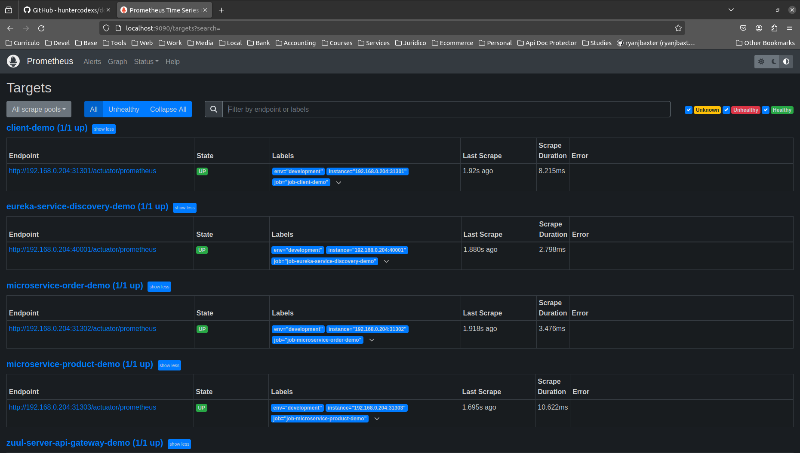

- Logstash - logstash.yml

The yml configuration It's pretty simple and don't need to be more explained and detailed, just have attention when you 
changed any configuration.

- Logstash - pipelineio.conf

This file is very important, and you can not make confusing or mistakes with it. The most important field in that file 
is the field index, witch should be equal to the index that will be created in the Kibana (ELK). In the configuration 
bellow all data that was received through the tcp port 5000 and http as well will be sent to output elasticsearch in all 
index previously created in the Kibana.

<pre>
input {
    tcp {
        port => 5000
    }

    http {

    }
}

output {
    elasticsearch {
        hosts => "${ELASTICSEARCH_HOST}"
        index => "tcp-elk_prometheus_grafana_zipkin_mysql_v1_demo"
        user => "${ELASTIC_USERNAME}"
        password => "${ELASTIC_PASSWORD}"
    }

    elasticsearch {
        hosts => "${ELASTICSEARCH_HOST}"
        index => "http-elk_prometheus_grafana_zipkin_mysql_v1_demo"
        user => "${ELASTIC_USERNAME}"
        password => "${ELASTIC_PASSWORD}"
    }

    elasticsearch {
        hosts => "${ELASTICSEARCH_HOST}"
        index => "postman-elk_prometheus_grafana_zipkin_mysql_v1_demo"
        user => "${ELASTIC_USERNAME}"
        password => "${ELASTIC_PASSWORD}"
    }
}
</pre>

- Kibana - Index Management

To set up Kibana, just give a look in the .env file and the yml file to kibana.yml.

In the Kibana execute the following steps 

- create an index in kibana at http://localhost:5601/app/management/kibana/indexPatterns/create
- put the name of the index in the input text box
  - click on Next step
    - select a value in "Time field"
      - click on Create index pattern (if necessary, it is possible to configure the index as the default)

# Grafana

 
 

After creating the entire environment, we can connect grafana to prometheus according to the information below

Dashboards

- Connect Grafana to Prometheus

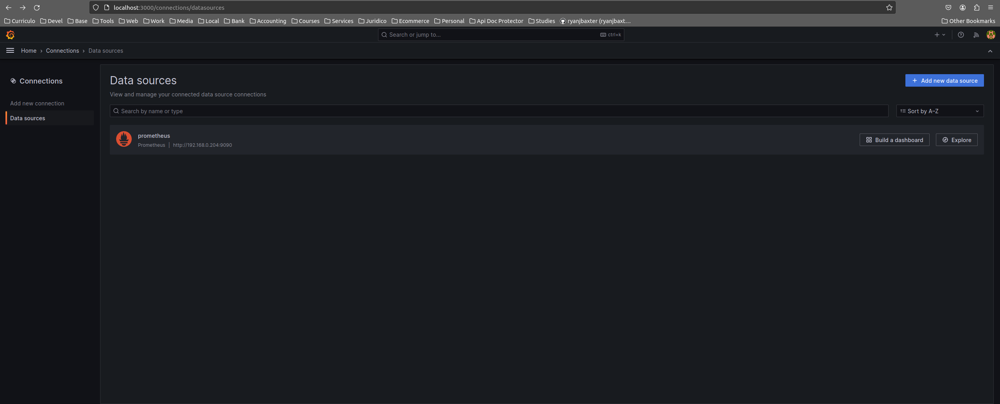

- Connect Grafana to Prometheus using the Spring Boot Statistics plugin

Get the plugin ID from the Grafana website at the following link https://grafana.com/grafana/dashboards/6756-spring-boot-statistics/.
Insert the dashboard ID into Grafana in Dashboard->import

Result (ID: 6756)

# Prometheus

 
 

There is one script named targets-export.sh to data export from EUREKA SERVICE DISCOVERY. This script only export 
microservices from Eureka Service Discovery Log, it means say that all microservices and only these microservices 
registered in the Eureka will be exported from the current log produced by Eureka. Therefore, you need to inform the 
current and correct path to Eureka Service where all microservices have been registered.

- Log record that will be sought in the log look like something like that:
<pre>
Registered instance NEW-MICROSERVICE-DEMO/192.168.0.204:new-microservice-demo:31315 with status UP (replication=true)
</pre>

- How to execute:
<pre>
user@host:/home/user/docker-series/elk_prometheus_grafana_zipkin_mysql_v1$ ./targets-export.sh /home/user/logs/EUREKA-SERVICE-DISCOVERY.log /home/prometheus/targets/ [--reload: optional]
</pre>

- Reload Prometheus YML Configurations (SIGHUP):
<pre>
pgrep prometheus -> 1
kill -HUP 1
</pre>

- You can use the script prometheus-reload.sh to make it more easily:

1- Export targets to prometheus without reload prometheus: 
<pre>
user@host:/home/user/docker-series/elk_prometheus_grafana_zipkin_mysql_v1$ ./targets-export.sh /home/user/logs/EUREKA-SERVICE-DISCOVERY.log /home/prometheus/targets/
</pre>

2- Export targets to prometheus with reload prometheus (recommended): 
<pre>
user@host:/home/user/docker-series/elk_prometheus_grafana_zipkin_mysql_v1$ ./targets-export.sh /home/user/logs/EUREKA-SERVICE-DISCOVERY.log /home/prometheus/targets/ --reload
</pre>

# Logstash

 
 

- Useful Links
  - http://localhost:5601/app/home#/
  - http://localhost:5601/app/management/
  - http://localhost:5601/app/management/kibana/indexPatterns/
  - http://localhost:5601/app/management/kibana/indexPatterns/create

The following steps must be performed to achieve a satisfactory result when using ELK

- check if it is necessary to delete kibana indexes
- configure logstash pipelineio.conf
- run the docker-compose up --build logstash command (the indexes will be pushed automatically in kibana)
<pre>
logstash          | [2024-01-29T00:03:24,299][INFO ][logstash.javapipeline    ][.monitoring-logstash] Pipeline Java execution initialization time {"seconds"=>0.55}
logstash          | [2024-01-29T00:03:24,342][INFO ][logstash.javapipeline    ][.monitoring-logstash] Pipeline started {"pipeline.id"=>".monitoring-logstash"}
logstash          | [2024-01-29T00:03:24,373][INFO ][logstash.javapipeline    ][main] Pipeline Java execution initialization time {"seconds"=>0.61}
logstash          | [2024-01-29T00:03:24,521][INFO ][logstash.javapipeline    ][main] Pipeline started {"pipeline.id"=>"main"}
logstash          | [2024-01-29T00:03:24,527][INFO ][logstash.inputs.http     ][main][ccb448981609b2f871d0e355d2ef5059aac13af82f623e7d3f2a8b9d0fdfc3e7] Starting http input listener {:address=>"0.0.0.0:8080", :ssl=>"false"}
logstash          | [2024-01-29T00:03:24,528][INFO ][logstash.inputs.tcp      ][main][ed9ed8f66d0cdf852b2df787cac8694d32f71b9d340b0b7b822994b97c3d35b8] Starting tcp input listener {:address=>"0.0.0.0:5000", :ssl_enable=>"false"}
logstash          | [2024-01-29T00:03:24,584][INFO ][logstash.agent           ] Pipelines running {:count=>2, :running_pipelines=>[:".monitoring-logstash", :main], :non_running_pipelines=>[]}
logstash          | [2024-01-29T00:03:24,765][INFO ][logstash.agent           ] Successfully started Logstash API endpoint {:port=>9600}
</pre>
- create an index in kibana at http://localhost:5601/app/management/kibana/indexPatterns/create
- put the name of the index in the input text box
  - click on Next step
    - select a value in "Time field"
      - click on Create index pattern (if necessary, it is possible to configure an index as the default)
- execute request in postman to the url http://localhost:31301/client-demo/orders
  - the endpoint is within a microservice previously configured to communicate with logstash via config
- check log status in kibana at
  - http://localhost:5601/app/discover
- select the index on the left side of the screen and analyze the log
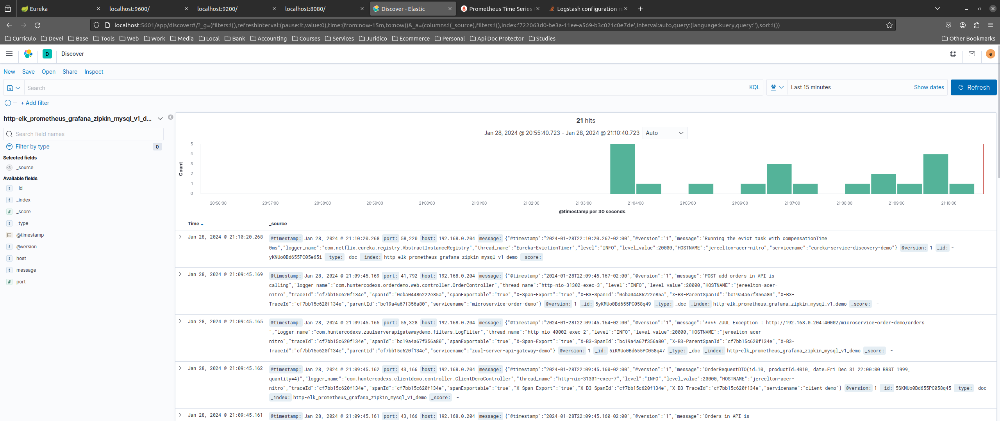
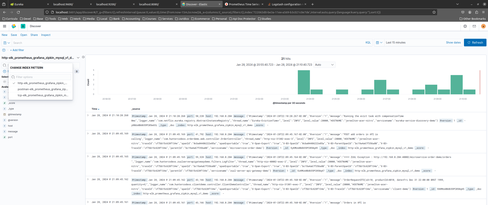
- use dev tools to analyze logs at http://localhost:5601/app/dev_tools#/console, as per the examples below

<pre>
GET _search
{
  "query": {
    "match_all": {}
  }
}

GET tcp-elk_prometheus_grafana_zipkin_mysql_v1_demo/_search
{
  "query": {
    "match": {
      "message": "POST add orders in API is calling"
    }
  }
}

GET tcp-elk_prometheus_grafana_zipkin_mysql_v1_demo/_search
{
  "query": {
    "match": {
      "message": "OrderRequestDTO"
    }
  }
}

GET http-elk_prometheus_grafana_zipkin_mysql_v1_demo/_search
{
  "query": {
    "match": {
      "message": "POST add orders in API is calling"
    }
  }
}

GET tcp-elk_prometheus_grafana_zipkin_mysql_v1_demo/_search
{
  "query": {
    "match": {
      "message": "OrderRequestDTO"
    }
  }
}
</pre>
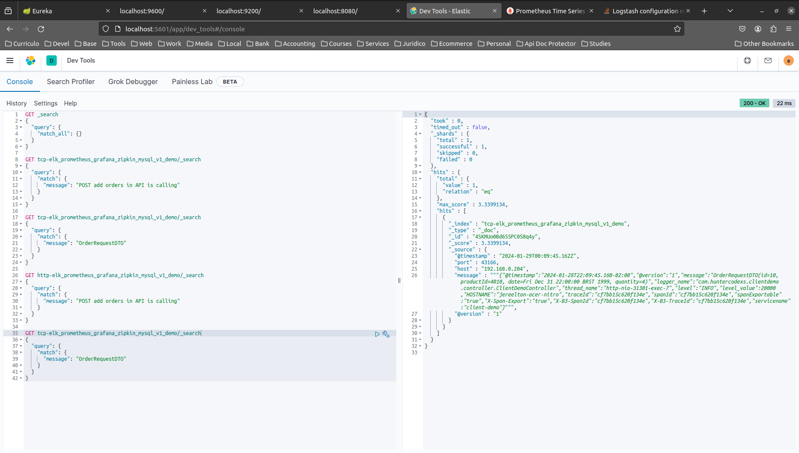

- if it is necessary to change the logstash pipeline settings, you must restart the service as follows
<pre>
user@host:/home/user/docker-series/elk_prometheus_grafana_zipkin_mysql_v1$ docker exec -it logstash /bin/bash

bash-4.2$ ps -ef
UID          PID    PPID  C STIME TTY          TIME CMD
logstash       1       0  5 21:17 ?        00:02:49 /bin/java -Xms1g -Xmx1g -XX:+UseConcMarkSweepGC -XX:CMSInitiatingOccupancyFraction=75 -XX:+UseCMSInitiatingOccupancyOnly -Djava.awt.headless=true -Dfile.encoding=UTF-8 -Djruby.compile.invokedynamic=true -Djruby.jit.threshold=0 -Dj
logstash     302       0  0 22:10 pts/0    00:00:00 /bin/bash
logstash     308     302  0 22:10 pts/0    00:00:00 ps -ef

bash-4.2$ kill -HUP 1 (isso reinicia o serviço logstash automaticamente)
</pre>

or simply use the logstash-reload.sh script that is inside the logstash container in /home/logstash which can be
run with the following command

<pre>
user@host:/home/user/docker-series/elk_prometheus_grafana_zipkin_mysql_v1$ docker exec -it logstash sh /home/logstash/logstash-reload.sh 
</pre>

# Step by Step

 
 

Follow the steps below to quick and easy environment creation

1- Clone the repository
<pre>
user@host:/home/user$ git clone https://github.com/huntercodexs/docker-series.git .
</pre>

2- Access the repository folder
<pre>
user@host:/home/user$ cd docker-series.git
</pre>

3- Change the current branch
<pre>
user@host:/home/user/docker-series$ git checkout elk_prometheus_grafana_zipkin_mysql_v1
</pre>

4- Access the elk_prometheus_grafana_zipkin_mysql_v1 folder
<pre>
user@host:/home/user/docker-series$ cd elk_prometheus_grafana_zipkin_mysql_v1
</pre>

5- Check and set up the .env file, also check and edit the files YML and pipelineio.conf
<pre>
elk_prometheus_grafana_zipkin_mysql_v1/elasticsearch/config/elasticsearch.yml
elk_prometheus_grafana_zipkin_mysql_v1/kibana/config/kibana.yml
elk_prometheus_grafana_zipkin_mysql_v1/logstash/config/logstash.yml
elk_prometheus_grafana_zipkin_mysql_v1/logstash/pipeline/pipelineio.conf
elk_prometheus_grafana_zipkin_mysql_v1/prometheus/prometheus.yml
</pre>

6- Also check and configure the applications.properties, log4j2.xml for each java application.

> IMPORTANT NOTE:  
> Check this documentation information above to get more details about it.

<pre>
elk_prometheus_grafana_zipkin_mysql_v1/ec2/app/api-gateway/log4j2.xml
elk_prometheus_grafana_zipkin_mysql_v1/ec2/app/api-gateway/application.properties

elk_prometheus_grafana_zipkin_mysql_v1/ec2/app/client/log4j2.xml
elk_prometheus_grafana_zipkin_mysql_v1/ec2/app/client/application.properties

elk_prometheus_grafana_zipkin_mysql_v1/ec2/app/microservice-order/log4j2.xml
elk_prometheus_grafana_zipkin_mysql_v1/ec2/app/microservice-order/application.properties

elk_prometheus_grafana_zipkin_mysql_v1/ec2/app/microservice-product/log4j2.xml
elk_prometheus_grafana_zipkin_mysql_v1/ec2/app/microservice-product/application.properties

elk_prometheus_grafana_zipkin_mysql_v1/ec2/app/service-discovery/log4j2.xml
elk_prometheus_grafana_zipkin_mysql_v1/ec2/app/service-discovery/application.properties
</pre>

7- Generate the runnable jar files and put each one in the refer folder path

> TIP: 
> If you don't know how to make it, please check the section <a href="#configurations">Configurations</a>

<pre>
elk_prometheus_grafana_zipkin_mysql_v1/ec2/app/api-gateway/API-GATEWAY-0.0.1-SNAPSHOT.jar
elk_prometheus_grafana_zipkin_mysql_v1/ec2/app/client/CLIENT-DEMO-0.0.1-SNAPSHOT.jar
elk_prometheus_grafana_zipkin_mysql_v1/ec2/app/microservice-order/ORDER-DEMO-0.0.1-SNAPSHOT.jar
elk_prometheus_grafana_zipkin_mysql_v1/ec2/app/microservice-product/PRODUCT-DEMO-0.0.1-SNAPSHOT.jar
elk_prometheus_grafana_zipkin_mysql_v1/ec2/app/service-discovery/EUREKA-SERVICE-DISCOVERY-0.0.1-SNAPSHOT.jar
</pre>

8- Build the containers

<pre>    
user@host:/home/user/docker-series/elk_prometheus_grafana_zipkin_mysql_v1$ docker network create elk_prometheus_grafana_zipkin_mysql_v1_open_network
user@host:/home/user/docker-series/elk_prometheus_grafana_zipkin_mysql_v1$ docker-compose up --build
user@host:/home/user/docker-series/elk_prometheus_grafana_zipkin_mysql_v1$ [Ctrl+C]
user@host:/home/user/docker-series/elk_prometheus_grafana_zipkin_mysql_v1$ docker-compose start
</pre>

> NOTE: 
> Hold on the complete docker-compose up --build is finished and make sure that the result look like this

<pre>
ec2-service-discovery       | 2024-02-01 12:20:30.411 [/] INFO  [Eureka-EvictionTimer] c.n.e.r.AbstractInstanceRegistry$EvictionTask - Running the evict task with compensationTime 0ms
ec2-service-discovery       |  1 --- [a-EvictionTimer] c.n.e.registry.AbstractInstanceRegistry  : Running the evict task with compensationTime 0ms
ec2-service-discovery       | 2024-02-01 12:21:30.411 [/] INFO  [Eureka-EvictionTimer] c.n.e.r.AbstractInstanceRegistry$EvictionTask - Running the evict task with compensationTime 0ms
ec2-service-discovery       |  1 --- [a-EvictionTimer] c.n.e.registry.AbstractInstanceRegistry  : Running the evict task with compensationTime 0ms
ec2-service-discovery       | 2024-02-01 12:22:30.411 [/] INFO  [Eureka-EvictionTimer] c.n.e.r.AbstractInstanceRegistry$EvictionTask - Running the evict task with compensationTime 0ms
ec2-service-discovery       |  1 --- [a-EvictionTimer] c.n.e.registry.AbstractInstanceRegistry  : Running the evict task with compensationTime 0ms
ec2-service-discovery       | 2024-02-01 12:23:30.411 [/] INFO  [Eureka-EvictionTimer] c.n.e.r.AbstractInstanceRegistry$EvictionTask - Running the evict task with compensationTime 0ms
ec2-service-discovery       |  1 --- [a-EvictionTimer] c.n.e.registry.AbstractInstanceRegistry  : Running the evict task with compensationTime 0ms
grafana                     | INFO [02-01|12:24:15] Database locked, sleeping then retrying  logger=sqlstore.transactions error="database is locked" retry=0 code="database is locked"
ec2-service-discovery       | 2024-02-01 12:24:30.411 [/] INFO  [Eureka-EvictionTimer] c.n.e.r.AbstractInstanceRegistry$EvictionTask - Running the evict task with compensationTime 0ms
ec2-service-discovery       |  1 --- [a-EvictionTimer] c.n.e.registry.AbstractInstanceRegistry  : Running the evict task with compensationTime 0ms
ec2-service-discovery       | 2024-02-01 12:24:55.812 [/] INFO  [AsyncResolver-bootstrap-executor-0] c.n.d.s.r.a.ConfigClusterResolver - Resolving eureka endpoints via configuration
ec2-service-discovery       |  1 --- [trap-executor-0] c.n.d.s.r.aws.ConfigClusterResolver      : Resolving eureka endpoints via configuration
ec2-service-discovery       | 2024-02-01 12:24:58.380 [/] INFO  [ReplicaAwareInstanceRegistry - RenewalThresholdUpdater] c.n.e.r.PeerAwareInstanceRegistryImpl - Current renewal threshold is : 5
ec2-service-discovery       |  1 --- [hresholdUpdater] c.n.e.r.PeerAwareInstanceRegistryImpl    : Current renewal threshold is : 5
ec2-client                  | 2024-02-01 12:24:59.098 [/] INFO  [AsyncResolver-bootstrap-executor-0] c.n.d.s.r.a.ConfigClusterResolver - Resolving eureka endpoints via configuration
ec2-client                  |  1 --- [trap-executor-0] c.n.d.s.r.aws.ConfigClusterResolver      : Resolving eureka endpoints via configuration
ec2-api-gateway             | 2024-02-01 12:25:00.956 [/] INFO  [AsyncResolver-bootstrap-executor-0] c.n.d.s.r.a.ConfigClusterResolver - Resolving eureka endpoints via configuration
ec2-api-gateway             |  1 --- [trap-executor-0] c.n.d.s.r.aws.ConfigClusterResolver      : Resolving eureka endpoints via configuration
</pre>

Check the status from containers

<pre>
user@host:/home/user/docker-series/elk_prometheus_grafana_zipkin_mysql_v1$ docker-compose ps
          Name                        Command                       State                                                                                                           Ports                                                                                                 
------------------------------------------------------------------------------------------------------------------------------------------------------------------------------------------------------------------------------------------------------------------------------------------
ec2-api-gateway            /usr/bin/java -jar /home/e ...   Up                      0.0.0.0:40002->40002/tcp,:::40002->40002/tcp, 0.0.0.0:40003->40003/tcp,:::40003->40003/tcp, 8080/tcp, 8081/tcp, 8765/tcp                                                                              
ec2-client                 /usr/bin/java -jar /home/e ...   Up                      0.0.0.0:31301->31301/tcp,:::31301->31301/tcp, 8080/tcp                                                                                                                                                
ec2-microservice-order     /usr/bin/java -jar /home/e ...   Up                      0.0.0.0:31302->31302/tcp,:::31302->31302/tcp, 8080/tcp                                                                                                                                                
ec2-microservice-product   /usr/bin/java -jar /home/e ...   Up                      0.0.0.0:31303->31303/tcp,:::31303->31303/tcp, 8080/tcp                                                                                                                                                
ec2-service-discovery      /usr/bin/java -jar /home/e ...   Up                      0.0.0.0:40001->40001/tcp,:::40001->40001/tcp, 8080/tcp, 8761/tcp                                                                                                                                      
elasticsearch              /tini -- /usr/local/bin/do ...   Up                      0.0.0.0:9200->9200/tcp,:::9200->9200/tcp, 0.0.0.0:9300->9300/tcp,:::9300->9300/tcp                                                                                                                    
grafana                    /run.sh                          Up                      0.0.0.0:3000->3000/tcp,:::3000->3000/tcp                                                                                                                                                              
grafana-ubuntu             /run.sh                          Up                      0.0.0.0:3001->3000/tcp,:::3001->3000/tcp                                                                                                                                                              
kibana                     /usr/local/bin/dumb-init - ...   Up                      0.0.0.0:5601->5601/tcp,:::5601->5601/tcp                                                                                                                                                              
logstash                   /usr/local/bin/docker-entr ...   Up                      0.0.0.0:5000->5000/tcp,:::5000->5000/tcp, 0.0.0.0:5000->5000/udp,:::5000->5000/udp, 0.0.0.0:5044->5044/tcp,:::5044->5044/tcp, 0.0.0.0:8080->8080/tcp,:::8080->8080/tcp,                               
                                                                                    0.0.0.0:9600->9600/tcp,:::9600->9600/tcp                                                                                                                                                              
mysql57                    docker-entrypoint.sh mysqld      Up                      0.0.0.0:3606->3306/tcp,:::3606->3306/tcp, 33060/tcp                                                                                                                                                   
mysql80                    docker-entrypoint.sh mysqld      Up                      0.0.0.0:3706->3306/tcp,:::3706->3306/tcp, 33060/tcp                                                                                                                                                   
prometheus                 /bin/prometheus --config.f ...   Up                      0.0.0.0:9090->9090/tcp,:::9090->9090/tcp                                                                                                                                                              
zipkin                     start-zipkin                     Up (health: starting)   9410/tcp, 0.0.0.0:9411->9411/tcp,:::9411->9411/tcp                                                                                                                                                    
</pre>

9- Export the microservices targets from EUREKA SERVICE DISCOVERY to Prometheus

> NOTE: 
> - This process is required to prometheus known about the microservices that are running
> - The first parameter say where is the log that belong to EUREKA
> - The second parameter refer to location inside prometheus container and is in according to docker-compose.yml configuration
> - The third parameter should be used if you want to reload the prometheus service with the currently or new information, it is highly recommended pass it in the parameters

<pre>
user@host:/home/user/docker-series/elk_prometheus_grafana_zipkin_mysql_v1$ cd prometheus/script/
user@host:/home/user/docker-series/elk_prometheus_grafana_zipkin_mysql_v1$ ./targets-export.sh /home/$USER/logs/EUREKA-SERVICE-DISCOVERY.log /home/prometheus/targets/ [--reload: optional]

#Real Example:
user@host:/home/user/docker-series/elk_prometheus_grafana_zipkin_mysql_v1$ ./targets-export.sh ~/Documentos/Devel/Docker/docker-series/elk_prometheus_grafana_zipkin_mysql_v1/ec2/app/service-discovery/EUREKA-SERVICE-DISCOVERY.log /home/prometheus/targets/ --reload
</pre>

10- Check and configure logstash

In this step, if you made any modification, or need to make any modification after build the container, you should be 
executed the script logstash-reload.sh to refresh the indexes and configurations from pipelineio.

<pre>
docker exec -it logstash sh /home/logstash/logstash-reload.sh
</pre>

11- Configure Kibana to listen logstash data request

> NOTE: 
> See this documentation above to get more details about it

To set up Kibana, just give a look in the .env file and the yml file to kibana.yml.

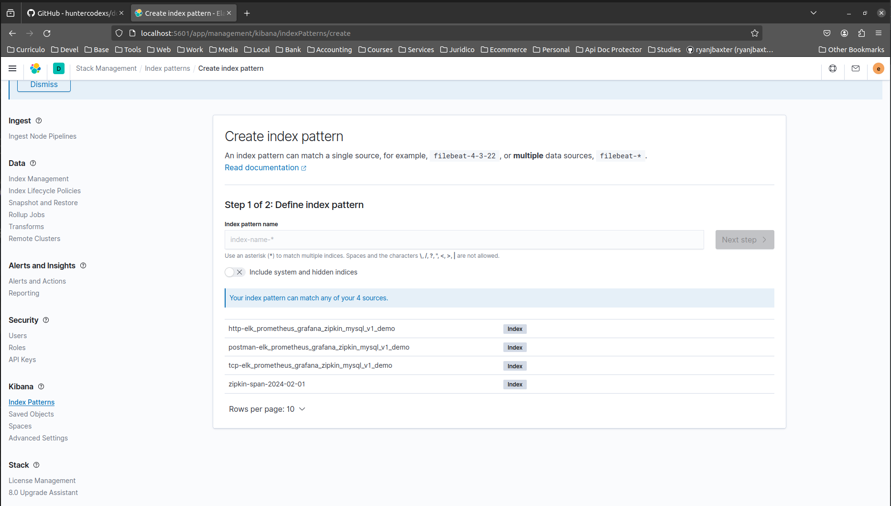

- create an index in kibana at http://localhost:5601/app/management/kibana/indexPatterns/create
- put the name of the index in the input text box
  - click on Next step
    - select a value in "Time field"
      - click on Create index pattern (if necessary, it is possible to configure an index as the default)
      - Follow the logs in the Kibana Discovery

12- Create Integration between Grafana and Prometheus

To do it, see the section <a href="#grafana">Grafana</a> in this documentation

13- Test the environment

13.1) Elasticsearch
<pre>
http://localhost:9200/
ELASTIC_USERNAME
ELASTIC_PASSWORD
</pre>

13.2) Logstash
<pre>
http://localhost:8080
</pre>

13.2.1) Indexes Logstash
<pre>
elk_prometheus_grafana_zipkin_mysql_v1/logstash/pipeline/pipelineio.conf
</pre>

13.3) Kibana
<pre>
http://localhost:5601/app/home#/
http://localhost:5601/app/dev_tools#/console
ELASTIC_USERNAME
ELASTIC_PASSWORD
</pre>

13.3.1) Create the index in Kibana (according logstash configuration - pipelineio.conf)
<pre>
http://localhost:5601/app/management/kibana/indexPatterns/create
</pre>

13.3.2) Check the log at Kibana Discover (the created index stay at left side of screen)
<pre>
http://localhost:5601/app/discover
</pre>

13.3.3) Sample Queries
<pre>
GET tcp-elk_prometheus_grafana_zipkin_mysql_v1_demo/_search
GET http-elk_prometheus_grafana_zipkin_mysql_v1_demo/_search
GET postman-tests-elk_prometheus_grafana_zipkin_mysql_v1_demo/_search
</pre>

13.4) Zipkin
<pre>
http://localhost:9411
</pre>

13.5) Prometheus
<pre>
http://localhost:9090
</pre>

13.5.1) Prometheus Settings (targets)

> NOTE: It is recommended use a specific tool or process to create dynamically the targets and then put the result
> in one json or yaml file, the manual process is not indicated

<pre>
elk_prometheus_grafana_zipkin_mysql_v1/prometheus/prometheus.yml
</pre>

13.6) Grafana
<pre>
http://localhost:3001/login
</pre>

13.7) Grafana Ubuntu
<pre>
http://localhost:3000/login
</pre>

13.8) Make one sample request using POSTMAN

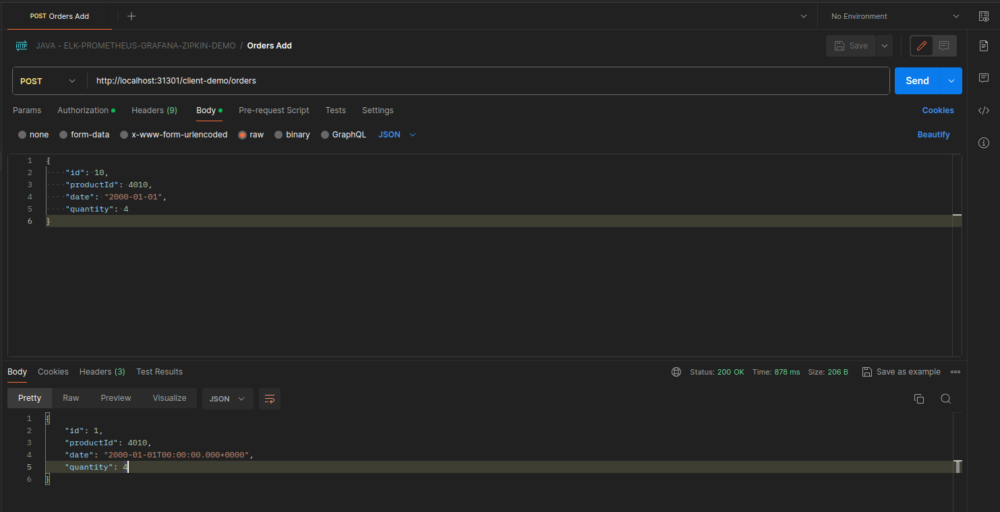

<pre>
POST http://localhost:31301/client-demo/orders
{
    "id": 1,
    "productId": 4001,
    "date": "2000-01-01",
    "quantity": 1
}
</pre>

See the logs in the Kibana to get details about that transaction/request

# Helper and References

 
 

Access zipkin container
<pre>
user@host:/home/user/docker-series/elk_prometheus_grafana_zipkin_mysql_v1$ docker exec -it zipkin sh
</pre>

Make a query in the Kibana Dashboard
<pre>
GET tcp-elk_prometheus_grafana_zipkin_mysql_v1_demo/_search

GET http-elk_prometheus_grafana_zipkin_mysql_v1_demo/_search

GET postman-tests-elk_prometheus_grafana_zipkin_mysql_v1_demo/_search
</pre>