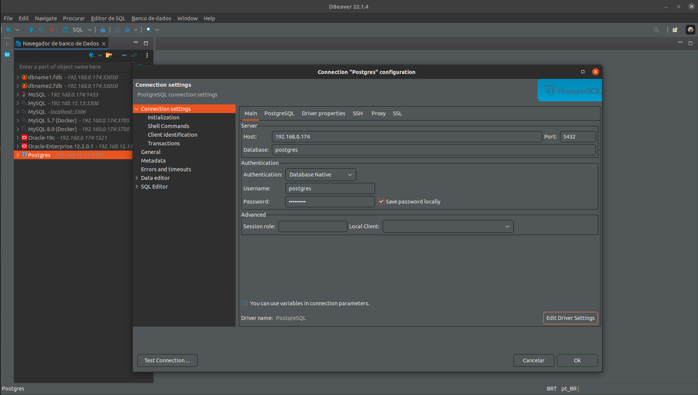

# JAVA + POSTGRES
Simple Environment to simulate a workflow

# Requisites

- Java 8
- Postgres

# How to use

Firstly get the project and checkout the correct branch

> NOTE: Check if folder postgres/PostgresSQL exists and is empty

<pre>
git clone https://github.com/huntercodexs/docker-series.git .
git checkout java_postgres
cd java_postgres
</pre>

Next make a builder to postgres database container

<pre>
docker-compose up --build postgres
</pre>

Output sample

<pre>
Starting postgres ... done
Attaching to postgres
postgres         | The files belonging to this database system will be owned by user "postgres".
postgres         | This user must also own the server process.
postgres         | 
postgres         | The database cluster will be initialized with locale "en_US.utf8".
postgres         | The default database encoding has accordingly been set to "UTF8".
postgres         | The default text search configuration will be set to "english".
postgres         | 
postgres         | Data page checksums are disabled.
postgres         | 
postgres         | fixing permissions on existing directory /var/lib/postgresql/data ... ok
postgres         | creating subdirectories ... ok
postgres         | selecting dynamic shared memory implementation ... posix
postgres         | selecting default max_connections ... 100
postgres         | selecting default shared_buffers ... 128MB
postgres         | selecting default time zone ... GMT
postgres         | creating configuration files ... ok
postgres         | running bootstrap script ... ok
postgres         | performing post-bootstrap initialization ... ok
postgres         | syncing data to disk ... ok
postgres         | 
postgres         | initdb: warning: enabling "trust" authentication for local connections
postgres         | initdb: hint: You can change this by editing pg_hba.conf or using the option -A, or --auth-local and --auth-host, the next time you run initdb.
postgres         | 
postgres         | Success. You can now start the database server using:
postgres         | 
postgres         |     pg_ctl -D /var/lib/postgresql/data -l logfile start
postgres         | 
postgres         | waiting for server to start....2023-02-13 01:22:28.814 GMT [49] LOG:  starting PostgreSQL 15.2 (Debian 15.2-1.pgdg110+1) on x86_64-pc-linux-gnu, compiled by gcc (Debian 10.2.1-6) 10.2.1 20210110, 64-bit
postgres         | 2023-02-13 01:22:28.815 GMT [49] LOG:  listening on Unix socket "/var/run/postgresql/.s.PGSQL.5432"
postgres         | 2023-02-13 01:22:28.819 GMT [52] LOG:  database system was shut down at 2023-02-13 01:22:28 GMT
postgres         | 2023-02-13 01:22:28.821 GMT [49] LOG:  database system is ready to accept connections
postgres         |  done
postgres         | server started
postgres         | 
postgres         | /usr/local/bin/docker-entrypoint.sh: ignoring /docker-entrypoint-initdb.d/*
postgres         | 
postgres         | waiting for server to shut down....2023-02-13 01:22:28.970 GMT [49] LOG:  received fast shutdown request
postgres         | 2023-02-13 01:22:28.971 GMT [49] LOG:  aborting any active transactions
postgres         | 2023-02-13 01:22:28.972 GMT [49] LOG:  background worker "logical replication launcher" (PID 55) exited with exit code 1
postgres         | 2023-02-13 01:22:28.973 GMT [50] LOG:  shutting down
postgres         | 2023-02-13 01:22:28.973 GMT [50] LOG:  checkpoint starting: shutdown immediate
postgres         | 2023-02-13 01:22:28.982 GMT [50] LOG:  checkpoint complete: wrote 3 buffers (0.0%); 0 WAL file(s) added, 0 removed, 0 recycled; write=0.003 s, sync=0.002 s, total=0.010 s; sync files=2, longest=0.001 s, average=0.001 s; distance=0 kB, estimate=0 kB
postgres         | 2023-02-13 01:22:28.989 GMT [49] LOG:  database system is shut down
postgres         |  done
postgres         | server stopped
postgres         | 
postgres         | PostgreSQL init process complete; ready for start up.
postgres         | 
postgres         | 2023-02-13 01:22:29.121 GMT [1] LOG:  starting PostgreSQL 15.2 (Debian 15.2-1.pgdg110+1) on x86_64-pc-linux-gnu, compiled by gcc (Debian 10.2.1-6) 10.2.1 20210110, 64-bit
postgres         | 2023-02-13 01:22:29.121 GMT [1] LOG:  listening on IPv4 address "0.0.0.0", port 5432
postgres         | 2023-02-13 01:22:29.121 GMT [1] LOG:  listening on IPv6 address "::", port 5432
postgres         | 2023-02-13 01:22:29.123 GMT [1] LOG:  listening on Unix socket "/var/run/postgresql/.s.PGSQL.5432"
postgres         | 2023-02-13 01:22:29.127 GMT [63] LOG:  database system was shut down at 2023-02-13 01:22:28 GMT
postgres         | 2023-02-13 01:22:29.132 GMT [1] LOG:  database system is ready to accept connections
</pre>

Make access in the postgres container

<pre>
user@ubuntu:$ Ctrl+C
user@ubuntu:$ docker-compose start postgres
user@ubuntu:$ docker exec -it postgres /bin/bash
user@host$ docker-compose ps
</pre>

Output sample

<pre>
  Name                Command              State                    Ports                  
-------------------------------------------------------------------------------------------
postgres   docker-entrypoint.sh postgres   Up      0.0.0.0:5432->5432/tcp,:::5432->5432/tcp
</pre>

Get the superuser postgres in CLI container postgres, and open the postgres database terminal:

<pre>
root@c63de647b32a:/# su - postgres
postgres@c63de647b32a:~$ psql 
psql (14.4 (Debian 14.4-1.pgdg110+1))
Type "help" for help.

postgres=# 
</pre>

- Create one user to manager the database:

<pre>
CREATE USER DEVEL SUPERUSER INHERIT CREATEDB CREATEROLE;
ALTER USER DEVEL PASSWORD '${POSTGRES_PASSWORD}';
</pre>

- List all users

<pre>
\du
</pre>

<pre>
postgres=# \du
                                   List of roles
 Role name |                         Attributes                         | Member of 
-----------+------------------------------------------------------------+-----------
 devel     | Superuser, Create role, Create DB                          | {}
 postgres  | Superuser, Create role, Create DB, Replication, Bypass RLS | {}
</pre>

- Create a table sample:

<pre>
CREATE TABLE customers (
    id serial NOT NULL,
    name VARCHAR(250) NOT NULL,
    email VARCHAR(250) NOT NULL,
    age INTEGER,
    PRIMARY KEY (id)
);

INSERT INTO customers (id, name, age) VALUES ('94734987', 'John Smith Wiz', 33);
INSERT INTO customers (id, name, age) VALUES ('12734983', 'Solange Smart Wow', 34);
SELECT * FROM customers;
</pre>

- Connect to postgres database with DBeaver

<pre>
Host: ${DATABASE_SERVER_ADDRESS}
Port: 5432
Database: postgres
Authentication: Database Native
Username: postgres
Password: ${POSTGRES_PASSWORD}
</pre>

Next make a builder to openjdk-8u212 (Before, checkout the "Run the sample projects")

<pre>
user@ubuntu:$ Ctrl+C
user@ubuntu:$ docker-compose stop
user@ubuntu:$ docker-compose up --build openjdk-8u212
user@ubuntu:$ Ctrl+C
</pre>

Finally, up both container with the following command

<pre>
docker-compose start
docker-compose ps
</pre>

Output sample

<pre>
    Name                   Command              State                      Ports                    
----------------------------------------------------------------------------------------------------
openjdk-8u212   bash                            Up      0.0.0.0:38001->38001/tcp,:::38001->38001/tcp
postgres        docker-entrypoint.sh postgres   Up      0.0.0.0:5432->5432/tcp,:::5432->5432/tcp
</pre>

# Run the sample projects

> Remember, the project is just to demonstration how work this project JAVA + POSTGRES

To run the sample projects contained in this project get the project files into folder sample-project, and follow the bellow:

- open each project in your prefer IDE
- run the "mvn package"
- take the generated jar file
- edit the application.properties file with the correct settings
- finally use the result files in the folder app

Application Properties Sample

<pre>
# APPLICATION SETTINGS
#-----------------------------------------------------------------------------------------------------------------------
server.port=38001
api.prefix=/api/v1
server.error.whitelabel.enabled=true
spring.main.allow-bean-definition-overriding=true

# SPRING JPA CONFIG
#-------------------------------------------------------------------------------------------------------------------
spring.datasource.url=jdbc:postgresql://192.168.0.174:5432/postgres
spring.datasource.username=postgres
spring.datasource.password=pgsql1Ipw
spring.jpa.hibernate.ddl-auto=update
spring.jpa.show-sql=true
spring.jpa.properties.hibernate.format_sql=true
spring.jpa.properties.hibernate.dialect=org.hibernate.dialect.PostgreSQL9Dialect
spring.jpa.properties.hibernate.temp.use_jdbc_metadata_defaults=false
</pre>

> TIPS: Use the "JAVA + POSTGRES.postman_collection.json" POSTMAN file to make tests

<pre>
./java_postgres/sample-project/java-postgres/JAVA + POSTGRES.postman_collection.json
</pre>

