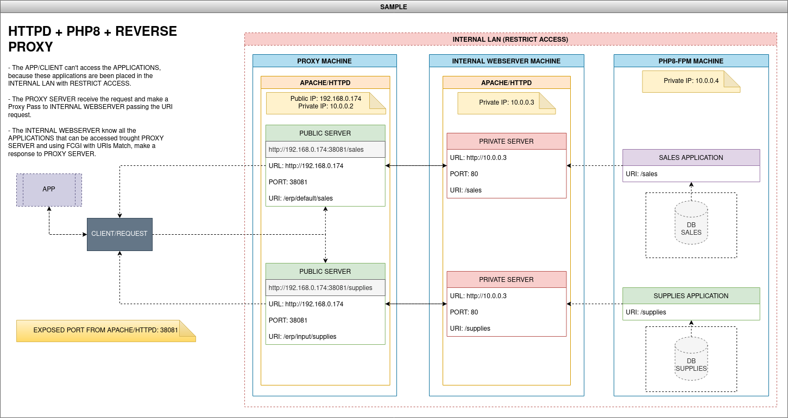

# HTTP + PHP8 + REVERSE-PROXY

To create a complete web environment using reverse proxy with apache2 

-------------

# Information

Please use the branch selection to access others containers and environments configurations

-------------

# Docker Configuration Contained

- HTTPD - 2.4.54 (Using Reverse Proxy)
- PHP8 - 8.1.0 (FPM)

-------------

# About

This branch set up the environment to run HTTPD (apache2) as Webserver with reverse proxy to contact PHP applications 
in the INTERNAL WEBSERVER folder path /var/www/webserver that are been placed in the INTERNAL LAN (RESTRICT ACCESS) trough 
PROXY SERVER.

Below can see the diagram that explain with more details this environment:

-------------

# Httpd Configurations

> Check the follow settings in the /usr/local/apache2/conf/httpd.conf to proxy server:

- Server Details
<pre>
ServerRoot "/usr/local/apache2"
Listen 80

DocumentRoot "/usr/local/apache2/htdocs"
&lt;Directory "/usr/local/apache2/htdocs"&gt;
</pre>

- Proxy Modules Required
<pre>
LoadModule proxy_module modules/mod_proxy.so
LoadModule proxy_http_module modules/mod_proxy_http.so
LoadModule proxy_balancer_module modules/mod_proxy_balancer.so
LoadModule proxy_hcheck_module modules/mod_proxy_hcheck.so
LoadModule slotmem_shm_module modules/mod_slotmem_shm.so
LoadModule lbmethod_byrequests_module modules/mod_lbmethod_byrequests.so
</pre>

- Default User
<pre>
User www-data
Group www-data
</pre>

- Include Proxy File Settings
<pre>
Include /usr/local/apache2/conf/proxy.conf
</pre>

-------------

# How to use

- Firstly check/set the all files below:

<pre>
httpd_php8_reverse_proxy/.env
httpd_php8_reverse_proxy/docker-compose.yml
httpd_php8_reverse_proxy/applications/sales/index.php
httpd_php8_reverse_proxy/applications/supplies/index.php
httpd_php8_reverse_proxy/php8/php8.dockerfile
httpd_php8_reverse_proxy/proxy/conf/httpd.conf
httpd_php8_reverse_proxy/proxy/conf/proxy.conf
httpd_php8_reverse_proxy/proxy/proxy.sh
httpd_php8_reverse_proxy/webserver/conf/httpd.conf
httpd_php8_reverse_proxy/webserver/conf/webserver.conf
httpd_php8_reverse_proxy/webserver/webserver.sh
</pre>

- Run the docker-compose command to build a project:
<pre>
docker-compose up --build
</pre>

- Access the sample application to test this environment:
<pre>
http://{WEBSERVER_IP}:38081/erp/default/sales/
http://{WEBSERVER_IP}:38081/erp/input/supplies/
</pre>

------------

# Problem Fix

If occurs any problem during build services or up services, try to fix the problem using a 
script refers to proxy or webserver container, as below:

> Proxy Container

- Access the proxy
<pre>
docker exec -it proxy /bin/bash
</pre>

- Access the home folder path and get configuration files from httpd apache2
<pre>
cd /home/proxy
./proxy.sh --get
</pre>

- After fix the configuration files from httpd, edit it and so apply the changes
<pre>
./proxy.sh --apply
</pre>

> Webserver Container

- Access the webserver
<pre>
docker exec -it webserver /bin/bash
</pre>

- Access the home folder path and get configuration files from httpd apache2
<pre>
cd /home/webserver
./webserver.sh --get
</pre>

- After fix the configuration files from httpd, edit it and so apply the changes
<pre>
./webserver.sh --apply
</pre>

-------------

