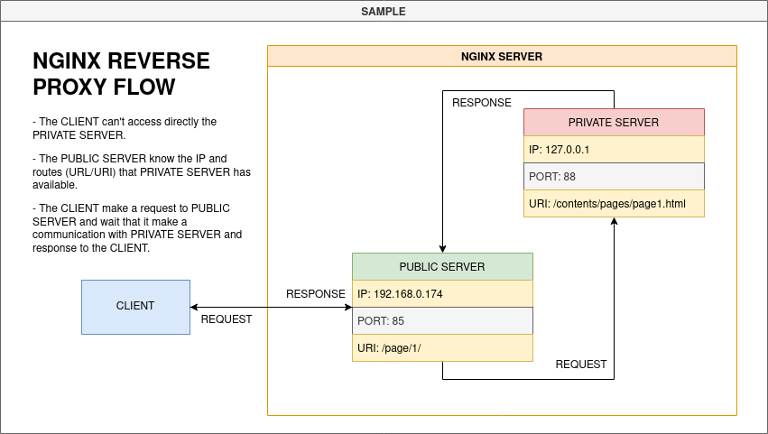

# NGINX + REVERSE PROXY
A quick and single repository to build an environment with NGINX

# About

This branch set up the environment to run NGINX as Webserver with internal reverse proxy, below can see the diagram that 
explain with more details:

# Usage

- Before build and start project set the following files configurations:

<pre>
- nginx.conf (./nginx_reverse_proxy/etc/nginx/nginx.conf)
- public-server.conf (./nginx_reverse_proxy/etc/nginx/conf/public-server.conf)
- private-server.conf (./nginx_reverse_proxy/etc/nginx/conf/private-server.conf)
</pre>

- Access the folder path in this project to run php8 together nginx, as below:

<pre>
user@host:/home/user$ git clone https://github.com/huntercodexs/docker-series.git .
user@host:/home/user$ cd docker-series
user@host:/home/user/docker-series$ git checkout nginx_reverse_proxy
user@host:/home/user/docker-series$ cd nginx_reverse_proxy
user@host:/home/user/docker-series/nginx_reverse_proxy$ docker network create nginx_reverse_proxy_open_network
user@host:/home/user/docker-series/nginx_reverse_proxy$ docker-compose up --build (in first time)
user@host:/home/user/docker-series/nginx_reverse_proxy$ [Ctrl+C]
user@host:/home/user/docker-series/nginx_reverse_proxy$ docker-compose start (in the next times)
user@host:/home/user/docker-series/nginx_reverse_proxy$ docker-compose ps (check the containers status)
</pre>

# Step by Step

Follow the steps below to quick and easy environment creation

1- Clone the repository
<pre>
user@host:/home/user$ git clone https://github.com/huntercodexs/docker-series.git .
</pre>

2- Access the repository folder
<pre>
user@host:/home/user$ cd docker-series.git
</pre>

3- Change the current branch
<pre>
user@host:/home/user/docker-series$ git checkout nginx_reverse_proxy
</pre>

4- Access the nginx_reverse_proxy folder
<pre>
user@host:/home/user/docker-series$ cd nginx_reverse_proxy
</pre>

5- Check and set up the .env file

6- Build the containers

<pre>    
user@host:/home/user/docker-series/nginx_reverse_proxy$ docker network create nginx_reverse_proxy_open_network
user@host:/home/user/docker-series/nginx_reverse_proxy$ docker-compose up --build
</pre>

Make sure that the result look like this
<pre>
user@host:/home/user/docker-series/nginx_reverse_proxy$ docker-compose ps
    Name                   Command                   State                                                                                                             Ports                                                                                                      
----------------------------------------------------------------------------------------------------------------------------------------------------------------------------------------------------------------------------------------------------------------------------------
</pre>

7- Access and test the applications
<pre>
http://localhost:38585
http://localhost:38585/app1/
http://localhost:38585/app1/pages/page1/
http://localhost:38585/app1/pages/page2/
http://localhost:38585/app1/pages/page3/
</pre>
