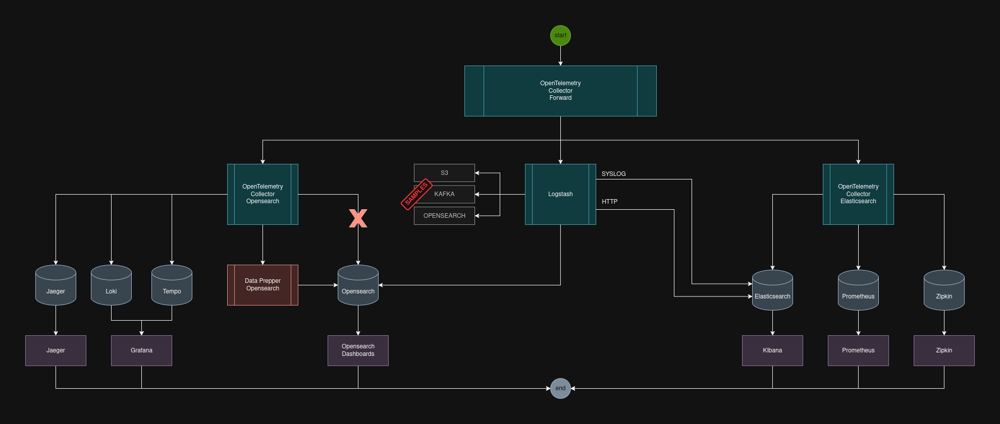
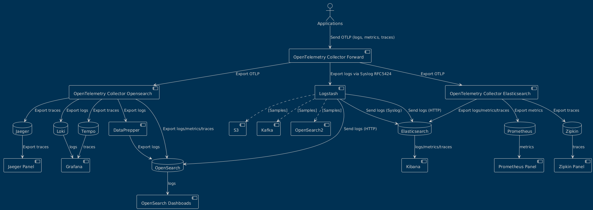

# OBSERVABILITY ENVIRONMENT
Complete tracing environment (v1)

# Overview

This repository aim to offer a short way to make some decisions in witch path you might follow to create an environment 
to observe and tests your applications using the observability concepts as logs, metrics, traces and so on.

All configurations here in this repo are almost done to be used, however you will need to perform the configurations 
to put on the things in the correct way that you need, for example:

- Creating a personalized tracking for logs using JSON
- Using one or more tools
- Creating dashboards in more than one same purpose tool
- Making some use cases as is made in Proof Of Concepts (POC) 

### ⚡ Traces

| Tools      | Status           |
|------------|------------------|
| **Zipkin** | ✅ Working        |
| **Jaeger** | ✅ Working        |
| **Tempo**  | ✅ Working        |
| **Outros** | → (Future tools) |

### ⚡ Logs

| Tools             | Status    |
|-------------------|-----------|
| **OpenSearch**    | ✅ Working |
| **Elasticsearch** | ✅ Working |
| **Loki**          | ✅ Working |

### ⚡ Metrics

| Tools          | Status    |
|----------------|-----------|
| **Prometheus** | ✅ Working |
| **Grafana**    | ✅ Working |

## 🔖 Containers Versions

| Component       | Version  | Status |
|-----------------|----------|--------|
| Firefox Browser | v25.04.1 | OK     |
| OpenTelemetry   | 0.118.0  | OK     |
| Elasticsearch   | 7.9.2    | OK     |
| Logstash        | 7.9.2    | OK     |
| Kibana          | 7.9.2    | OK     |
| Grafana         | 12.0.0   | OK     |
| Loki            | 3.2.0    | OK     |
| Tempo           | 2.7.2    | OK     |
| Jaeger          | 1.69.0   | OK     |
| Zipkin          | 3.5.1    | OK     |
| Prometheus      | v3.3.1   | OK     |
| OpenSearch      | 2.15.0   | OK     |
| DataPrepper     | 2.12.0   | OK     |

## 🔖 Scenarios

| #  | Scenario                                                    | Protocol  | Status | Generator           |
|----|-------------------------------------------------------------|-----------|--------|---------------------|
| 1  | OTEL[Forward] > OTEL[Elasticsearch] > Kibana                | HTTP      | ✅ OK   |                     |
| 2  | OTEL[Forward] > OTEL[Elasticsearch] > Zipkin                | ZIPKIN    | ✅ OK   | span-generate.sh    |
| 3  | OTEL[Forward] > OTEL[Elasticsearch] > Prometheus            | OTLP      | ✅ OK   | metrics-generate.sh |
| 4  | OTEL[Forward] > Logstash(syslog) > Elasticsearch > Kibana   | UDP       | ✅ OK   |                     |
| 5  | OTEL[Forward] > Logstash(http) > Elasticsearch > Kibana     | HTTP      | ✅ OK   |                     |
| 6  | OTEL[Forward] > Logstash(http) > Opensearch                 | HTTP      | ✅ OK   | logs-generate.sh    |
| 7  | OTEL[Forward] > OTEL[Opensearch] > Loki                     | HTTP      | ✅ OK   | logs-generate.sh    | 
| 8  | OTEL[Forward] > OTEL[Opensearch] > Tempo                    | OTLP      | ✅ OK   | span-generate.sh    |
| 9  | OTEL[Forward] > OTEL[Opensearch] > Jaeger                   | OTLPHTTP  | ✅ OK   | span-generate.sh    | 
| 10 | OTEL[Forward] > OTEL[Opensearch] > Opensearch               |           | ⚠️ NOK |                     |
| 11 | OTEL[Forward] > OTEL[Opensearch] > DataPrepper > Opensearch | OTLPHTTP  | ✅ OK   | logs-generate.sh    |

The scenarios above can be described as shown below

## 🔖 Usage

1. Clone this respiratory
2. Checkout to this branch, the current branch name
3. Run the tests scripts, the scripts are placed in the support/scripts path
4. Use the applications (Java) placed in observability_environment_v1/apps folder

> This work is Free !

