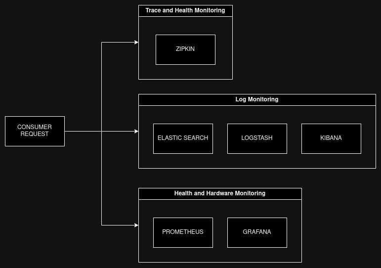
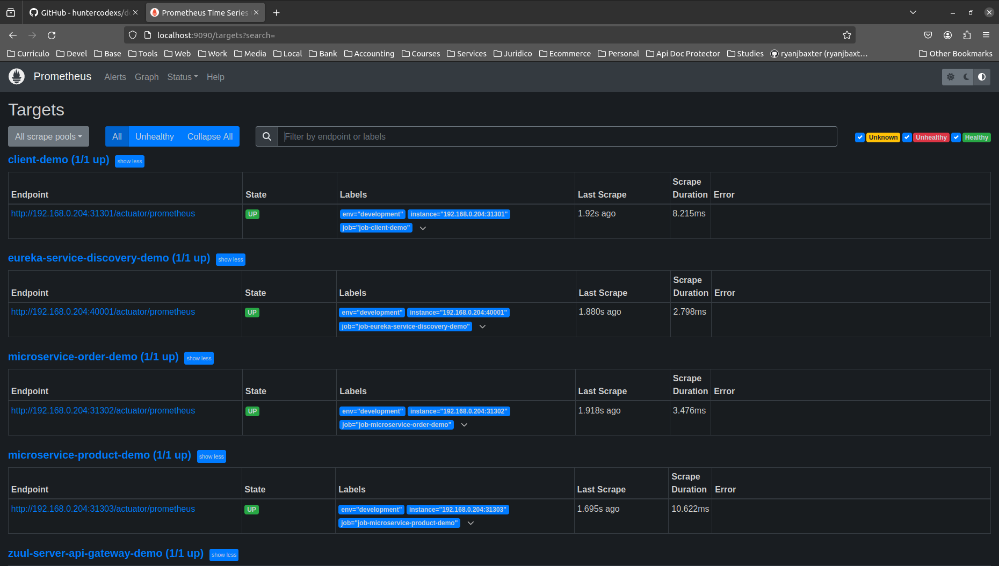
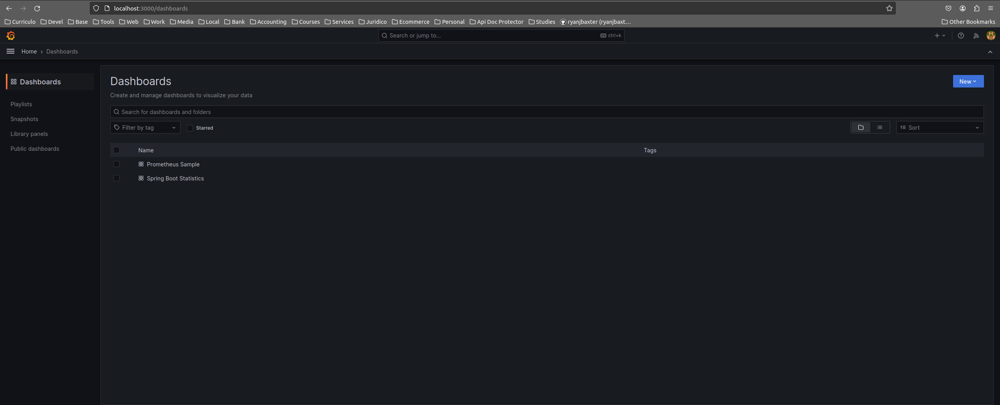
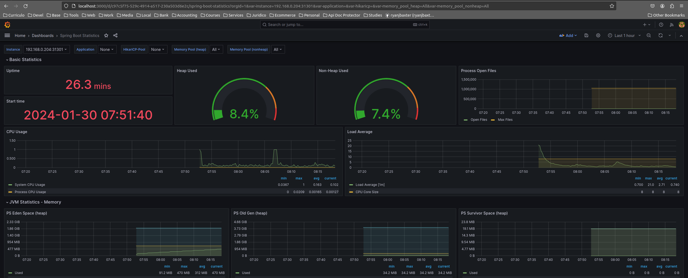
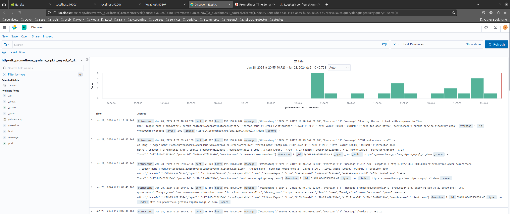
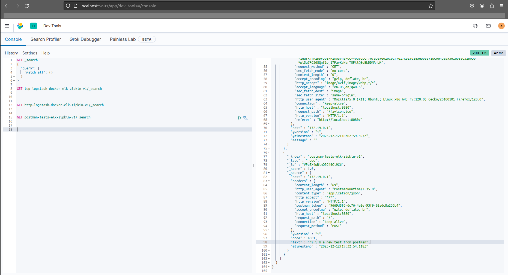

# ELK PROMETHEUS GRAFANA ZIPKIN
Complete trace environment

> NOTE: If you want to be more fast goto step by step in this documentation
> <a href="#step-by-step">Step by Step</a>

Summary

- <a href="#information">Information</a>
- <a href="#resources">Resources</a>
- <a href="#quick-usage">Quick Usage</a>
- <a href="#project-purpose">Project Purpose</a>
- <a href="#configurations">Configurations</a>
- <a href="#grafana">Grafana</a>
- <a href="#prometheus">Prometheus</a>
- <a href="#logstash">Logstash</a>
- <a href="#step-by-step">Step by Step</a>
- <a href="#helper-and-references">Helper and References</a>

# Information

 
 

Please use the branch selector to access others configurations for your needed and purposes

# Resources

 
 

- Stack Version (ELK) : 7.9.2
- Elasticsearch
- Kibana
- Logstash
- Zipkin
- Prometheus
- Grafana

> NOTE: 
> - It's highly recommended to use the same stack version to ELK 
> - Please see the .env file to more details

# Quick Usage

 
 

<pre>
user@host:/home/user$ git clone https://github.com/huntercodexs/docker-series.git .
user@host:/home/user$ cd docker-series
user@host:/home/user/docker-series$ git checkout elk_prometheus_grafana_zipkin_v1
user@host:/home/user/docker-series$ cd elk_prometheus_grafana_zipkin_v1
user@host:/home/user/docker-series/elk_prometheus_grafana_zipkin_v1$ docker network create elk_prometheus_grafana_zipkin_v1_open_network
user@host:/home/user/docker-series/elk_prometheus_grafana_zipkin_v1$ docker-compose up --build
user@host:/home/user/docker-series/elk_prometheus_grafana_zipkin_v1$ [Ctrl+C]
user@host:/home/user/docker-series/elk_prometheus_grafana_zipkin_v1$ docker-compose start
user@host:/home/user/docker-series/elk_prometheus_grafana_zipkin_v1$ docker-compose ps
</pre>

# Project Purpose

 
 

This project aims to offer a development environment with production concepts for managing microservices. In this case,
an example project made in Java will be offered, but nothing prevents the environment from being used for other languages
such as Python, PHP, among others.

Like any microservices architecture, your size is scalable and depend on demand and, therefore, since this can be
very large, we need to have effective monitoring and management tools. At this point we have to separate these needs by
scope and functionality.

Starting from the point where we need to manage our architecture and its resources, we need to separate the needs into
specific subjects and at least to ask the following questions:

- How we go make the monitoring via log
- How we go make the monitoring of hardware resources
- How we go make the monitoring the health of applications

Therefore, we are aware that the environment must offer resources or tools that facilitate this work which actually
refers more to DevOps than development itself. In situations like this we can then work with the tools presented here,
namely: Zipkin, Prometheus, ELK and Grafana, being separated in the following topics:

- Log Monitoring
    - Elasticsearch
    - Logstash
    - Kibana

- Hardware Monitoring
    - Prometheus
    - Grafana

- Health Monitoring
    - Zipkin
    - Prometheus
    - Eureka Service Discovery

A flow diagram is presented below to illustrate this entire environment, notice how the tools are connected
between themselves and how they communicate for a well-controlled and stable environment.

# Configurations

 
 

To use this environment correctly, you must follow the rules below:

- Prometheus

***About prometheus.yml***

The prometheus configuration is showed below just for one application/microservice, look that this single configuration
can be applied to more others cases included more than one application. What should be changed in another case is
job_name and files (target.json), we can understand that this configuration is pretty simple and there is not much to
say about that.

<pre>
scrape_configs:

  - job_name: 'microservice-demo'
    scrape_interval: 2s
    metrics_path: "/actuator/prometheus"
    file_sd_configs:
    - files:
      - /home/prometheus/targets/microservice-demo.json
</pre>

Give a look in the section <a href="#prometheus"># Prometheus</a> to see how to use this script.

***About targets.json***

This configuration is a complement for prometheus.yml that is accessible to it in the files field. When we use the
script targets-export.sh to generate automatically the prometheus.yml file, the targets.json file will be generated as
well, and each target.json will have the name according the application registered in the EUREKA SERVICE DISCOVERY log.

<pre>
[
	{
 		"targets": ["192.168.0.204:31301"],
 		"labels": {
 			"env": "development",
 			"job": "job-microservice-demo"
 		}
 	}
]
</pre>

To be more clear, when we have in the EUREKA SERVICE DISCOVERY log one register like this
<pre>
Registered instance MICROSERVICE-DEMO/192.168.0.204:microservice-demo:31315 with status UP (replication=true)
</pre>

The target.json will be named as microservice-demo.json, and the content inside it will be something like below

<pre>
[
	{
 		"targets": ["192.168.0.204:31315"],
 		"labels": {
 			"env": "development",
 			"job": "job-microservice-demo"
 		}
 	}
]
</pre>

and prometheus.yml will be configured in the follow way

<pre>
scrape_configs:

  - job_name: 'microservice-demo'
    scrape_interval: 2s
    metrics_path: "/actuator/prometheus"
    file_sd_configs:
    - files:
      - /home/prometheus/targets/microservice-demo.json
</pre>

When Prometheus has correctly configurations it will be present for us one dashboard look like this

- Logstash - logstash.yml

The yml configuration It's pretty simple and don't need to be more explained and detailed, just have attention when you
changed any configuration.

- Logstash - pipelineio.conf

This file is very important, and you can not make confusing or mistakes with it. The most important field in that file
is the field index, witch should be equal to the index that will be created in the Kibana (ELK). In the configuration
bellow all data that was received through the tcp port 5000 and http as well will be sent to output elasticsearch in all
index previously created in the Kibana.

<pre>
input {
    tcp {
        port => 5000
    }

    http {

    }
}

output {
    elasticsearch {
        hosts => "${ELASTICSEARCH_HOST}"
        index => "elk_prometheus_grafana_zipkin_v1_demo"
        user => "${ELASTIC_USERNAME}"
        password => "${ELASTIC_PASSWORD}"
    }
}
</pre>

- Kibana - Index Management

To set up Kibana, just give a look in the .env file and the yml file to kibana.yml.

In the Kibana execute the following steps

- create an index in kibana at http://localhost:5601/app/management/kibana/indexPatterns/create
- put the name of the index in the input text box
    - click on Next step
        - select a value in "Time field"
            - click on Create index pattern (if necessary, it is possible to configure the index as the default)

# Grafana

 
 

After creating the entire environment, we can connect grafana to prometheus according to the information below

Dashboards

- Connect Grafana to Prometheus

- Connect Grafana to Prometheus using the Spring Boot Statistics plugin

Get the plugin ID from the Grafana website at the following link https://grafana.com/grafana/dashboards/6756-spring-boot-statistics/.
Insert the dashboard ID into Grafana in Dashboard->import

Result (ID: 6756)

# Logstash

 
 

- Useful Links
    - http://localhost:5601/app/home#/
    - http://localhost:5601/app/management/
    - http://localhost:5601/app/management/kibana/indexPatterns/
    - http://localhost:5601/app/management/kibana/indexPatterns/create

The following steps must be performed to achieve a satisfactory result when using ELK

- check if it is necessary to delete kibana indexes
- configure logstash pipelineio.conf
- run the docker-compose up --build logstash command (the indexes will be pushed automatically in kibana)
<pre>
logstash          | [2024-01-29T00:03:24,299][INFO ][logstash.javapipeline    ][.monitoring-logstash] Pipeline Java execution initialization time {"seconds"=>0.55}
logstash          | [2024-01-29T00:03:24,342][INFO ][logstash.javapipeline    ][.monitoring-logstash] Pipeline started {"pipeline.id"=>".monitoring-logstash"}
logstash          | [2024-01-29T00:03:24,373][INFO ][logstash.javapipeline    ][main] Pipeline Java execution initialization time {"seconds"=>0.61}
logstash          | [2024-01-29T00:03:24,521][INFO ][logstash.javapipeline    ][main] Pipeline started {"pipeline.id"=>"main"}
logstash          | [2024-01-29T00:03:24,527][INFO ][logstash.inputs.http     ][main][ccb448981609b2f871d0e355d2ef5059aac13af82f623e7d3f2a8b9d0fdfc3e7] Starting http input listener {:address=>"0.0.0.0:8080", :ssl=>"false"}
logstash          | [2024-01-29T00:03:24,528][INFO ][logstash.inputs.tcp      ][main][ed9ed8f66d0cdf852b2df787cac8694d32f71b9d340b0b7b822994b97c3d35b8] Starting tcp input listener {:address=>"0.0.0.0:5000", :ssl_enable=>"false"}
logstash          | [2024-01-29T00:03:24,584][INFO ][logstash.agent           ] Pipelines running {:count=>2, :running_pipelines=>[:".monitoring-logstash", :main], :non_running_pipelines=>[]}
logstash          | [2024-01-29T00:03:24,765][INFO ][logstash.agent           ] Successfully started Logstash API endpoint {:port=>9600}
</pre>
- create an index in kibana at http://localhost:5601/app/management/kibana/indexPatterns/create
- put the name of the index in the input text box
    - click on Next step
        - select a value in "Time field"
            - click on Create index pattern (if necessary, it is possible to configure an index as the default)
- execute request in postman to the url http://localhost:31301/microservice-demo/orders
    - the endpoint is within a microservice previously configured to communicate with logstash via config
- check log status in kibana at
    - http://localhost:5601/app/discover
- select the index on the left side of the screen and analyze the log
  
  
- use dev tools to analyze logs at http://localhost:5601/app/dev_tools#/console, as per the examples below

<pre>
GET _search
{
  "query": {
    "match_all": {}
  }
}

GET elk_prometheus_grafana_zipkin_v1_demo/_search
{
  "query": {
    "match": {
      "message": "POST add orders in API is calling"
    }
  }
}
</pre>

- if it is necessary to change the logstash pipeline settings, you must restart the service as follows
<pre>
user@host:/home/user/docker-series/elk_prometheus_grafana_zipkin_v1$ docker exec -it logstash /bin/bash

bash-4.2$ ps -ef
UID          PID    PPID  C STIME TTY          TIME CMD
logstash       1       0  5 21:17 ?        00:02:49 /bin/java -Xms1g -Xmx1g -XX:+UseConcMarkSweepGC -XX:CMSInitiatingOccupancyFraction=75 -XX:+UseCMSInitiatingOccupancyOnly -Djava.awt.headless=true -Dfile.encoding=UTF-8 -Djruby.compile.invokedynamic=true -Djruby.jit.threshold=0 -Dj
logstash     302       0  0 22:10 pts/0    00:00:00 /bin/bash
logstash     308     302  0 22:10 pts/0    00:00:00 ps -ef

bash-4.2$ kill -HUP 1 (isso reinicia o serviço logstash automaticamente)
</pre>

or simply use the logstash-reload.sh script that is inside the logstash container in /home/logstash which can be
run with the following command

<pre>
user@host:/home/user/docker-series/elk_prometheus_grafana_zipkin_v1$ docker exec -it logstash sh /home/logstash/logstash-reload.sh 
</pre>

# Step by Step

 
 

Follow the steps below to quick and easy environment creation

1- Clone the repository
<pre>
user@host:/home/user$ git clone https://github.com/huntercodexs/docker-series.git .
</pre>

2- Access the repository folder
<pre>
user@host:/home/user$ cd docker-series.git
</pre>

3- Change the current branch
<pre>
user@host:/home/user/docker-series$ git checkout elk_prometheus_grafana_zipkin_v1
</pre>

4- Access the elk_prometheus_grafana_zipkin_v1 folder
<pre>
user@host:/home/user/docker-series$ cd elk_prometheus_grafana_zipkin_v1
</pre>

5- Check and set up the .env file, also check and edit the files YML and pipelineio.conf
<pre>
elk_prometheus_grafana_zipkin_v1/elasticsearch/config/elasticsearch.yml
elk_prometheus_grafana_zipkin_v1/kibana/config/kibana.yml
elk_prometheus_grafana_zipkin_v1/logstash/config/logstash.yml
elk_prometheus_grafana_zipkin_v1/logstash/pipeline/pipelineio.conf
elk_prometheus_grafana_zipkin_v1/prometheus/prometheus.yml
</pre>

6- Build the containers

<pre>    
user@host:/home/user/docker-series/elk_prometheus_grafana_zipkin_v1$ docker network create elk_prometheus_grafana_zipkin_v1_open_network
user@host:/home/user/docker-series/elk_prometheus_grafana_zipkin_v1$ docker-compose up --build
user@host:/home/user/docker-series/elk_prometheus_grafana_zipkin_v1$ [Ctrl+C]
user@host:/home/user/docker-series/elk_prometheus_grafana_zipkin_v1$ docker-compose start
user@host:/home/user/docker-series/elk_prometheus_grafana_zipkin_v1$ docker-compose ps
</pre>

Result

<pre>
          Name                        Command                       State                                                                                                           Ports                                                                                                 
------------------------------------------------------------------------------------------------------------------------------------------------------------------------------------------------------------------------------------------------------------------------------------------
elasticsearch              /tini -- /usr/local/bin/do ...   Up                      0.0.0.0:9200->9200/tcp,:::9200->9200/tcp, 0.0.0.0:9300->9300/tcp,:::9300->9300/tcp                                                                                                                    
grafana                    /run.sh                          Up                      0.0.0.0:3000->3000/tcp,:::3000->3000/tcp                                                                                                                                                              
grafana-ubuntu             /run.sh                          Up                      0.0.0.0:3001->3000/tcp,:::3001->3000/tcp                                                                                                                                                              
kibana                     /usr/local/bin/dumb-init - ...   Up                      0.0.0.0:5601->5601/tcp,:::5601->5601/tcp                                                                                                                                                              
logstash                   /usr/local/bin/docker-entr ...   Up                      0.0.0.0:5000->5000/tcp,:::5000->5000/tcp, 0.0.0.0:5000->5000/udp,:::5000->5000/udp, 0.0.0.0:5044->5044/tcp,:::5044->5044/tcp, 0.0.0.0:8080->8080/tcp,:::8080->8080/tcp,                               
                                                                                    0.0.0.0:9600->9600/tcp,:::9600->9600/tcp                                                                                                                                                              
prometheus                 /bin/prometheus --config.f ...   Up                      0.0.0.0:9090->9090/tcp,:::9090->9090/tcp                                                                                                                                                              
zipkin                     start-zipkin                     Up (health: starting)   9410/tcp, 0.0.0.0:9411->9411/tcp,:::9411->9411/tcp                                                                                                                                                    
</pre>

7- Check and configure logstash

In this step, if you made any modification, or need to make any modification after build the container, you should be
executed the script logstash-reload.sh to refresh the indexes and configurations from pipelineio.

<pre>
user@host:/home/user/docker-series/elk_prometheus_grafana_zipkin_v1$ docker exec -it logstash sh /home/logstash/logstash-reload.sh
</pre>

8- Configure Kibana to listen logstash data request

> NOTE: 
> See this documentation above to get more details about it

To set up Kibana, just give a look in the .env file and the yml file to kibana.yml.

- create an index in kibana at http://localhost:5601/app/management/kibana/indexPatterns/create
- put the name of the index in the input text box
    - click on Next step
        - select a value in "Time field"
            - click on Create index pattern (if necessary, it is possible to configure an index as the default)
            - Follow the logs in the Kibana Discovery

9- Create Integration between Grafana and Prometheus

To do it, see the section <a href="#grafana">Grafana</a> in this documentation

10- Test the environment

10.1) Elasticsearch
<pre>
http://localhost:9200/
ELASTIC_USERNAME
ELASTIC_PASSWORD
</pre>

10.2) Logstash
<pre>
http://localhost:8080
</pre>

10.2.1) Indexes Logstash
<pre>
elk_prometheus_grafana_zipkin_v1/logstash/pipeline/pipelineio.conf
</pre>

10.3) Kibana
<pre>
http://localhost:5601/app/home#/
http://localhost:5601/app/dev_tools#/console
ELASTIC_USERNAME
ELASTIC_PASSWORD
</pre>

10.3.1) Create the index in Kibana (according logstash configuration - pipelineio.conf)
<pre>
http://localhost:5601/app/management/kibana/indexPatterns/create
</pre>

10.3.2) Check the log at Kibana Discover (the created index stay at left side of screen)
<pre>
http://localhost:5601/app/discover
</pre>

10.3.3) Sample Queries
<pre>
GET elk_prometheus_grafana_zipkin_v1_demo/_search
</pre>

10.4) Zipkin
<pre>
http://localhost:9411
</pre>

10.5) Prometheus
<pre>
http://localhost:9090
</pre>

10.5.1) Prometheus Settings (targets)

> NOTE: It is recommended use a specific tool or process to create dynamically the targets and then put the result
> in one json or yaml file, the manual process is not indicated

<pre>
elk_prometheus_grafana_zipkin_v1/prometheus/prometheus.yml
</pre>

10.6) Grafana
<pre>
http://localhost:3001/login
</pre>

10.7) Grafana Ubuntu
<pre>
http://localhost:3000/login
</pre>

# Helper and References

 
 

Access zipkin container
<pre>
user@host:/home/user/docker-series/elk_prometheus_grafana_zipkin_v1$ docker exec -it zipkin sh
</pre>

Make a query in the Kibana Dashboard
<pre>
GET tcp-elk_prometheus_grafana_zipkin_v1_demo/_search

GET http-elk_prometheus_grafana_zipkin_v1_demo/_search

GET postman-tests-elk_prometheus_grafana_zipkin_v1_demo/_search
</pre>