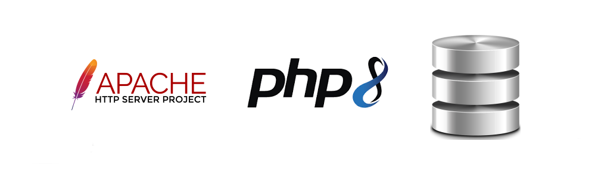

# HTTPD + PHP8 + DATABASES (USING DEDICATED CONTAINER)
Using PHP8 together NGINX connected with the most used databases

# Information

Please use the branch selection to access others configurations for your need and purposes, this branch offers a complete
environment to development using HTTPD(Apache2) + PHP8 + Databases(see bellow).

> IMPORTANT

See the file .env in the root path of this repository to see all details about the application settings

# About project

# Docker Containers Databases

>  Available
>  Pending
>  Unavailable

- HTTPD 
- PHP8-FPM 
- DATABASES
  - MYSQL 
    - 5.7 
    - 8.0 
  - MSSQL 
  - PGSQL 
  - MONGO 
  - FIREBIRD 
  - INTERBASE 
  - ORACLELINUX 
  - SQLITE 
  - REDIS 

# About PHP8

> DOCKERFILE

Set up the php8.dockerfile in the header to refers an application or settings that should be used in all 
process, by example DIR_PHP_INI or DIR_WEBSERVER

> PHP INI FILES

Configuration file to PHP server shared between HOST and Container

<pre>
/usr/local/etc/php/php.ini
/usr/local/etc/php/conf.d/
</pre>

> EXTENSIONS

Extension directory shared between HOST and Container

<pre>
/usr/local/lib/php/extensions/no-debug-non-zts-20210902/
</pre>

> IMPORTANT

Edit the /usr/local/etc/php/php.ini file and restart the service or container php8, by example

from 
<pre>
;extension=pdo_oci
</pre>

to
<pre>
extension=pdo_oci
</pre>

# About Webserver HTTPD

The version of HTTP used in this project is:

<pre>
Server version: Apache/2.4.54 (Unix)
Server built:   Jul 12 2022 04:31:28
</pre>

> IMPORTANT

In the first time to run this container, execute the script "webserver.sh prepare" after docker-compose up -d

<pre>
docker exec -it webserver /bin/bash
/home/apache2/webserver.sh prepare
</pre>

Before run the previous step, please edit the files in /httpd_php8_separated/webserver/conf/ in this project 
path [conf|htdocs], these files are responsible to configure the webserver HTTP.

<pre>
httpd.conf
sites-available.conf
</pre>

After the first step (see above) execute again the script "webserver.sh" but pass the "restart" as parameter

<pre>
/home/webserver/webserver.sh restart
</pre>

# Usage

<pre>
user@host:/home/user$ git clone https://github.com/huntercodexs/docker-series.git .
user@host:/home/user$ cd docker-series
user@host:/home/user/docker-series$ git checkout httpd_php8_databases_separated
user@host:/home/user/docker-series$ cd httpd_php8_databases_separated
user@host:/home/user/docker-series/httpd_php8_databases_separated$ docker network create webserver_network
user@host:/home/user/docker-series/httpd_php8_databases_separated$ docker-compose up --build (in first time)
user@host:/home/user/docker-series/httpd_php8_databases_separated$ [Ctrl+C]
user@host:/home/user/docker-series/httpd_php8_databases_separated$ docker-compose start (in the next times)
user@host:/home/user/docker-series/httpd_php8_databases_separated$ docker-compose ps (check the containers status)
</pre>

# Oracle

https://github.com/huntercodexs/docker-series/tree/databases#oracle

- Access the application sample to Oracle Linux Database:
<pre>
http://${WEBSERVER_ADDRESS}:38080/microservice-oraclelinux/
</pre>

# MongoDB

https://github.com/huntercodexs/docker-series/tree/databases#mongodb

- Access the application sample to MongoDB Database:
<pre>
http://${WEBSERVER_ADDRESS}:38080/microservice-mongodb/
</pre>

# Postgres

https://github.com/huntercodexs/docker-series/tree/databases#postgres

- Access the application sample to Postgres Database:
<pre>
http://${WEBSERVER_ADDRESS}:38080/microservice-postgres/
</pre>

# MSSQL

https://github.com/huntercodexs/docker-series/tree/databases#mssql

- Access the application sample to MsSQL Database:
<pre>
http://${WEBSERVER_ADDRESS}:38080/microservice-mssql/
</pre>

# Firebird

https://github.com/huntercodexs/docker-series/tree/databases#firebird

> NOTE: IS NOT WORKING CORRECTLY YET !!!

- Access the application sample to Firebird Database:
<pre>
http://${WEBSERVER_ADDRESS}:38080/microservice-firebird/
</pre>

# MYSQL 5.7

https://github.com/huntercodexs/docker-series/tree/databases#mysql-57

- Access the application sample to MySQL 5.7 Database:
<pre>
http://${WEBSERVER_ADDRESS}:38080/microservice-mysql57/
</pre>

# MYSQL 8.0

https://github.com/huntercodexs/docker-series/tree/databases#mysql-80

- Access the application sample to MySQL 8.0 Database:
<pre>
http://${WEBSERVER_ADDRESS}:38080/microservice-mysql80/
</pre>

# SQLITE

https://github.com/huntercodexs/docker-series/tree/databases#sqlite3

- Access the application sample to Sqlite3 Database:
<pre>
http://${WEBSERVER_ADDRESS}:38080/microservice-sqlite/
</pre>

# REDIS

> IMPORTANT: Redis is not a database engine, it is used to make a data cache

https://github.com/huntercodexs/docker-series/tree/databases#redis

- Access the application sample to Redis System Cache:
<pre>
http://${WEBSERVER_ADDRESS}:38080/microservice-redis/
</pre>

# Step by Step

