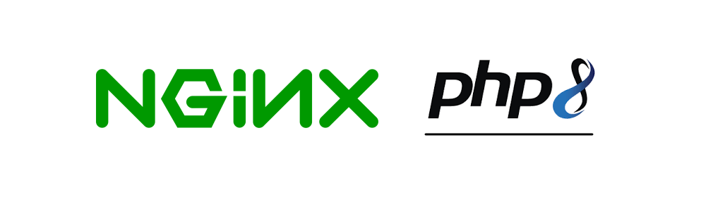

# NGINX + PHP-8.X.X (WITH PHP-7.4.0 AS WELL)
A quick and single repository to build an environment for PHP with NGINX

# Information

Please use the branch selector to access others environment configurations

The PHP available in this branch are:

- PHP-7.4.0
- PHP-8.0.0
- PHP-8.1.0
- PHP-8.2.2
- PHP-8.2.13

# Usage

- Access the folder path in this project to run php8 together nginx, as below:  

<pre>
user@host:/home/user$ git clone https://github.com/huntercodexs/docker-series.git .
user@host:/home/user$ cd docker-series
user@host:/home/user/docker-series$ git checkout nginx_php8
user@host:/home/user/docker-series$ cd nginx_php8
user@host:/home/user/docker-series/nginx_php8$ docker network create nginx_php8_network
user@host:/home/user/docker-series/nginx_php8$ docker-compose up --build (in first time)
user@host:/home/user/docker-series/nginx_php8$ [Ctrl+C]
user@host:/home/user/docker-series/nginx_php8$ docker-compose start (in the next times)
user@host:/home/user/docker-series/nginx_php8$ docker-compose ps (check the containers status)
</pre>

- Before build and start project set the following configurations files:

<pre>
- php.ini (nginx_php8/php/{PHP-VERSION}/conf/)
- nginx.conf (nginx_php8/nginx/)
- php-{PHP-VERSION}.conf (nginx_php8/nginx/conf.d/)
</pre>

- Access the application

<pre>
http://{WEBSERVER-ADDRESS}:38080/php-7.4.0/menu.php
http://{WEBSERVER-ADDRESS}:38080/php-7.4.0/content/index.php

http://{WEBSERVER-ADDRESS}:38081/php-8.0.0/menu.php
http://{WEBSERVER-ADDRESS}:38081/php-8.0.0/content/index.php

http://{WEBSERVER-ADDRESS}:38082/php-8.1.0/menu.php
http://{WEBSERVER-ADDRESS}:38082/php-8.1.0/content/index.php

http://{WEBSERVER-ADDRESS}:38083/php-8.2.2/menu.php
http://{WEBSERVER-ADDRESS}:38083/php-8.2.2/content/index.php

http://{WEBSERVER-ADDRESS}:38084/php-8.2.13/menu.php
http://{WEBSERVER-ADDRESS}:38084/php-8.2.13/content/index.php
</pre>

