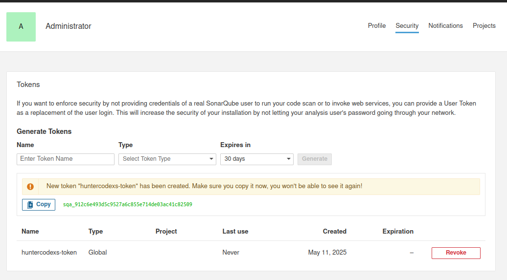
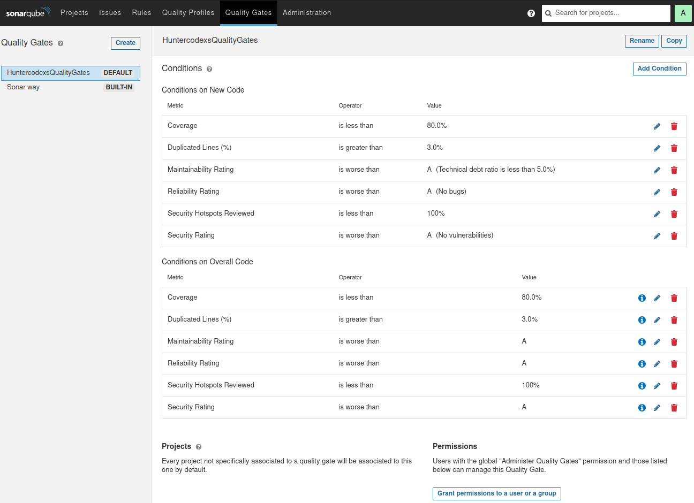
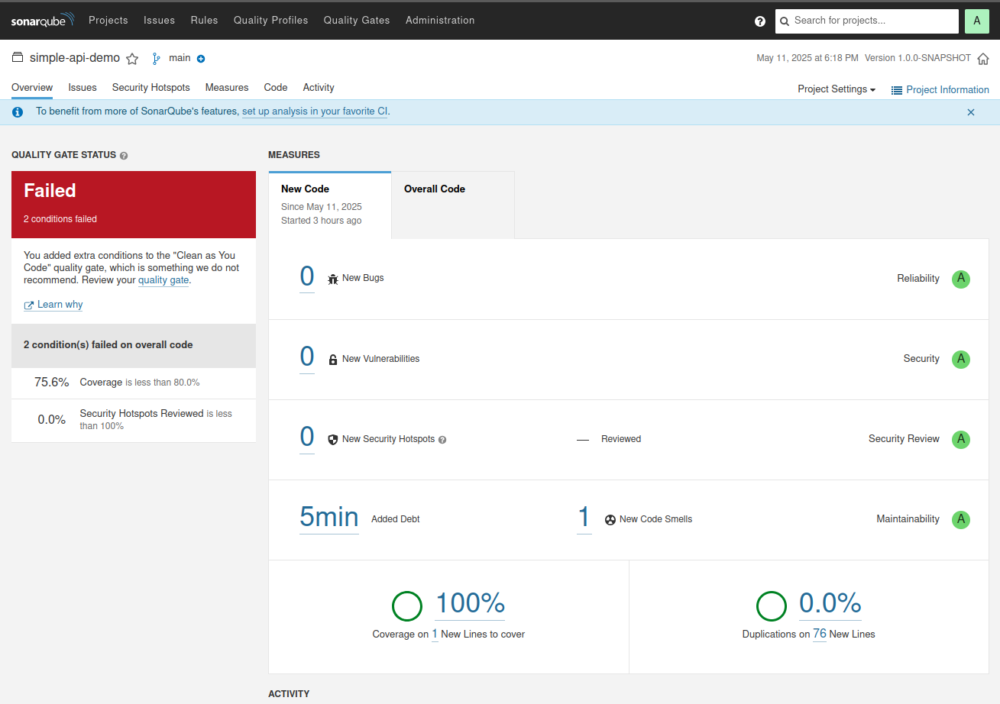

# INTEGRATION
This directory contains integration code for various third-party services and platforms. 
Each subdirectory corresponds to a specific integration and includes the necessary code, configuration files, 
and documentation to set up and use the integration effectively.


# CONTAINERS AVAILABLE

This project provides Docker container configurations for the following services:

- Apache Kafka
- RabbitMQ
- Sonarqube
- Mongodb
- Redis

# TL;DR

This integration directory provides Docker container configurations for popular services like Apache Kafka, RabbitMQ,
Sonarqube, Mongodb, and Redis. Each service has its own setup instructions and usage guidelines to help you get
started quickly. Whether you're looking to implement messaging queues, code quality analysis, or database solutions,
this directory has you covered with ready-to-use Docker setups.

> PT-BR (Português - Brasil): This section was translated to Portuguese using an AI tool.

1) Cleanup Script
```text
user@host:~/Documentos/Devel/Docker/docker-series/integration$ ./cleanup.sh 
=========================================================
 🧹 LIMPANDO CERTIFICADOS E ARQUIVOS GERADOS
=========================================================
Base dir: /home/user/Documentos/Devel/Docker/docker-series/integration
Conf dir: /home/user/Documentos/Devel/Docker/docker-series/integration/messenger/kafka-7.6.0-SASL_SSL/security
Secrets dir: /home/user/Documentos/Devel/Docker/docker-series/integration/messenger/kafka-7.6.0-SASL_SSL/security/secrets

🗑️  Removendo arquivos de CA...
🗑️  Removendo arquivos do broker...
🗑️  Removendo truststore do client...
🗑️  Removendo JAAS copiados...

🗂️  Limpando arquivos temporários (se existirem)...

🧨 Removendo diretório secrets (se estiver vazio)...

🧨 Removendo containers docker ...
Removing network integration_default
WARNING: Network integration_default not found.
Network open_network is external, skipping
Removing network integration_internal_network
WARNING: Network integration_internal_network not found.
Removing volume integration_zookeeper-7.6.0-sasl-ssl_vol
WARNING: Volume integration_zookeeper-7.6.0-sasl-ssl_vol not found.
Removing volume integration_kafka-7.6.0-sasl-ssl_vol
WARNING: Volume integration_kafka-7.6.0-sasl-ssl_vol not found.
Removing volume integration_schema-registry-7.6.0-sasl-ssl_vol
WARNING: Volume integration_schema-registry-7.6.0-sasl-ssl_vol not found.
Removing volume integration_kafka-ui-0.7.2-sasl-ssl_vol
WARNING: Volume integration_kafka-ui-0.7.2-sasl-ssl_vol not found.
Removing volume integration_sonarqube_data998
WARNING: Volume integration_sonarqube_data998 not found.
Removing volume integration_sonarqube_extensions998
WARNING: Volume integration_sonarqube_extensions998 not found.
Removing volume integration_postgresql998
WARNING: Volume integration_postgresql998 not found.
Removing volume integration_postgresql_data998
WARNING: Volume integration_postgresql_data998 not found.
Removing volume integration_mongodb_data
WARNING: Volume integration_mongodb_data not found.
Removing volume integration_rabbitmq_data
WARNING: Volume integration_rabbitmq_data not found.

=========================================================
 ✅ LIMPEZA CONCLUÍDA COM SUCESSO
 Agora você pode executar novamente o generate-certs.sh
=========================================================
```
2) Generate Certificates for Kafka with SASL_SSL
```text
user@host:~/Documentos/Devel/Docker/docker-series/integration$ ./generate-certs.sh 
🧨 Usando diretório base: /home/user/Documentos/Devel/Docker/docker-series/integration
🧨 Usando diretório de conf: /home/user/Documentos/Devel/Docker/docker-series/integration/messenger/kafka-7.6.0-SASL_SSL/security
🧨 Usando diretório de secrets: /home/user/Documentos/Devel/Docker/docker-series/integration/messenger/kafka-7.6.0-SASL_SSL/security/secrets
🧨 1) Gerando CA...
Generating RSA private key, 2048 bit long modulus (2 primes)
............................................+++++
....................+++++
e is 65537 (0x010001)
🧨 2) Criando SAN config...
🧨 3) Gerando chave do broker...
Generating RSA private key, 2048 bit long modulus (2 primes)
...................................+++++
............+++++
e is 65537 (0x010001)
🧨 4) Gerando CSR com SAN...
🧨 5) Assinando certificado com CA...
Signature ok
subject=CN = kafka-7.6.0-sasl-ssl
Getting CA Private Key
🧨 6) Criando PKCS12 do broker...
🧨 7) Criando keystore do broker (JKS)...
Importing keystore /home/user/Documentos/Devel/Docker/docker-series/integration/messenger/kafka-7.6.0-SASL_SSL/security/secrets/broker.p12 to /home/user/Documentos/Devel/Docker/docker-series/integration/messenger/kafka-7.6.0-SASL_SSL/security/secrets/broker.keystore.jks...
🧨 8) Criando truststore (broker)...
Certificate was added to keystore
🧨 9) Criando truststore (client)...
🧨 10) Copiando arquivos JAAS...
🧨 11) Criando arquivos *_credentials exigidos pela Confluent...
Arquivos credentials criados:
-rwxrwxr-x 1 user user    9 Dec  7 17:01 key_password
-rwxrwxr-x 1 user user    9 Dec  7 17:01 keystore_password
-rwxrwxr-x 1 user user    9 Dec  7 17:01 truststore_password

====================================================
✅ Certificados e JAAS gerados com sucesso!
Pasta final: /home/user/Documentos/Devel/Docker/docker-series/integration/messenger/kafka-7.6.0-SASL_SSL/security/secrets
total 72
-rw-rw-r-- 1 user user 1099 Dec  7 17:01 broker.cert.pem
-rw-rw-r-- 1 user user 1005 Dec  7 17:01 broker.csr.pem
-rw------- 1 user user 1679 Dec  7 17:01 broker.key.pem
-rw-rw-r-- 1 user user 3556 Dec  7 17:01 broker.keystore.jks
-rw------- 1 user user 3318 Dec  7 17:01 broker.p12
-rw-rw-r-- 1 user user 1158 Dec  7 17:01 broker.truststore.jks
-rw-rw-r-- 1 user user 1123 Dec  7 17:01 ca.cert.pem
-rw-rw-r-- 1 user user   41 Dec  7 17:01 ca.cert.srl
-rw------- 1 user user 1679 Dec  7 17:01 ca.key.pem
-rwxrwxr-x 1 user user  131 Dec  7 17:01 client_jaas.conf
-rw-rw-r-- 1 user user 1158 Dec  7 17:01 client.truststore.jks
-rwxrwxr-x 1 user user    9 Dec  7 17:01 key_password
-rwxrwxr-x 1 user user    9 Dec  7 17:01 keystore_password
-rwxrwxr-x 1 user user  321 Dec  7 15:42 openssl-san.cnf
-rwxrwxr-x 1 user user  248 Dec  7 17:01 san.cnf
-rwxrwxr-x 1 user user  312 Dec  7 17:01 server_jaas.conf
-rwxrwxr-x 1 user user    9 Dec  7 17:01 truststore_password
-rwxrwxr-x 1 user user  223 Dec  7 17:01 zookeeper_jaas.conf
====================================================
```

3) Sonar Qube Fix Script for Linux
```text
user@host:~/Documentos/Devel/Docker/docker-series/integration$ ./sonar-fix-linux.sh 
🧨 Sonar Qube Fix Script Started
⚠️  System parameters updated
✅ Sonar Qube Fix Script Completed
```

4) Docker Compose Up
> IMPORTANT: Add the CN in the /etc/hosts file in your machine, for example:

```text
127.0.0.1 kafka-7.6.0-sasl-ssl
```
After that, run the command below to build and start all containers
```text
user@host:~/Documentos/Devel/Docker/docker-series/integration$ docker-compose up --build
```

# HOW TO RUN

First, make sure you have Docker and Docker Compose installed on your machine.
Then, follow the instructions below for each service you want to run.

> NOTE: Add the CN in the /etc/hosts file in your machine, for example: 127.0.0.1 kafka-7.6.0-sasl-ssl

<pre>
user@host:/home/user$ git clone https://github.com/huntercodexs/docker-series.git .
user@host:/home/user$ cd docker-series/integration
user@host:/home/user/docker-series/integration$ ./cleanup.sh
user@host:/home/user/docker-series/integration$ ./generate-certs.sh
user@host:/home/user/docker-series/integration$ docker network create open_network
user@host:/home/user/docker-series/integration$ docker-compose up --build
user@host:/home/user/docker-series/integration$ [Ctrl+C]
user@host:/home/user/docker-series/integration$ docker-compose start
</pre>


# APACHE KAFKA 7.6.0-SASL_SSL

- Access the  Kafka UI from web browser

<pre>
http://localhost:8282
Username: admin
Password: changeit
</pre>

- Sample Java Producer/Consumer Code

https://github.com/huntercodexs/java-spring-boot-kafka-producer

https://github.com/huntercodexs/java-spring-boot-kafka-consumer

Also try this repo with both Producer and Consumer

https://github.com/huntercodexs/java-spring-boot-integration-sample/tree/kafka-7.6.0-SASL_SSL ***Private***


# RABBITMQ 3.9.8

> NOTE: If occurs some error during the build of container, check if it's the folder lib in the
> integration/messenger/rabbitmq-3.9.8/lib, maybe must be required delete all content in this folder
> for example:

<pre>
user@host:/home/user/docker-series/integration/messenger/rabbitmq-3.9.8$ cd lib
user@host:/home/user/docker-series/integration/messenger/rabbitmq-3.9.8$ rm -rf .*
user@host:/home/user/docker-series/integration/messenger/rabbitmq-3.9.8$ rm -rf *
</pre>

- Access the RabbitMQ container

<pre>
user@host:/home/user/docker-series/integration/messenger/rabbitmq-3.9.8$ docker exec -it rabbitmq-3.9.8 /bin/bash
</pre>

- Manager the RabbitMQ
<pre>
bash-4.2# rabbitmq-server start &
bash-4.2# rabbitmqctl list_users &
bash-4.2# rabbitmq-plugins enable rabbitmq_management &
bash-4.2# rabbitmqctl authenticate_user guest guest &
</pre>  

- Add a new user and give permissions
<pre>
bash-4.2# rabbitmqctl add_user test test
bash-4.2# rabbitmqctl set_user_tags test administrator
bash-4.2# rabbitmqctl set_permissions -p / test ".*" ".*" ".*"
</pre>

- Access the manager from web browser
<pre>
http://localhost:38080/
Username: test or guess
Password: test or guess
</pre>


# SONARQUBE

## Available Versions

| Item | Version       | Build  | Description        | Operational System | URL                    |
|------|---------------|--------|--------------------|--------------------|------------------------|
| 4    | 9.9.8         | 100196 | Community Edition  | Linux / Windows    | http://localhost:39003 |

## Plugins

- Vulnerabilities checking

> Releases: github.com/dependency-check/dependency-check-sonar-plugin/releases

[Example]
https://github.com/dependency-check/dependency-check-sonar-plugin/releases/download/5.0.0/sonar-dependency-check-plugin-5.0.0.jar

## Access

Use the table above to access each docker using the respective version
<pre>
Login: admin
Password: admin

** You might be requested to change the password after first login
</pre>


## Usage

After you make login in the Sonar UI Form, you can follow these steps below to achieve a good and satisfactory usage
of this amazing and powerful tools for code quality, just read with attention and enjoy.

### ✅ Step 1: Create a Global Token

<pre>
Log in to SonarQube
Go to “My Account” > “Security”

Under “Generate Tokens”:
    Give it a name like ci-token-java-projects
    Click “Generate”
    Copy and save the token immediately (you won’t see it again)
    
Example: sqa_753b0f09b0b8ca51d78251912cdfa48e0ccf0377
</pre>



### ✅ Step 2: Define a Minimum Score Using Quality Gates

1. Log in as Admin or Project Admin

Only users with admin privileges can edit or apply Quality Gates.
2. Go to the Quality Gates Section

   In the top menu, go to “Quality Gates”.

   Click on the Quality Gate you want to edit (e.g., "Sonar Way").

3. Add Conditions to the Quality Gate

Click “Add Condition” and configure rules such as:

    Coverage < 80%
    New Code Maintainability Rating worse than A
    Security Rating worse than B
    Bugs > 0
    Duplications on new code > 3%

These serve as your minimum score thresholds.

If any condition fails, the Quality Gate will fail, and the dashboard will indicate this with a red “Failed” badge.
🎯 Example: Enforcing Minimum Maintainability and Coverage

Let’s say you want:

    Coverage must be at least 80%
    Maintainability Rating must be A (i.e., zero code smells on new code)

Your conditions would be:
Metric	Operator	Value
Coverage on New Code	<	80%
Maintainability Rating on New Code	worse than	A

4. Set the Quality Gate as Default (optional)

   On the Quality Gate page, click “Set as Default”.
   Or assign it to a specific project via Project Settings > Quality Gate.

5. Check the Result in the Dashboard

After your next analysis (e.g., via CI/CD), go to the project dashboard. You’ll see whether the project passed or failed the Quality Gate.

6. Also you can add more conditions to your Gate settings for measurements more strict or critical in the
   Quality Gates top menu, see the example below



So in this case you will get Failed when sonar was running because the coverage consider the
Overall Code as well, so the results should be like something below



### ✅ Step 3: Create a Custom Quality Profile for Java

1. Log in as Admin

Only users with Admin privileges can create or edit quality profiles.

2. Go to the Quality Profiles Section

   From the top menu, go to “Quality Profiles”.
   On the left, you’ll see a list of languages (Java, Python, JavaScript, etc.).

3. Select Java

   Click on “Java” from the language list.
   You’ll see existing profiles like “Sonar way”.

4. Create a New Profile

   Click “Create”.
   Give your profile a name, e.g., Strict Java Rules.
   Choose an existing profile to inherit from (typically "Sonar way") or start from scratch.

5. Activate or Deactivate Rules

After creating the profile, you'll be taken to its rules page.

Use filters to:

    Show all available rules for Java.
    Search for rules by tags like security, bug, or code smell.
    Enable or disable specific rules.

⚠️ You can also set severity levels (Info, Minor, Major, Critical, Blocker) when activating rules.

6. Set as Default (Optional)

To make this your default Java profile:

    Go back to the Java profiles list.
    Click the “star” icon next to your profile.

7. Assign a Quality Profile to a Specific Project (Optional)

If you want a specific project to use this profile:

    Go to Project Settings > Quality Profiles.
    Click “Java”, then select your custom profile from the list.

### ✅ Step 4: Using Sonar in the Maven Command

You can pass the token directly via the command line:

<pre>
mvn clean verify sonar:sonar -Dsonar.projectKey=simple-api-demo -Dsonar.host.url=http://localhost:39003 -Dsonar.login=sqa_912c6e493d5c9527a6c855e714de03ac41c82509
</pre>

Replace YOUR_TOKEN_HERE with your generated token.

## Sonar commands

- Example 1

<pre>
mvn clean verify sonar:sonar -Dsonar.projectKey=simple-api-demo -Dsonar.host.url=http://localhost:39003 -Dsonar.login=sqa_912c6e493d5c9527a6c855e714de03ac41c82509
</pre>

- Example 2

<pre>
mvn -V org.jacoco:jacoco-maven-plugin:prepare-agent test org.jacoco:jacoco-maven-plugin:report compile install org.sonarsource.scanner.maven:sonar-maven-plugin:3.5.0.1254:sonar -Dsonar.profile={Java-Profile-Sample} -Dsonar.log.level=INFO -Dbranch={PROJECT-BRANCH-GIT} -Dsonar.projectKey={PROJECT-KEY-NAME-IN-SONAR-DASHBOARD} -Dsonar.projectName={PROJECT-NAME-IN-SONAR-DASHBOARD} -Dsonar.host.url=http://localhost:3900[0-4] -Dsonar.login={LOGIN-TOKEN}

# Example1
mvn -V org.jacoco:jacoco-maven-plugin:prepare-agent test org.jacoco:jacoco-maven-plugin:report compile install org.sonarsource.scanner.maven:sonar-maven-plugin:3.5.0.1254:sonar 
-Dsonar.profile=HuntercodexsJava 
-Dsonar.log.level=INFO 
-Dbranch=pipeline-release 
-Dsonar.projectKey=simple-api-demo 
-Dsonar.projectName=simple-api-demo 
-Dsonar.host.url=http://localhost:39003
-Dsonar.login=sqa_912c6e493d5c9527a6c855e714de03ac41c82509

# Example2
mvn -V org.jacoco:jacoco-maven-plugin:prepare-agent test org.jacoco:jacoco-maven-plugin:report compile install org.sonarsource.scanner.maven:sonar-maven-plugin:3.7.0.1746:sonar  
-Dsonar.profile=HuntercodexsJava  
-Dsonar.log.level=INFO  
-Dbranch=pipeline-release  
-Dsonar.projectKey=simple-api-demo  
-Dsonar.projectName=simple-api-demo  
-Dsonar.host.url=http://localhost:39003  
-Dsonar.login=sqa_5654448d73d6552f6f36568e8f9ecd9dfb8868a2
</pre>

## Java Project Example

> Reference Project: https://github.com/huntercodexs/simple-api-demo

To use sonarqube ain java projects you can follow the steps bellow:

1. Configure sonar files exclusion, for example:

```xml
	<properties>
		<java.version>17</java.version>
		<project.build.sourceEncoding>UTF-8</project.build.sourceEncoding>
		<project.reporting.outputEncoding>UTF-8</project.reporting.outputEncoding>
		<sonar-exclusions>
			src/main/java/com/huntercodexs/simpleapidemo/dto/QuickJsonDto.java,
			src/main/java/com/huntercodexs/simpleapidemo/SimpleApiDemoApplication.java
		</sonar-exclusions>

		<sonar.exclusions>${sonar-exclusions}</sonar.exclusions>
		<sonar.coverage.exclusions>${sonar-exclusions}</sonar.coverage.exclusions>
	</properties>
```

> Note: It is not required to use both of them (sonar.exclusions and sonar.coverage.exclusions) use just one if you prefer

2. Add sonar maven plugins, for example

```xml

			<!--sonar-maven-plugin-->
			<plugin>
				<groupId>org.sonarsource.scanner.maven</groupId>
				<artifactId>sonar-maven-plugin</artifactId>
				<version>3.7.0.1746</version>
			</plugin>
			<!--jacoco-maven-plugin - Sonarqube-->
			<plugin>
				<groupId>org.jacoco</groupId>
				<artifactId>jacoco-maven-plugin</artifactId>
				<version>0.8.10</version>
				<configuration>
					<!--Use this configuration to set witch files should be ignored in the sonar measures/metrics-->
					<!--<excludes>
						<exclude>${sonar-exclusions}</exclude>
					</excludes>-->
				</configuration>
			</plugin>
```

3. Run the MVN command, for example

> TIP: In this case you do not need to include the plugins mentioned above (sonar-maven-plugin and jacoco-maven-plugin)

```shell
mvn -V org.jacoco:jacoco-maven-plugin:prepare-agent test org.jacoco:jacoco-maven-plugin:report compile install org.sonarsource.scanner.maven:sonar-maven-plugin:3.7.0.1746:sonar  
-Dsonar.profile=HuntercodexsJava  
-Dsonar.log.level=INFO  
-Dbranch=pipeline-release  
-Dsonar.projectKey=simple-api-demo  
-Dsonar.projectName=simple-api-demo  
-Dsonar.host.url=http://localhost:3900[0-4]  
-Dsonar.login=sqa_912c6e493d5c9527a6c855e714de03ac41c82509
```

or

```shell
mvn clean verify sonar:sonar -Dsonar.projectKey=simple-api-demo -Dsonar.host.url=http://localhost:3900[0-4] -Dsonar.login=sqa_912c6e493d5c9527a6c855e714de03ac41c82509
```

## Troubleshooting

> For Linux

If any problem occurs, for example the error below

<pre>
sonarqube_1  | 
sonarqube_1  | ERROR: [1] bootstrap checks failed. You must address the points described in the following [1] lines before starting Elasticsearch.
sonarqube_1  | bootstrap check failure [1] of [1]: max virtual memory areas vm.max_map_count [65530] is too low, increase to at least [262144]
sonarqube_1  | ERROR: Elasticsearch did not exit normally - check the logs at /opt/sonarqube/logs/sonarqube.log
sonarqube_1  | 2025.05.11 14:24:20 INFO  es[][o.e.n.Node] stopping ...
sonarqube_1  | 2025.05.11 14:24:20 INFO  es[][o.e.n.Node] stopped
sonarqube_1  | 2025.05.11 14:24:20 INFO  es[][o.e.n.Node] closing ...
sonarqube_1  | 2025.05.11 14:24:20 INFO  es[][o.e.n.Node] closed
sonarqube_1  | 2025.05.11 14:24:20 WARN  app[][o.s.a.p.AbstractManagedProcess] Process exited with exit value [ElasticSearch]: 78
sonarqube_1  | 2025.05.11 14:24:20 INFO  app[][o.s.a.SchedulerImpl] Process[ElasticSearch] is stopped
sonarqube_1  | 2025.05.11 14:24:20 INFO  app[][o.s.a.SchedulerImpl] SonarQube is stopped
sonar_sonarqube_1 exited with code 0
</pre>

you can try to run the commands below in order to fix it

<pre>
sudo sysctl -w vm.max_map_count=524288
sudo sysctl -w fs.file-max=131072
ulimit -n 131072
ulimit -u 8192
</pre>

or just execute the script

```shell
./sonar-fix-linux.sh
```

That's it !

# MONGODB

- Set up the integration/mongodb/mongo/mongod.conf
- Set up the .env file as below

<pre>
##############################################################################
#### MONGO SETTINGS
##############################################################################

# Set the port to MONGO
MONGO_PORT=27017

# Set mongo username and password
MONGO_INIT_DB_ROOT_USERNAME=root
MONGO_INIT_DB_ROOT_PASSWORD=MongoDB2019!
</pre>

# REDIS

- Access, execute, and test redis

<pre>
user@host:/home/user/docker-series/integration/redis$ docker exec -it redis /bin/bash
root@3e760fd49412:/opt# redis-cli 
127.0.0.1:6379>[Ctrl+D]
root@3e760fd49412:/opt# redis-cli -h 127.0.0.1 -p 6379 -a '123@Mudar!'
Warning: Using a password with '-a' or '-u' option on the command line interface may not be safe.
127.0.0.1:6379> SET redistestkey 123456
OK
127.0.0.1:6379> GET redistestkey
"123456"
127.0.0.1:6379> DEL redistestkey
(integer) 1
127.0.0.1:6379> GET redistestkey
(nil)
127.0.0.1:6379> 
</pre>

