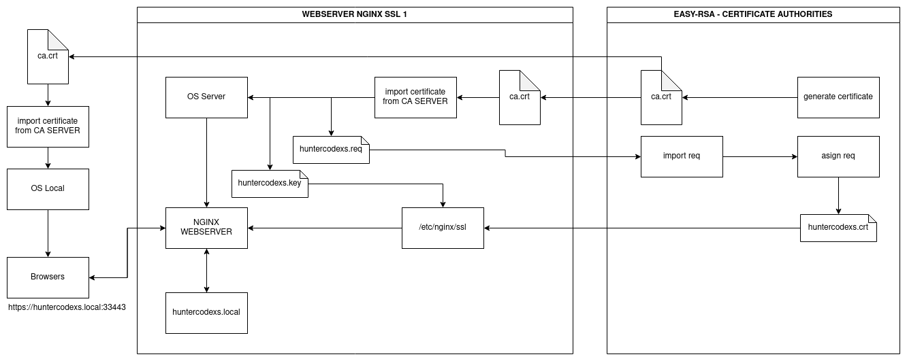
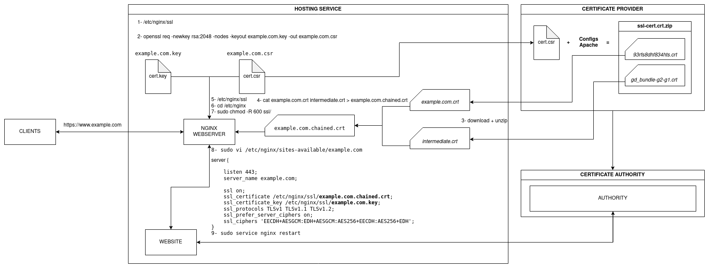

# CERTIFICATE AUTHORITIES
The repository to simulate a complete environment using SSL layer - HTTPS Protocol

# Information
This project aims to offer a viable means for testing during development and the preparation of applications that 
use end-to-end encryption in their communications based on HTTPS. At the end of project it will be possible to run one 
complete environment simulating a private network controlled by certificates and a certificate authorities, in addition 
to ensuring that an application that needs to use the TLS/SSL layer can be run for testing purposes.

> IMPORTANT: This repository should not be used in a production environment

Below we have a graphic example of how the project resources work and interact

# Usage

> NOTE: To execute this environment just copy and paste the commands below, it's not needed to make any other things

Firstly, get the project from GitHub using git clone

<pre>
user@host:/home/user$ git clone https://github.com/huntercodexs/docker-series.git .
user@host:/home/user$ cd docker-series
user@host:/home/user/docker-series$ git checkout certificate_authorities
user@host:/home/user/docker-series$ cd certificate_authorities/
user@host:/home/user/docker-series/certificate_authorities$ docker-compose up --build (in first time)
user@host:/home/user/docker-series/certificate_authorities$ docker-compose start (in others case)
</pre>

Now, edit the .env file to create an CA SERVER information and NGINX SERVER settings, as example:

<pre>
CA_SERVER_PORT=35900
CA_SERVER_COUNTRY=BR
CA_SERVER_PROVINCE=SaoPaulo
CA_SERVER_CITY=Taubate
CA_SERVER_ORG=Huntercodexs
CA_SERVER_EMAIL=huntercodexs@gmail.com
CA_SERVER_ORGANIZATION_UNIT_NAME=Softwares
CA_SERVER_ALGORITHM=ec
CA_SERVER_DIGEST=sha512

# SETUP NGINX SSL SERVER 1
NGINX_SSL_1_HTTP_PORT=38080
NGINX_SSL_1_HTTPS_PORT=33443
NGINX_SSL_1_COUNTRY=BR
NGINX_SSL_1_STATE=SaoPaulo
NGINX_SSL_1_CITY=Taubate
NGINX_SSL_1_ORGANIZATION=Huntercodexs
NGINX_SSL_1_ORGANIZATION_UNIT_NAME=Nginx-Server-Ssl-1
NGINX_SSL_1_COMMON_NAME=huntercodexs.local
NGINX_SSL_1_EMAIL_ADDRESS=huntercodexs@gmail.com
</pre>

It's possible to use many servers as needed, just pay attention in the following files:

<pre>
.env
docker-compose.yml
nginx-ssl-server{NUMBER-SERVER}.dockerfile
</pre>

# Lets to get started (commands)

In the first time you should be warrantied that all the folders path are been empty without 
crt, req, csr or key certificate files, so you can use the script reset.sh placed in the 
root in this repository.

<pre>
user@host:/home/user/docker-series/certificate_authorities$ ./reset.sh  
</pre>

> IMPORTANT: Ensure that the huntercodexs.local.conf is comment on code block ssl, as shown below

<pre>
server {
    #listen       443 ssl;
    #listen       [::]:443 ssl;
    #server_name  huntercodexs.local;
    #index index.html;
    #client_max_body_size 20M;
    #error_log  /var/log/nginx/error-app1.log;
    #access_log /var/log/nginx/access-app1.log;
    #root /var/www/app1;

    ##deprecated: keep on commented
    ##ssl on;
    ##ssl_certificate /etc/nginx/ssl/huntercodexs.local.chained.crt;
    
    #ssl_certificate /etc/nginx/ssl/huntercodexs.local.crt;
    #ssl_certificate_key /etc/nginx/ssl/huntercodexs.local.key;
    #ssl_protocols TLSv1 TLSv1.1 TLSv1.2;
    #ssl_prefer_server_ciphers on;
    #ssl_ciphers 'EECDH+AESGCM:EDH+AESGCM:AES256+EECDH:AES256+EDH';

    #location / {
    #    try_files $uri $uri/ /index.html?$query_string;
    #}
}
</pre>

Run the container

<pre>
user@host:/home/user/docker-series/certificate_authorities$ docker network create open_network (if required)
user@host:/home/user/docker-series/certificate_authorities$ docker-compose up --build (in first time)
</pre>

Access the CA SERVER and execute the procedures below

<pre>
user@host:/home/user/docker-series/certificate_authorities$ [Ctrl+C]
user@host:/home/user/docker-series/certificate_authorities$ docker-compose start
user@host:/home/user/docker-series/certificate_authorities$ docker exec -it caserver /bin/bash
</pre>

Get the ca.crt file in the CA SERVER

> Note: The docker-compose up --build will generate the ca.crt file automatically

<pre>
root@ae09760e65ab:/home/causer/easy-rsa# ls /tmp/ca.crt
root@ae09760e65ab:/home/causer/easy-rsa# cp /tmp/ca.crt /home/causer/share/easy-rsa/
root@ae09760e65ab:/home/causer/easy-rsa# exit
</pre>

Copy the /share/caserver/easy-rsa/ca.crt to /share/nginx-ssl-1/ssl/ca.crt (locally in this repository)

Get access to NGINX SERVER

<pre>
user@host:/home/user/docker-series/certificate_authorities$ docker exec -it nginx-ssl-server1 /bin/bash
</pre>

Put the ca.crt file in the /usr/local/share/ca-certificates/ path and run the command

<pre>
root@36ef5ac2d59e:/etc/nginx# cp /home/nginx/ca.crt /usr/local/share/ca-certificates/ca.crt
root@36ef5ac2d59e:/etc/nginx# ls /usr/local/share/ca-certificates/
root@36ef5ac2d59e:/etc/nginx# update-ca-certificates
</pre>

Get the req file generated to copy into CA SERVER

<pre>
root@36ef5ac2d59e:/etc/nginx# cp /tmp/$NGINX_SSL_1_COMMON_NAME.req /home/nginx/
</pre>

Copy the /share/nginx-ssl-1/$NGINX_SSL_1_COMMON_NAME.req to /share/caserver/easy-rsa/$NGINX_SSL_1_COMMON_NAME.req (locally)

Get access to the folder easy-rsa on CA SERVER

<pre>
#logout current container
root@36ef5ac2d59e:/etc/nginx# [Ctrl+D]

# access the caserver container
user@host:/home/user/docker-series/certificate_authorities$ docker exec -it caserver /bin/bash

# access the path
root@ae09760e65ab:/home/causer/easy-rsa# cd /home/causer/share/easy-rsa
root@ae09760e65ab:/home/causer/easy-rsa# cp $NGINX_SSL_1_COMMON_NAME.req /tmp/$NGINX_SSL_1_COMMON_NAME.req

# import
root@ae09760e65ab:/home/causer/easy-rsa# cd /home/causer/easy-rsa
root@ae09760e65ab:/home/causer/easy-rsa# ./easyrsa import-req /tmp/$NGINX_SSL_1_COMMON_NAME.req $NGINX_SSL_1_COMMON_NAME

# asign
root@ae09760e65ab:/home/causer/easy-rsa# ./easyrsa sign-req server $NGINX_SSL_1_COMMON_NAME

# resulted
root@ae09760e65ab:/home/causer/easy-rsa# ls /home/causer/easy-rsa/pki/ca.crt
root@ae09760e65ab:/home/causer/easy-rsa# ls /home/causer/easy-rsa/pki/issued/$NGINX_SSL_1_COMMON_NAME.crt

root@ae09760e65ab:/home/causer/easy-rsa# cp /home/causer/easy-rsa/pki/ca.crt /home/causer/share/easy-rsa/
root@ae09760e65ab:/home/causer/easy-rsa# cp /home/causer/easy-rsa/pki/issued/$NGINX_SSL_1_COMMON_NAME.crt /home/causer/share/easy-rsa/
</pre>

> NOTE: Check the permissions in this step

Copy the /share/caserver/easy-rsa/ca.crt to /share/nginx-ssl-1/ca.crt to (locally)
Copy the /share/caserver/easy-rsa/$NGINX_SSL_1_COMMON_NAME.crt to /share/nginx-ssl-1/$NGINX_SSL_1_COMMON_NAME.crt to (locally)

Set up the webserver (NGINX)

<pre>
user@host:/home/user/docker-series/certificate_authorities$ docker exec -it nginx-ssl-server1 /bin/bash
</pre>

<pre>
root@ae09760e65ab:/home/causer/easy-rsa# su nginx
root@ae09760e65ab:/home/causer/easy-rsa# cp /home/nginx/ca.crt /etc/nginx/ssl/
root@ae09760e65ab:/home/causer/easy-rsa# cp /home/nginx/$NGINX_SSL_1_COMMON_NAME.crt /etc/nginx/ssl/
root@ae09760e65ab:/home/causer/easy-rsa# cp /tmp/$NGINX_SSL_1_COMMON_NAME.key /etc/nginx/ssl/
root@ae09760e65ab:/home/causer/easy-rsa# cd /etc/nginx/ssl/
root@ae09760e65ab:/home/causer/easy-rsa# cat /etc/nginx/ssl/$NGINX_SSL_1_COMMON_NAME.crt /etc/nginx/ssl/ca.crt >> /etc/nginx/ssl/$NGINX_SSL_1_COMMON_NAME.chained.crt
root@ae09760e65ab:/home/causer/easy-rsa# chmod 755 -R /etc/nginx/ssl/
</pre>

Set up the NGINX Server

On local path /certificate_authorities$/nginx-ssl-server-1/sites-enabled/$NGINX_SSL_1_COMMON_NAME.conf, uncomment the 
following lines in the file, or copy and past the code below

<pre>
server {
    listen       443 ssl;
    listen       [::]:443 ssl;
    server_name  huntercodexs.local;
    index index.html;
    client_max_body_size 20M;
    error_log  /var/log/nginx/error-app1.log;
    access_log /var/log/nginx/access-app1.log;
    root /var/www/app1;

    #deprecated: keep on commented
    #ssl on;
    #ssl_certificate /etc/nginx/ssl/huntercodexs.local.chained.crt;

    ssl_certificate /etc/nginx/ssl/huntercodexs.local.crt;
    ssl_certificate_key /etc/nginx/ssl/huntercodexs.local.key;
    ssl_protocols TLSv1 TLSv1.1 TLSv1.2;
    ssl_prefer_server_ciphers on;
    ssl_ciphers 'EECDH+AESGCM:EDH+AESGCM:AES256+EECDH:AES256+EDH';

    location / {
        try_files $uri $uri/ /index.html?$query_string;
    }
}
</pre>

<pre>
root@36ef5ac2d59e:/etc/nginx# [Ctrl+D]
root@36ef5ac2d59e:/etc/nginx# nginx -t
root@36ef5ac2d59e:/etc/nginx# service nginx restart
</pre>

> TIP: Maybe it is necessary restart the container

<pre>
user@host:/home/user/docker-series/certificate_authorities$ docker-compose stop
user@host:/home/user/docker-series/certificate_authorities$ docker-compose start
user@host:/home/user/docker-series/certificate_authorities$ docker-compose ps
</pre>

Edit the /etc/hosts in the host machine

<pre>
{IP-ADDRESS}	{DOMAIN-NAME} #Example: huntercodexs.local
</pre>

> EXTRA: If needed revoke the CA use

<pre>
user@host:/home/user/docker-series/certificate_authorities$ docker exec -it caserver /bin/bash
root@ae09760e65ab:/home/causer/easy-rsa# cd /home/causer/easy-rsa
root@ae09760e65ab:/home/causer/easy-rsa# ./easyrsa revoke $NGINX_SSL_1_COMMON_NAME
</pre>

# Browsers - Firefox Configure

If you are used the Mozilla Firefox to access the application in the webserver, you needed 
to do the follow settings

- Get the ca.crt certificate file from CA SERVER
- Click in Edit (menu bar)
- Choose Settings
- CLick in Privacy and Security (menu bar left side)
- Scroll the screen until Security->Certificates
- Click in See certificates
- Go to the tab Authorities
- Click in Import
- Select the ca.crt certificate file (from the CA SERVER)
- Click in OK to import the certificate file
- Check if is required to import the ca.crt certificate file in the local machine or others servers (user@host)
  - Ubuntu: update-ca-certificates
- So, just enjoy the environment using HTTPS protocol

Get access to app running in NGINX

<pre>
https://{ADDRESS}:{PORT} #Example: https://huntercodexs.local:33443
https://{ADDRESS}:{PORT} #Example: https://huntercodexs.local:33443/contact.html

#Non HTTPS
http://{ADDRESS}:{PORT} #Example: http://huntercodexs.local:38080
http://{ADDRESS}:{PORT} #Example: http://huntercodexs.local:38080/contact.html
</pre>

# Specific SSL process - GoDaddy

