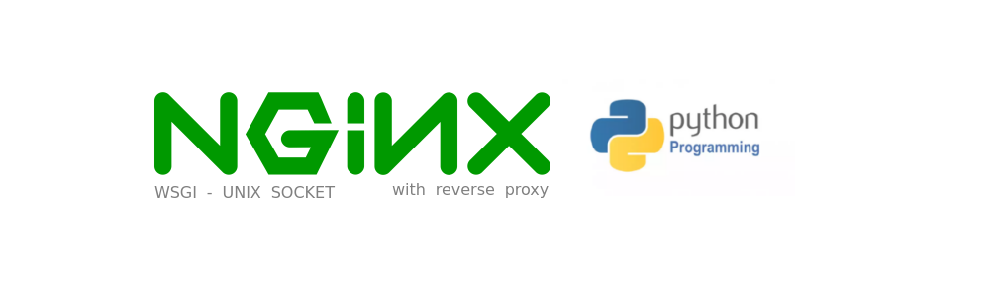

# NGINX + REVERSE PROXY + PYTHON + UWSGI (SERVICE)
Dockerized project using Nginx Reverse Proxy and PYTHON

> WARNING: This is a development server. Do not use it in a production deployment. 
> Use a production WSGI server instead.

> IMPORTANT: Check the sample service in the path files/sample/app1-sample-unix-socket-nginx.zip, it can be used to get
> more details about the UNIX SOCKET protocol and understand in the better way how to use this resource

# Requisites

- Nginx
- Python
- Postman
- Shell Script

# About

This branch set up the environment to run NGINX as Webserver with reverse proxy to contact PYTHON applications, below can 
see the diagram that explain with more details:

> NOTE: Using docker is not possible execute systemctl as a service manager, so give a look in th file 
> nginx_reverse_proxy_python_wsgi/applications/applications-deploy.sh and see with more details this issue.

# Usage

- Before build and start project set the following files configurations:

<pre>
- nginx.conf (./nginx_reverse_proxy_python_wsgi/etc/nginx/nginx.conf)
- reverse-proxy-python-server.conf (./nginx_reverse_proxy_python_wsgi/etc/nginx/conf/reverse-proxy-python-server.conf)
- reverse-proxy-python.log (./nginx_reverse_proxy_python_wsgi/etc/nginx/logs/reverse-proxy-python.log)
</pre>

- Before build and start project set the python applications in script below

<pre>
- applications-deploy.sh (nginx_reverse_proxy_python_wsgi/applications/applications-deploy.sh)
</pre>

- Access the folder path in this project to run nginx_reverse_proxy_python_wsgi, as below:

<pre>
user@host:/home/user$ git clone https://github.com/huntercodexs/docker-series.git .
user@host:/home/user$ cd docker-series
user@host:/home/user/docker-series$ git checkout nginx_reverse_proxy_python_wsgi
user@host:/home/user/docker-series$ cd nginx_reverse_proxy_python_wsgi
user@host:/home/user/docker-series/nginx_reverse_proxy_python_wsgi$ docker network create nginx_reverse_proxy_python_wsgi_open_network
user@host:/home/user/docker-series/nginx_reverse_proxy_python_wsgi$ docker-compose up --build (in first time)
user@host:/home/user/docker-series/nginx_reverse_proxy_python_wsgi$ [Ctrl+C]
user@host:/home/user/docker-series/nginx_reverse_proxy_python_wsgi$ docker-compose start (in the next times)
user@host:/home/user/docker-series/nginx_reverse_proxy_python_wsgi$ docker-compose ps (check the containers status)
</pre>

- Run the applications in nginx_uwsgi_python container

> IMPORTANT NOTE: If the automatically deploy not work in the builder will be necessary run the command below 

<pre>
user@host:/home/user/docker-series/nginx_reverse_proxy_python_wsgi$ docker exec -it nginx_uwsgi_python /bin/bash
root@25f8c997da0a:/home/python/applications# ./applications-deploy.sh
</pre>

# Step by Step

Follow the steps below to quick and easy environment creation

1- Clone the repository
<pre>
user@host:/home/user$ git clone https://github.com/huntercodexs/docker-series.git .
</pre>

2- Access the repository folder
<pre>
user@host:/home/user$ cd docker-series.git
</pre>

3- Change the current branch
<pre>
user@host:/home/user/docker-series$ git checkout nginx_reverse_proxy_python_wsgi
</pre>

4- Access the nginx_reverse_proxy_python_wsgi folder
<pre>
user@host:/home/user/docker-series$ cd nginx_reverse_proxy_python_wsgi
</pre>

5- Check and set up the .env file

6- Build the containers

<pre>    
user@host:/home/user/docker-series/nginx_reverse_proxy_python_wsgi$ docker network create nginx_reverse_proxy_python_wsgi_open_network
user@host:/home/user/docker-series/nginx_reverse_proxy_python_wsgi$ docker-compose up --build
user@host:/home/user/docker-series/nginx_reverse_proxy_python_wsgi$ [Ctrl+C]
user@host:/home/user/docker-series/nginx_reverse_proxy_python_wsgi$ docker-compose start
</pre>

Make sure that the result look like this
<pre>
user@host:/home/user/docker-series/nginx_reverse_proxy_python_wsgi$ docker-compose ps
        Name                      Command               State                       Ports                     
--------------------------------------------------------------------------------------------------------------
reverse-proxy          /docker-entrypoint.sh ngin ...   Up      80/tcp, 0.0.0.0:38085->85/tcp,:::38085->85/tcp
ubuntu-nginx-python3   bash /home/python3/applica ...   Up      80/tcp, 8080/tcp                              
</pre>

7- Up the applications
<pre>
user@host:/home/user/docker-series/nginx_reverse_proxy_python_wsgi$ docker exec -it nginx_uwsgi_python /bin/bash
root@25f8c997da0a:/home/python/applications# ./applications-deploy.sh
</pre>

The result should be look like as below
<pre>
 * * * * * * * * * * * * * * Welcome to APP1  * * * * * * * * * * * * * *
 * Serving Flask app 'APP1'
 * Debug mode: on
 * Running on all addresses (0.0.0.0)
 * Running on http://127.0.0.1:55001
 * Running on http://172.19.0.3:55001
Press CTRL+C to quit
 * Restarting with stat
 * * * * * * * * * * * * * * Welcome to APP1  * * * * * * * * * * * * * *
 * Debugger is active!
 * Debugger PIN: 136-930-991

* * * * * * * * * * * * * * Welcome to APP2  * * * * * * * * * * * * * *
 * Serving Flask app 'APP2'
 * Debug mode: on
 * Running on all addresses (0.0.0.0)
 * Running on http://127.0.0.1:55002
 * Running on http://172.19.0.3:55002
Press CTRL+C to quit
 * Restarting with stat
 * * * * * * * * * * * * * * Welcome to APP2  * * * * * * * * * * * * * *
 * Debugger is active!
 * Debugger PIN: 136-930-991
</pre>

8- Check the process for applications running
<pre>
user@host:/home/user/docker-series/nginx_reverse_proxy_python_wsgi$ docker exec -it python3 /bin/bash
root@8c1ede295935:/home/python3/applications# ps -ef
UID          PID    PPID  C STIME TTY          TIME CMD
root           1       0  0 17:54 pts/0    00:00:00 bash /home/python3/applications/applications-deploy.sh
root          24       1  0 17:54 pts/0    00:00:00 python3 app1.py
root          26      24  0 17:54 pts/0    00:00:00 /usr/local/bin/python3 app1.py
root          40       1  0 17:54 pts/0    00:00:00 python3 app2.py
root          41      40  0 17:54 pts/0    00:00:00 /usr/local/bin/python3 app2.py
root          46       0  0 17:56 pts/1    00:00:00 /bin/bash
root          53      46  0 17:56 pts/1    00:00:00 ps -ef
root@8c1ede295935:/home/python3/applications#
</pre>

8- Access and test - APIs
<pre>
[GET] http://localhost:38085/app1/
[RESPONSE]
{
  "message": "Everything fine !",
  "response": "Welcome to APP1",
  "status": 200
}

[GET] http://localhost:38085/app2/
[RESPONSE]
{
    "message": "Everything fine !",
    "response": "Welcome to APP2",
    "status": 200
}
</pre>

> Use the postman file to make a tests above: "PYTHON - NGINX REVERSE PROXY.postman_collection.json"

