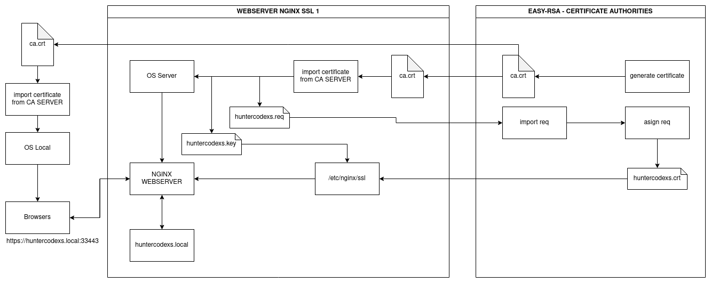
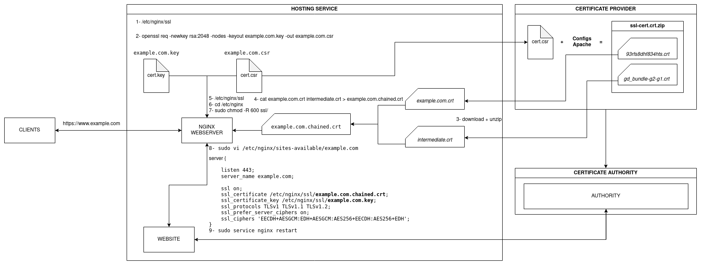

# CERTIFICATE AUTHORITIES
A project to simulate a complete environment using SSL layer - HTTPS Protocol

# Information

This project aims to offer a viable means for testing during development and
the preparation of applications that use end-to-end encryption in their communications. At the end of
project it will be possible to run a complete environment simulating a private network controlled by
certificates and a certification authority, in addition to ensuring that an application that needs to use
the TLS/SSL layer can be run for testing purposes.

> IMPORTANT: This project should not be used in a production environment

Below we have a graphic example of how the project resources work and interact

# Usage

> NOTE: TO execute this project just copy and paste the commands below, is not needed to make any other things

Firstly, edit the .env file to create an CA SERVER information and NGINX SERVER settings, as example:

<pre>
CA_SERVER_PORT=35900
CA_SERVER_COUNTRY=BR
CA_SERVER_PROVINCE=SaoPaulo
CA_SERVER_CITY=Taubate
CA_SERVER_ORG=Huntercodexs
CA_SERVER_EMAIL=huntercodexs@gmail.com
CA_SERVER_ORGANIZATION_UNIT_NAME=Softwares
CA_SERVER_ALGORITHM=ec
CA_SERVER_DIGEST=sha512

# SETUP NGINX SSL SERVER 1
NGINX_SSL_1_HTTP_PORT=38080
NGINX_SSL_1_HTTPS_PORT=33443
NGINX_SSL_1_COUNTRY=BR
NGINX_SSL_1_STATE=SaoPaulo
NGINX_SSL_1_CITY=Taubate
NGINX_SSL_1_ORGANIZATION=Huntercodexs
NGINX_SSL_1_ORGANIZATION_UNIT_NAME=Nginx-Server-Ssl-1
NGINX_SSL_1_COMMON_NAME=huntercodexs.local
NGINX_SSL_1_EMAIL_ADDRESS=huntercodexs@gmail.com
</pre>

It's possible to use many servers as needed, just pay attention in the following files:

<pre>
.env
docker-compose.yml
nginx-ssl-server{NUMBER-SERVER}.dockerfile
</pre>

# Lets to get started (commands)

In the first time you should be warrantied that all the folders path are been empty without 
crt, req, csr or key certificate files, so you can use the script reset.sh placed in the 
root in this project.

<pre>
./certification_authority/reset.sh
or
cd certification_authority/
./reset.sh
</pre>

Run the container

<pre>
user@host: docker network create open_network (if required)
user@host: docker-compose up --build (in first time)
user@host: docker-compose start (in the next time)
</pre>

Access the CA SERVER and execute the procedures below

<pre>
user@host: docker-compose start
user@host: docker exec -it caserver /bin/bash
</pre>

Get the ca.crt file in the CA SERVER

> Note: The docker-compose up --build will generate the ca.crt file automatically

<pre>
causer@caserver: ls /tmp/ca.crt
causer@caserver: cp /tmp/ca.crt /home/causer/share/easy-rsa/
causer@caserver: exit
</pre>

Copy the /share/caserver/easy-rsa/ca.crt to /share/nginx-ssl-1/ca.crt locally

Get access to NGINX SERVER

<pre>
user@host: docker exec -it nginx-ssl-server1 /bin/bash
</pre>

Put the ca.crt file in the folder and run the command

<pre>
nginx@nginx-ssl-server-1: cp /home/nginx/ca.crt /usr/local/share/ca-certificates/ca.crt
nginx@nginx-ssl-server-1: ls /usr/local/share/ca-certificates/
nginx@nginx-ssl-server-1: update-ca-certificates
</pre>

Get the req file generated to copy into CA SERVER

<pre>
nginx@nginx-ssl-server-1: cp /tmp/$NGINX_SSL_1_COMMON_NAME.req /home/nginx/
</pre>

Copy the /share/nginx-ssl-1/$NGINX_SSL_1_COMMON_NAME.req to /share/caserver/easy-rsa/$NGINX_SSL_1_COMMON_NAME.req locally

Get access to the folder easy-rsa on CA SERVER

<pre>
user@host: docker exec -it caserver /bin/bash
</pre>

<pre>
# access
causer@caserver: cd /home/causer/share/easy-rsa
causer@caserver: cp $NGINX_SSL_1_COMMON_NAME.req /tmp/$NGINX_SSL_1_COMMON_NAME.req

# import
causer@caserver: cd /home/causer/easy-rsa
causer@caserver: ./easyrsa import-req /tmp/$NGINX_SSL_1_COMMON_NAME.req $NGINX_SSL_1_COMMON_NAME

# asign
causer@caserver: ./easyrsa sign-req server $NGINX_SSL_1_COMMON_NAME

# resulted
causer@caserver: ls /home/causer/easy-rsa/pki/ca.crt
causer@caserver: ls /home/causer/easy-rsa/pki/issued/$NGINX_SSL_1_COMMON_NAME.crt

causer@caserver: cp /home/causer/easy-rsa/pki/ca.crt /home/causer/share/easy-rsa/
causer@caserver: cp /home/causer/easy-rsa/pki/issued/$NGINX_SSL_1_COMMON_NAME.crt /home/causer/share/easy-rsa/
</pre>

Copy the /share/caserver/easy-rsa/ca.crt to /share/nginx-ssl-1/ca.crt to locally
Copy the /share/caserver/easy-rsa/$NGINX_SSL_1_COMMON_NAME.crt to /share/nginx-ssl-1/$NGINX_SSL_1_COMMON_NAME.crt to locally

Set up the webserver (NGINX)

<pre>
user@host: docker exec -it nginx-ssl-server1 /bin/bash
</pre>

<pre>
causer@caserver: su nginx
causer@caserver: cp /home/nginx/ca.crt /etc/nginx/ssl/
causer@caserver: cp /home/nginx/$NGINX_SSL_1_COMMON_NAME.crt /etc/nginx/ssl/
causer@caserver: cp /tmp/$NGINX_SSL_1_COMMON_NAME.key /etc/nginx/ssl/
causer@caserver: cd /etc/nginx/ssl/
causer@caserver: cat /etc/nginx/ssl/$NGINX_SSL_1_COMMON_NAME.crt /etc/nginx/ssl/ca.crt >> /etc/nginx/ssl/$NGINX_SSL_1_COMMON_NAME.chained.crt
causer@caserver: su root
causer@caserver: chmod 755 -R /etc/nginx/ssl/
</pre>

Set up the NGINX Server

<pre>

local path: /certification_authority/nginx-ssl-server-1/sites-enabled/$NGINX_SSL_1_COMMON_NAME

server {

    listen 443;
    listen [::]:443;
    server_name $NGINX_SSL_1_COMMON_NAME;
    client_max_body_size 20M;

    ....

    #ssl on;
    #ssl_certificate /etc/nginx/ssl/$NGINX_SSL_1_COMMON_NAME.chained.crt;

    ...

    ssl_certificate /etc/nginx/ssl/$NGINX_SSL_1_COMMON_NAME.crt;
    ssl_certificate_key /etc/nginx/ssl/$NGINX_SSL_1_COMMON_NAME.key;
    ssl_protocols TLSv1 TLSv1.1 TLSv1.2; 
    ssl_prefer_server_ciphers on;
    ssl_ciphers 'EECDH+AESGCM:EDH+AESGCM:AES256+EECDH:AES256+EDH';
}

nginx@nginx-ssl-server-1: nginx -t
nginx@nginx-ssl-server-1: service nginx restart
</pre>

<pre>
user@host: docker-compose stop
user@host: docker-compose start
user@host: docker-compose ps
</pre>

Edit the /etc/hosts

<pre>
{IP-ADDRESS}	{DOMAIN-NAME} #Example: huntercodexs.local
</pre>

If needed revoke the CA use

<pre>
user@host: docker exec -it caserver /bin/bash
causer@caserver: cd /home/causer/easy-rsa
causer@caserver: ./easyrsa revoke $NGINX_SSL_1_COMMON_NAME
</pre>

# Browsers - Firefox Configure

If you are used the Mozilla Firefox to access the application in the webserver, you needed 
to do the follow settings

- Get the ca.crt certificate file from CA SERVER
- Click in Edit (menu bar)
- Choose Settings
- CLick in Privacy and Security (manu bar left side)
- Scroll the screen until  Security->Certificates
- Click in See certificates
- Go to the tab Authorities
- Click in Import
- Select the ca.crt certificate file (from the CA SERVER)
- Click in OK to import the certificate file
- Check if is required to import the ca.crt certificate file in the local machine or others servers (user@host)
- So, just enjoy the environment using HTTPS protocol

Get access to app running in NGINX

<pre>
https://{ADDRESS}:{PORT} #Example: https://huntercodexs.local:33443
https://{ADDRESS}:{PORT} #Example: https://huntercodexs.local:33443/contact.html

#Non HTTPS
http://{ADDRESS}:{PORT} #Example: http://huntercodexs.local:38080
http://{ADDRESS}:{PORT} #Example: http://huntercodexs.local:38080/contact.html
</pre>

# Specific SSL process - GoDaddy

