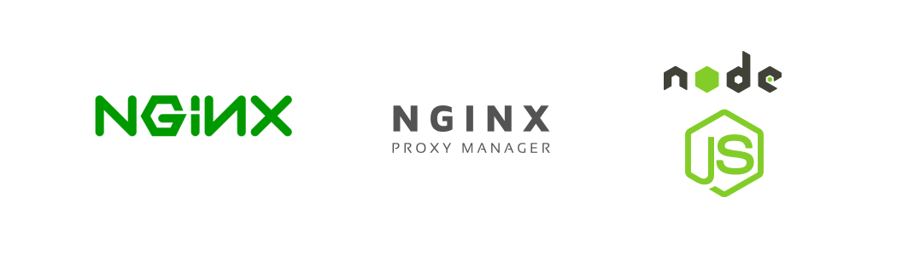

# NGINX + REVERSE PROXY + NODEJS
The simple repository to create an environment of development using NodeJS

# Usage

<pre>
user@host:/home/user$ git clone https://github.com/huntercodexs/docker-series.git .
user@host:/home/user$ cd docker-series
user@host:/home/user/docker-series$ git checkout nginx_reverse_proxy_nodejs
user@host:/home/user/docker-series$ cd nginx_reverse_proxy_nodejs
user@host:/home/user/docker-series/nginx_reverse_proxy_nodejs$ docker-compose up --build
user@host:/home/user/docker-series/nginx_reverse_proxy_nodejs$ [Ctrl+C]
user@host:/home/user/docker-series/nginx_reverse_proxy_nodejs$ docker-compose start
</pre>

# Step by Step

Follow the steps below to quick and easy environment creation

1- Clone the repository
<pre>
user@host:/home/user$ git clone https://github.com/huntercodexs/docker-series.git .
</pre>

2- Access the repository folder
<pre>
user@host:/home/user$ cd docker-series
</pre>

3- Change the current branch
<pre>
user@host:/home/user/docker-series$ git checkout nginx_reverse_proxy_nodejs
</pre>

4- Access the nginx_reverse_proxy_nodejs folder
<pre>
user@host:/home/user/docker-series$ cd nginx_reverse_proxy_nodejs
</pre>

5- Check and set up the .env file

6- Put the applications in the folder path nginx_reverse_proxy_nodejs/applications
<pre>
nginx_reverse_proxy_nodejs/applications/app1
nginx_reverse_proxy_nodejs/applications/app2
...
</pre>

7- Set up the Nginx Server like showed bellow
<pre>
server {
    listen 85;
    server_name nginx_reverse_proxy_nodejs nginx_reverse_proxy_nodejs.local;

    location /app1/ {
        include proxy_params;
        proxy_pass http://192.168.0.200:33001/app1;
    }

    location /app2/ {
        include proxy_params;
        proxy_pass http://192.168.0.200:33002/app2;
    }

    ...
}
</pre>

8- Build the containers
<pre>    
user@host:/home/user/docker-series/ec2_java_mysql_rabbitmq$ docker network create open_network
user@host:/home/user/docker-series/ec2_java_mysql_rabbitmq$ docker-compose up --build
</pre>

9- Access the applications
<pre>
http://localhost:33000/app1/
</pre>

Result
<pre>
The NodeJS App1 is running from Docker Container !---
</pre>

<pre>
http://localhost:33000/app2/
</pre>

Result
<pre>
The NodeJS App2 is running from Docker Container !---
</pre>

