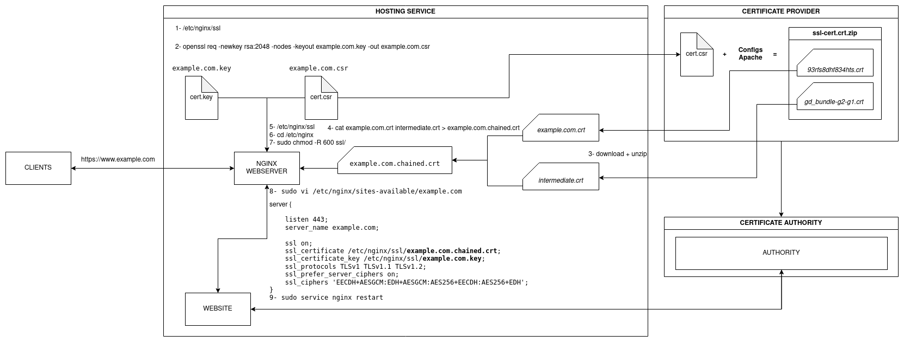

# CERTIFICATION AUTHORITY

# Information

# How to use

Run the container

<pre>
user@server: docker-compose up --build (in first time)
user@server: docker-compose start (in the next time)
user@server: docker network create open_network (if required)
</pre>

Access the CA SERVER and execute the procedures below

<pre>
user@server: docker exec -it caserver /bin/bash
</pre>

Get the ca.crt file in the CA SERVER

> Note: The docker-compose up --build will generate the ca.crt file automatically

<pre>
user@server: ls /tmp/ca.crt
</pre>

Get access to NGINX SERVER

<pre>
user@server: docker exec -it nginx-ssl-server1 /bin/bash
</pre>

Put the ca.crt file in the folder and run the command

<pre>
user@server: ls /usr/local/share/ca-certificates/
user@server: sudo update-ca-certificates
</pre>

Get the req file generated and copy do CA SERVER

<pre>
user@server: scp {FILENAME}.req causer@10.0.0.2:/tmp/{FILENAME}.req
</pre>

Get access to the folder easy-rsa on CA SERVER

<pre>
# access
user@server: cd /home/causer/easy-rsa

# import
user@server: ./easyrsa import-req /tmp/$NGINX_SSL_1_COMMON_NAME.req $NGINX_SSL_1_COMMON_NAME

# asign
user@server: ./easyrsa sign-req server $NGINX_SSL_1_COMMON_NAM

# resulted
user@server: ls /home/causer/easy-rsa/pki/ca.crt
user@server: ls /home/causer/easy-rsa/pki/issued/$NGINX_SSL_1_COMMON_NAME.crt
</pre>

Set up the webserver (NGINX)

<pre>
copied from CA SERVER /tmp/ca.crt
copied from CA SERVER /tmp/$NGINX_SSL_1_COMMON_NAME.crt
user@server: cp /tmp/pki/ca.crt /etc/nginx/ssl/
user@server: cp /tmp/$NGINX_SSL_1_COMMON_NAME.crt /etc/nginx/ssl/
user@server: cat /etc/nginx/ssl/$NGINX_SSL_1_COMMON_NAME.crt /etc/nginx/ssl/ca.crt >> /etc/nginx/ssl/$NGINX_SSL_1_COMMON_NAME.chained.crt
user@server: chmod 600 -R /etc/nginx/ssl/
user@server: sudo vi /etc/nginx/sites-available/$NGINX_SSL_1_COMMON_NAME (ex: huntercodexs.local)

server {
    listen 443;
    listen [::]:443;
    server_name huntercodexs.local;
    client_max_body_size 20M;
 
    ssl on;
    ssl_certificate /etc/nginx/ssl/$NGINX_SSL_1_COMMON_NAME.chained.crt;
    ssl_certificate_key /etc/nginx/ssl/$NGINX_SSL_1_COMMON_NAME.key;    
    ssl_protocols TLSv1 TLSv1.1 TLSv1.2; 
    ssl_prefer_server_ciphers on;
    ssl_ciphers 'EECDH+AESGCM:EDH+AESGCM:AES256+EECDH:AES256+EDH';
}

user@server: sudo service nginx restart
user@server: docker-compose stop
user@server: docker-compose start
</pre>

If needed revoke the CA use

<pre>
user@server: ./easyrsa revoke $NGINX_SSL_1_COMMON_NAME
</pre>

