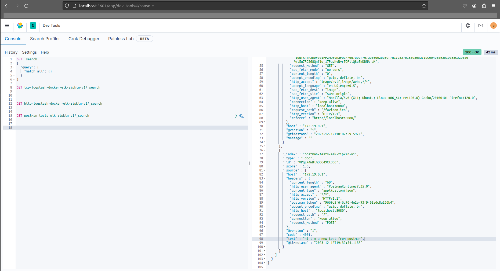

# ELK
Using complete ELK stack

> NOTE: This branch offers only a containers

# Information

Please use the branch selection to access others configurations for your need and purposes

# Resources

> Please see the .env file to more details

- Stack Version 7.9.2
- Elasticsearch
- Kibana
- Logstash

# Usage

<pre>
user@host:/home/user$ git clone https://github.com/huntercodexs/docker-series.git .
user@host:/home/user$ cd docker-series
user@host:/home/user/docker-series$ git checkout elk
user@host:/home/user/docker-series$ cd elk
user@host:/home/user/docker-series/elk$ docker network create elk_open_network
user@host:/home/user/docker-series/elk$ docker-compose up --build (in first time)
user@host:/home/user/docker-series/elk$ [Ctrl+C]
user@host:/home/user/docker-series/elk$ docker-compose start (in the next times)
user@host:/home/user/docker-series/elk$ docker-compose ps (check the containers status)
</pre>

# Step by Step

Follow the steps below to quick and easy environment creation

1- Clone the repository
<pre>
user@host:/home/user$ git clone https://github.com/huntercodexs/docker-series.git .
</pre>

2- Access the repository folder
<pre>
user@host:/home/user$ cd docker-series.git
</pre>

3- Change the current branch
<pre>
user@host:/home/user/docker-series$ git checkout elk
</pre>

4- Access the elk folder
<pre>
user@host:/home/user/docker-series$ cd elk
</pre>

5- Check and set up the .env file

6- Build the containers

<pre>    
user@host:/home/user/docker-series/elk$ docker network create elk_open_network
user@host:/home/user/docker-series/elk$ docker-compose up --build
</pre>

Make sure that the result look like this
<pre>
user@host:/home/user/docker-series/elk$ docker-compose ps
    Name                   Command                   State                                                                                                             Ports                                                                                                      
----------------------------------------------------------------------------------------------------------------------------------------------------------------------------------------------------------------------------------------------------------------------------------
elasticsearch   /tini -- /usr/local/bin/do ...   Up               0.0.0.0:9200->9200/tcp,:::9200->9200/tcp, 0.0.0.0:9300->9300/tcp,:::9300->9300/tcp                                                                                                                              
kibana          /usr/local/bin/dumb-init - ...   Up               0.0.0.0:5601->5601/tcp,:::5601->5601/tcp                                                                                                                                                                        
logstash        /usr/local/bin/docker-entr ...   Up               0.0.0.0:5000->5000/tcp,:::5000->5000/tcp, 0.0.0.0:5000->5000/udp,:::5000->5000/udp, 0.0.0.0:5044->5044/tcp,:::5044->5044/tcp, 0.0.0.0:8080->8080/tcp,:::8080->8080/tcp, 0.0.0.0:9600->9600/tcp,:::9600->9600/tcp
</pre>

7- Test the containers

Elasticsearch
<pre>
http://localhost:9200/
ELASTIC_USERNAME
ELASTIC_PASSWORD
</pre>

Kibana
<pre>
http://localhost:5601/app/home#/
http://localhost:5601/app/dev_tools#/console
ELASTIC_USERNAME
ELASTIC_PASSWORD
</pre>

Example

Queries
<pre>
GET tcp-logstash-docker-elk/_search
GET http-logstash-docker-elk/_search
GET postman-tests-elk/_search
</pre>

Indexes
<pre>
elk/logstash/pipeline/pipelineio.conf
</pre>

Logstash
<pre>
http://localhost:8080
</pre>

# Helper and References

Make a query in the Kibana Dashboard
<pre>
GET tcp-logstash-docker-elk/_search

GET http-logstash-docker-elk/_search

GET postman-tests-elk/_search
</pre>
