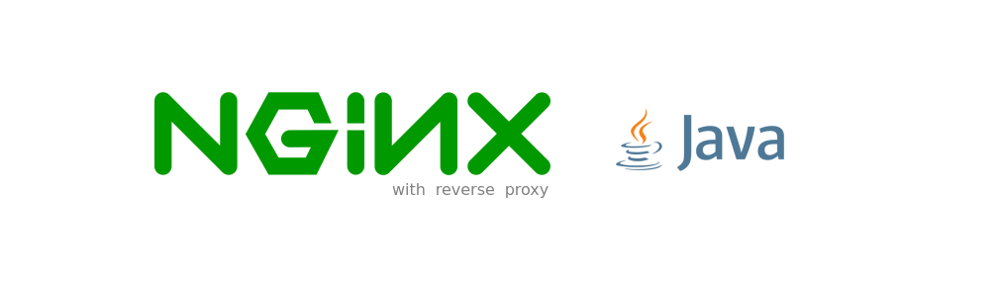
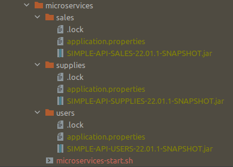

# NGINX + REVERSE PROXY + JAVA
Dockerized project using Nginx Reverse Proxy and JAVA

> IMPORTANT NOTE: All the microservices in this project are simply to show the functional concept. Those projects 
> are placed in the path openjdk/microservices in a jar file that was previously built in one FAKE project.

# Pre-Requisites

- Nginx
- Java (openjdk-8u212)
- Postman
- Shell Script
- Mysql 5.7 or higher

# About

This branch set up the environment to run NGINX as Webserver with reverse proxy to contact JAVA microservices, below can 
see the diagram that explain with more details:

# Usage

- Before build and start project set the following files configurations:

<pre>
- nginx.conf (./nginx_reverse_proxy_java/etc/nginx/nginx.conf)
- reverse-proxy-ms-java-server.conf (./nginx_reverse_proxy_java/etc/nginx/conf/reverse-proxy-ms-java-server.conf)
- reverse-proxy-java.log (./nginx_reverse_proxy_java/etc/nginx/logs/reverse-proxy-java.log)
</pre>

- Before build and start project set the microservices in script below

<pre>
- microservices-start.sh (nginx_reverse_proxy_java/microservices/microservices-start.sh)
</pre>

- Put all "jar files microservices" inside "microservices folder path", see bellow the sample image from IDE:

- Access the folder path in this project to run nginx_reverse_proxy_java, as below:

<pre>
user@host:/home/user$ git clone https://github.com/huntercodexs/docker-series.git .
user@host:/home/user$ cd docker-series
user@host:/home/user/docker-series$ git checkout nginx_reverse_proxy_java
user@host:/home/user/docker-series$ cd nginx_reverse_proxy_java
user@host:/home/user/docker-series/nginx_reverse_proxy_java$ docker network create nginx_reverse_proxy_java_open_network
user@host:/home/user/docker-series/nginx_reverse_proxy_java$ docker-compose up --build (in first time)
user@host:/home/user/docker-series/nginx_reverse_proxy_java$ [Ctrl+C]
user@host:/home/user/docker-series/nginx_reverse_proxy_java$ docker-compose start (in the next times)
user@host:/home/user/docker-series/nginx_reverse_proxy_java$ docker-compose ps (check the containers status)
</pre>

- Run the microservices in openjdk-8u212 container

<pre>
user@host:/home/user/docker-series/nginx_reverse_proxy_java$ docker exec -it openjdk-8u212 ./home/openjdk8u212/microservices-start.sh
</pre>

or

<pre>
user@host:/home/user/docker-series/nginx_reverse_proxy_java$ docker exec -it openjdk-8u212 /bin/bash
root@25f8c997da0a:/home/openjdk8u212# ./microservices-start.sh
root@25f8c997da0a:/home/openjdk8u212# ps -ef
UID          PID    PPID  C STIME TTY          TIME CMD
root           1       0  0 12:48 pts/0    00:00:00 bash
root           7       0  0 12:48 pts/1    00:00:00 /bin/bash
root          15       1 63 12:49 pts/1    00:00:11 java -jar SIMPLE-API-USERS-22.01.1-SNAPSHOT.jar
root          16       1 63 12:49 pts/1    00:00:11 java -jar SIMPLE-API-SALES-22.01.1-SNAPSHOT.jar
root          17       1 55 12:49 pts/1    00:00:09 java -jar SIMPLE-API-SUPPLIES-22.01.1-SNAPSHOT.jar
</pre>

# Step by Step

Follow the steps below to quick and easy environment creation

1- Clone the repository
<pre>
user@host:/home/user$ git clone https://github.com/huntercodexs/docker-series.git .
</pre>

2- Access the repository folder
<pre>
user@host:/home/user$ cd docker-series.git
</pre>

3- Change the current branch
<pre>
user@host:/home/user/docker-series$ git checkout nginx_reverse_proxy_java
</pre>

4- Access the nginx_reverse_proxy_java folder
<pre>
user@host:/home/user/docker-series$ cd nginx_reverse_proxy_java
</pre>

5- Check and set up the .env file

6- Build the containers

<pre>    
user@host:/home/user/docker-series/nginx_reverse_proxy_java$ docker network create nginx_reverse_proxy_java_open_network
user@host:/home/user/docker-series/nginx_reverse_proxy_java$ docker-compose up --build
</pre>

Make sure that the result look like this
<pre>
user@host:/home/user/docker-series/nginx_reverse_proxy_java$ docker-compose ps
    Name                   Command               State                       Ports                     
-------------------------------------------------------------------------------------------------------
mysql57         docker-entrypoint.sh mysqld      Up                                                    
nginx           /docker-entrypoint.sh ngin ...   Up      80/tcp, 0.0.0.0:38085->85/tcp,:::38085->85/tcp
openjdk-8u212   bash                             Up
</pre>

7- Access and test - APIs
<pre>
[GET] http://localhost:38085/api/v1/users 
[RESPONSE] OK, it is working fine !

[GET] http://localhost:38085/api/v1/sales 
[RESPONSE] OK, it is working fine !

[GET] http://localhost:38085/api/v1/supplies 
[RESPONSE] OK, it is working fine !
</pre>

> Use the postman file to make a tests above: "JAVA - NGINX REVERSE PROXY.postman_collection.json"

> The microservices are localized in this project on folder nginx_reverse_proxy_java/microservices

