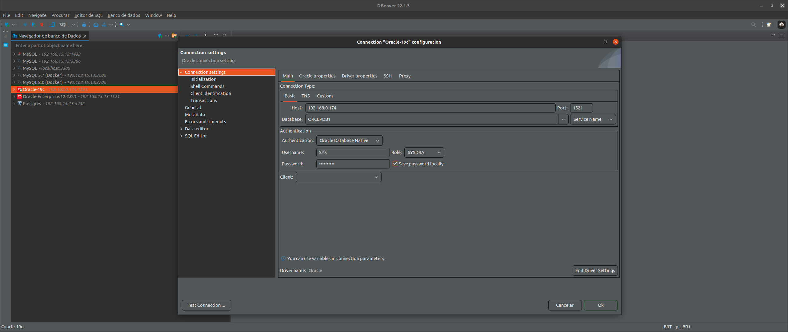

# JAVA + ORACLELINUX
Simple Environment to simulate a workflow

# Requisites

- Java 8
- Oraclelinux 19c

# How to use

> NOTE: As a main tip always start the oraclelinux before that anyone other container

- Run Container

<pre>
git clone https://github.com/huntercodexs/docker-series.git .
git checkout java_oraclelinux
cd java_oraclelinux
</pre>

- Oraclelinux

> Set the ORACLE EDITION (see .env file):

<pre>
ee - Enterprise Edition
se2 - Standard Edition
xe - Express Edition
</pre>

> 
REQUIRED

- Database file: LINUX.X64_193000_db_home.zip (in this case)
- This file can be downloaded in https://www.oracle.com/database/technologies/oracle-database-software-downloads.html

> 
STEPS BEFORE BUILD

- Put the LINUX.X64_193000_db_home.zip inside oracle/database before run the docker-compose
- Unzip the oraclelinux-database-scripts-19c.tar.bz2 file inside the oracle/database folder:
<pre>
tar -xvf oraclelinux-database-scripts-19c.tar.bz2
</pre>
- Create the oradata folder in oracle path
- Check if oracle/oradata is empty or just have the dbconfig/ and ORCLCDB/ folders

> 
IMPORTANT

- The path oracle/oradata in current container instance "should be empty"
- Have sure that the oracle/oradata is empty or just have the dbconfig/ and ORCLCDB/ folders
- The builder of this container is very long and need a long time to finish correctly
- Use the command docker-compose up --build to run in first time

> 
STEPS AFTER BUILD

- HOST(your machine):

Set Password Administration
<pre>
docker-compose start oraclelinux

docker-compose ps
oraclelinux     /bin/sh -c exec $ORACLE_BA ...   Up (healthy)   0.0.0.0:1521->1521/tcp,:::1521->1521/tcp, 0.0.0.0:5500->5500/tcp,:::5500->5500/tcp
</pre>

<pre>
docker exec -it oraclelinux ./setPassword.sh ${YOUR_ORACLE_PASSWORD}

OUTPUT COMMAND ****************************************************************************************
The Oracle base remains unchanged with value /opt/oracle

SQL*Plus: Release 19.0.0.0.0 - Production on Sat Feb 11 21:20:12 2023
Version 19.3.0.0.0

Copyright (c) 1982, 2019, Oracle.  All rights reserved.

Connected to:
Oracle Database 19c Enterprise Edition Release 19.0.0.0.0 - Production
Version 19.3.0.0.0

SQL> 
User altered.

SQL> 
User altered.

SQL> 
Session altered.

SQL> 
User altered.

SQL> Disconnected from Oracle Database 19c Enterprise Edition Release 19.0.0.0.0 - Production
Version 19.3.0.0.0
********************************************************************************************************
</pre>

- Access the database container
<pre>
docker exec -it oraclelinux /bin/bash
</pre>

- GUEST(inside oraclelinux):

Create User
<pre>
sqlplus sys/${YOUR_ORACLE_PASSWORD}@ORCLPDB1 as sysdba
CREATE USER DEVEL IDENTIFIED BY ${YOUR_ORACLE_PASSWORD};
GRANT CREATE SESSION, CREATE TABLE, CREATE SEQUENCE TO DEVEL;
ALTER USER DEVEL QUOTA 50m ON SYSTEM;
CREATE SMALLFILE TABLESPACE DEVEL DATAFILE '/opt/oracle/oradata/ORCLCDB/ORCLPDB1/DEVEL.dbf' SIZE 1G;
ALTER DATABASE DEFAULT TABLESPACE DEVEL;
ALTER USER DEVEL QUOTA 100M ON DEVEL;
SELECT * FROM ALL_USERS au;
SELECT * FROM ALL_USERS au WHERE au.USERNAME = 'DEVEL';
EXIT;
</pre>

Connect on database using the new user
<pre>
sqlplus DEVEL/${YOUR_ORACLE_PASSWORD}@ORCLPDB1
</pre>

- Access the Database Oracle Linux:

<pre>
Host: ${DATABASE_ORACLE_SERVER_IP}
Port: 1521
Database: ORCLPDB1 [Service Name]
Authentication: Oracle Database Native
Username: DEVEL
Role: Normal
Password: ${YOUR_ORACLE_PASSWORD}
</pre>

> Database Connection Sample

> Enterprise Manager

- After the first build use 

<pre>docker-compose up -d oraclelinux</pre>
or
<pre>docker-compose start oraclelinux</pre>
and finally
<pre>docker-compose start openjdk-8u212</pre>

Not forgot that modify the application.properties

- Access the Enterprise Manager:

<pre>
https://${WEBSERVER_ADDRESS}:5500/em
  > username: sys
  > password: ${YOUR_ORACLE_PASSWORD}
  > container name: ORCLPDB1
  ** to get this value exec in the current terminal:
  SQL> show pdbs;
  
  CON_ID CON_NAME			  OPEN MODE  RESTRICTED
  ---------- ------------------------------ ---------- ----------
   3 ORCLPDB1			  READ WRITE NO
  SQL> 
  
</pre>

* All rights reserved to ORACLE - https://www.oracle.com/

- Access JAVA OPENJDK container

<pre>
docker exec -it openjdk-8u212 /bin/bash
</pre>

- Final Result

<pre>
user@host$ docker-compose ps
    Name                   Command                  State                                             Ports                                       
--------------------------------------------------------------------------------------------------------------------------------------------------
openjdk-8u212   java -jar /home/openjdk8u2 ...   Up             0.0.0.0:38001->38001/tcp,:::38001->38001/tcp                                      
oraclelinux     /bin/sh -c exec $ORACLE_BA ...   Up (healthy)   0.0.0.0:1521->1521/tcp,:::1521->1521/tcp, 0.0.0.0:5500->5500/tcp,:::5500->5500/tcp
</pre>

# About the sample project

> Remember, the sample project is just to demonstration how work this project JAVA + ORACLE

To run the sample projects contained in this project get the project files into folder sample-project, and follow the bellow:

- open the project in your prefer IDE
- run the "mvn package"
- take the generated jar file
- edit the application.properties file with the correct settings
- finally put the resulted jar file and application.properties in the folder app/

> TIPS: Use the "JAVA + ORACLE.postman_collection.json" POSTMAN file to make tests

<pre>
./java_oraclelinux/sample-project/java-oraclelinux/JAVA + ORACLELINUX.postman_collection.json
</pre>