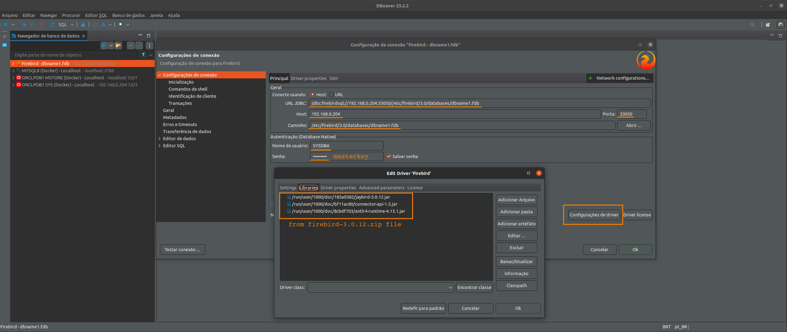

# Databases
The helpful repository for all databases

# Usage

<pre>
user@host:~/home/user$ git clone https://github.com/huntercodexs/docker-series.git .
user@host:~/home/user/docker-series$ cd docker-series
user@host:~/home/user/docker-series$ git checkout databases
user@host:~/home/user/docker-series$ cd databases
user@host:~/home/user/docker-series/databases$ ./pre-requisites.sh
user@host:~/home/user/docker-series/databases$ docker-compose up --build (in first time)
user@host:~/home/user/docker-series/databases$ docker-compose start (in the next times)
user@host:~/home/user/docker-series/databases$ docker-compose ps
    Name                   Command                  State                                                                      Ports                                                                
----------------------------------------------------------------------------------------------------------------------------------------------------------------------------------------------------
firebird        firebird                         Up             0.0.0.0:33050->3050/tcp,:::33050->3050/tcp                                                                                          
h2-database     start-h2-database-server         Up             0.0.0.0:35900->35900/tcp,:::35900->35900/tcp, 0.0.0.0:38085->8085/tcp,:::38085->8085/tcp, 0.0.0.0:39095->9095/tcp,:::39095->9095/tcp
mongo           docker-entrypoint.sh mongod      Up             0.0.0.0:27017->27017/tcp,:::27017->27017/tcp                                                                                        
mongo-express   /sbin/tini -- /docker-entr ...   Up             0.0.0.0:38091->8081/tcp,:::38091->8081/tcp                                                                                          
mssql           /opt/mssql/bin/permissions ...   Up             0.0.0.0:1433->1433/tcp,:::1433->1433/tcp                                                                                            
mssql-tools     /bin/sh -c /bin/bash             Up             0.0.0.0:31812->10000/tcp,:::31812->10000/tcp                                                                                        
mysql-57        docker-entrypoint.sh mysqld      Up             0.0.0.0:3357->3306/tcp,:::3357->3306/tcp, 33060/tcp                                                                                 
mysql-80        docker-entrypoint.sh mysqld      Up             0.0.0.0:3708->3306/tcp,:::3708->3306/tcp, 33060/tcp                                                                                 
oraclelinux     /bin/sh -c exec $ORACLE_BA ...   Up (healthy)   0.0.0.0:1521->1521/tcp,:::1521->1521/tcp, 0.0.0.0:5500->5500/tcp,:::5500->5500/tcp                                                  
postgres        docker-entrypoint.sh postgres    Up             0.0.0.0:5432->5432/tcp,:::5432->5432/tcp                                                                                            
redis           docker-entrypoint.sh redis ...   Up             0.0.0.0:6379->6379/tcp,:::6379->6379/tcp                                                                                            
sqlite3         bash                             Up             0.0.0.0:31050->5050/tcp,:::31050->5050/tcp 
</pre>

# Documentation and Support

<h3>Firebird</h3>

- Version

<pre>3.0.1</pre>

- Settings

Before build the firebird container, use the firebird/data folder path (in this project) to set up the configurations
that should be used in the Server:

<pre>
databases.conf
fbintl.conf
fbtrace.conf
firebird.conf
plugins.conf
SYSDBA.password
</pre>

- Terminal Connection

<pre>
user@host:~/home/user/docker-series/databases$ docker exec -it firebird /bin/bash
root@f6c930f8ed06:/etc/firebird/3.0# isql-fb 
Use CONNECT or CREATE DATABASE to specify a database
</pre>

- Create Database and Table

<pre>
SQL> CREATE DATABASE '/etc/firebird/3.0/databases/dbname1.fdb';
SQL> CREATE TABLE users (id INT NOT NULL PRIMARY KEY,name VARCHAR(250) NOT NULL);
SQL> INSERT INTO users (id, name) VALUES ('94734987', 'John Smith Wiz');
SQL> COMMIT;
SQL> SELECT * FROM users;

          ID NAME                                                                                                                                                                                                                                                       
============ =============================================================================== 
    94734987 John Smith Wiz                                                                                                                                                                                                                                             

SQL> QUIT;
</pre>

- Connection SGDB

<pre>
host: 192.168.0.174
port: 33050
path: /etc/firebird/3.0/databases/dbname1.fdb
username: sysdba
password: ${FIREBIRD_PASSWORD} or masterkey
jdbc-url: jdbc:firebirdsql://192.168.0.174:33050//etc/firebird/3.0/databases/dbname1.fdb
Reference library file: Jaybird-3.0.12-JDK_1.8.zip (https://firebirdsql.org/en/jdbc-driver/)
  jaybird-3.0.12.jar
  connector-api-1.5.jar
  antlr-runtime-4.7.jar
</pre>

- Install correct driver in your SGDB tool (example: DBeaver) get the driver in the follow address:

<pre>
https://firebirdsql.org/en/jdbc-driver/
</pre>

> TIP: Use the drivers placed in the local path project

<pre>
./database/drivers/firebird/firebird-3.0.12.zip
</pre>

- Below is the visual sample to Firebird Connection from DBeaver using a correct driver

<h3>H2</h3>

- Settings to do before run this project

Configure the file .env as shown bellow

> NOTE: Check the version and zip filename in the https://www.h2database.com/html/download.html

<pre>
H2DATABASE_VERSION=version-2.1.214
H2DATABASE_ZIPFILE=h2-2022-06-13.zip
</pre>

- Set up the ports

<pre>
H2DATABASE_HOST_PORT=35900
H2DATABASE_HOST_ADDITIONAL_PORT=35900

H2DATABASE_HOST_TCP_PORT=39095
H2DATABASE_TCP_SERVER_PORT=9095

H2DATABASE_HOST_HTTP_PORT=38085
H2DATABASE_HTTP_SERVER_PORT=8085
</pre>

- Access the H2 Database via HTTP (console)

<pre>
http://{server-address}:38085
</pre>

> TIP: Weather occurs any error, try again ! 

- Access the H2 Database via TCP/IP

<pre>
tcp://localhost:39095/~/db-h2-test
</pre>

- Access the H2 Database via Java Application

<pre>
spring.datasource.url=jdbc:h2:tcp://localhost:39095/~/db-h2-test
spring.datasource.jdbcUrl=jdbc:h2:tcp://localhost:39095/~/db-h2-test
</pre>

> TIP: You can customize the script bin/start-h2-database-server to gain more effects in your environment

> TIP: You can also create an initializer sql commands into bin/db-init.sql to charge database from tests in your
> application as showed bellow

<pre>
spring.datasource.url=jdbc:h2:tcp://localhost:39095/~/db-h2-test;INIT=RUNSCRIPT FROM '~/db-init.sql'
spring.datasource.jdbcUrl=jdbc:h2:tcp://localhost:39095/~/db-h2-test;INIT=RUNSCRIPT FROM '~/db-init.sql'
</pre>

<h3>MsSQL</h3>

- Set up the .env file

<pre>
# Set the port to MSSQL
MSSQL_PORT=1433
MSSQL_TOOLS_PORT=31812

# Set database access (strong)
MSSQL_USERNAME=SA
MSSQL_SA_PASSWORD=mssql1Ipw

# Set license accept (Y/N)
MSSQL_ACCEPT_EULA=Y

# Set the current use for this image container
# (Developer, Express, Standard, Enterprise, EnterpriseCore)
MSSQL_EDITION=Express
MSSQL_TRUSTED_CONNECTION=true
</pre>

- Settings

<pre>
server: 192.168.0.174
port: 1433
user: SA
pass: mssql1Ipw
</pre>

- SGDB Configuration

<h3>MongoDB</h3>

- Settings

Edit the .env file to create correctly to Mongo Express and MongoDB access.

- Access the MongoDB Express

<pre>
http://${WEBSERVER_ADDRESS}:38091/
username: ${MONGO_EXPRESS_USERNAME}
password: ${MONGO_EXPRESS_PASSWORD}
</pre>

- Create a database: dbname

- Create a collection: users

- Create a documents(index): id, name

<h3>MySQL-5.7</h3>

- Access the database

<pre>
server: 192.168.0.174
port: 3705
user: root
pass: root123
</pre>

<h3>MySQL-8.0</h3>

- Access the database

<pre>
server: 192.168.0.174
port: 3708
user: root
pass: root123
</pre>

<h3>Oracle</h3>

- Definitions and Variables

<pre>
ORACLELINUX_USERNAME: DEVEL (if error, try SYS or SYSTEM)
ORACLELINUX_USERNAME_LOWERCASE: devel
ORACLELINUX_PDB: ORCLPDB1
ORACLELINUX_PASSWORD: oracle1Ipw
ORACLELINUX_DATABASE_ROLE: Normal (in many cases can be SYSDBA)
ORACLELINUX_DATABASE_AUTH_MODE: Oracle Database Native
ORACLELINUX_DATABASE_PORT: 1521
ORACLELINUX_TABLESPACE_NAME: DEVEL
ORACLELINUX_DATABASE_TABLESPACE: /opt/oracle/oradata/ORCLCDB/{{ORACLELINUX_PDB}}/{{ORACLELINUX_USERNAME_LOWERCASE}}.dbf
</pre>

> IMPORTANT

- The builder of this container is too long and toke a long time to finish all
- Use the command docker-compose up --build to run on first time
- After the first build use docker-compose up -d oraclelinux or docker-compose start oraclelinux

> ** VERY IMPORTANT **
- The path oracle/oradata in current container instance "should be empty"
- Ensure that the oracle/oradata is empty or just have the dbconfig/ and ORCLCDB/ folders

- ORACLE EDITION (see the .env file):

<pre>
ee - Enterprise Edition
se2 - Standard Edition
xe - Express Edition
</pre>

> REQUIRED

<pre>
Database file: LINUX.X64_193000_db_home.zip (in this case)
This file can be downloaded in https://www.oracle.com/database/technologies/oracle-database-software-downloads.html
</pre>

- BEFORE BUILD

Put the LINUX.X64_193000_db_home.zip inside oracle/database before run the docker-compose

Set up the .env file on section ORACLELINUX SETTINGS

> TIP: Use the script pre-requisites.sh to save time

Unzip the oraclelinux-database-scripts-19c.tar.bz2 file inside the oracle/database folder:
<pre>
user@host:~/home/user/docker-series/databases/oracle/database$ tar -xvf oraclelinux-database-scripts-19c.tar.bz2
</pre>
Create the oradata folder in oracle path
Check if oracle/oradata is empty or just have the dbconfig/ and ORCLCDB/ folders

Final results from build
<pre>
oraclelinux    | Version 19.3.0.0.0
oraclelinux    | The Oracle base remains unchanged with value /opt/oracle
oraclelinux    | The Oracle base remains unchanged with value /opt/oracle
oraclelinux    | #########################
oraclelinux    | DATABASE IS READY TO USE!
oraclelinux    | #########################
oraclelinux    | The following output is now a tail of the alert.log:
oraclelinux    | ORCLPDB1(3):Completed: ALTER DATABASE DEFAULT TABLESPACE "USERS"
oraclelinux    | 2023-10-12T14:59:47.143786+00:00
oraclelinux    | ALTER SYSTEM SET control_files='/opt/oracle/oradata/ORCLCDB/control01.ctl' SCOPE=SPFILE;
oraclelinux    | 2023-10-12T14:59:47.148098+00:00
oraclelinux    | ALTER SYSTEM SET local_listener='' SCOPE=BOTH;
oraclelinux    |    ALTER PLUGGABLE DATABASE ORCLPDB1 SAVE STATE
oraclelinux    | Completed:    ALTER PLUGGABLE DATABASE ORCLPDB1 SAVE STATE
oraclelinux    | 2023-10-12T14:59:47.721280+00:00
oraclelinux    | 
oraclelinux    | XDB initialized.
</pre>

- AFTER BUILD

Make the follow commands in the HOST(the machine where is installed the instance oraclelinux via docker):

Set Password Administration
<pre>
user@host:~/home/user/docker-series/databases$ docker-compose start oraclelinux
user@host:~/home/user/docker-series/databases$ docker exec -it oraclelinux ./setPassword.sh {{YOUR_ORACLE_PASSWORD}}
</pre>

Result
<pre>
user@host:~/home/user/docker-series/databases$ docker exec -it oraclelinux ./setPassword.sh oracle1Ipw
The Oracle base remains unchanged with value /opt/oracle

SQL*Plus: Release 19.0.0.0.0 - Production on Thu Oct 12 15:09:12 2023
Version 19.3.0.0.0

Copyright (c) 1982, 2019, Oracle.  All rights reserved.

Connected to:
Oracle Database 19c Enterprise Edition Release 19.0.0.0.0 - Production
Version 19.3.0.0.0

SQL> 
User altered.

SQL> 
User altered.

SQL> 
Session altered.

SQL> 
User altered.

SQL> Disconnected from Oracle Database 19c Enterprise Edition Release 19.0.0.0.0 - Production
Version 19.3.0.0.0
</pre>

Access the database container
<pre>
user@host:~/home/user/docker-series/databases$ docker exec -it oraclelinux /bin/bash
</pre>

- Make the follow commands inside oraclelinux instance via docker (GUEST):

Create User
<pre>
sqlplus sys/{{ORACLELINUX_PASSWORD}}@{{ORACLELINUX_PDB}} as sysdba
CREATE USER {{ORACLELINUX_USERNAME}} IDENTIFIED BY {{ORACLELINUX_PASSWORD}};
GRANT CREATE SESSION, CREATE TABLE TO {{ORACLELINUX_USERNAME}};
ALTER USER {{ORACLELINUX_USERNAME}} QUOTA 50m ON SYSTEM;
CREATE SMALLFILE TABLESPACE {{ORACLELINUX_USERNAME}} DATAFILE '{{ORACLELINUX_DATABASE_TABLESPACE}}' SIZE 1G;
ALTER DATABASE DEFAULT TABLESPACE {{ORACLELINUX_USERNAME}};
ALTER USER {{ORACLELINUX_USERNAME}} QUOTA UNLIMITED ON SYSTEM;
ALTER USER {{ORACLELINUX_USERNAME}} QUOTA UNLIMITED ON {{ORACLELINUX_TABLESPACE_NAME}};
SELECT * FROM ALL_USERS au;
SELECT * FROM ALL_USERS au WHERE au.USERNAME = '{{ORACLELINUX_USERNAME}}';
EXIT;
</pre>

> TIP: User the script init.sql to make a test in the current oraclelinux instance via docker

[init.sql](./databases/oracle/scripts/init.sql)

Get ORACLELINUX_PDB available from oracle
<pre>
** to get this value exec in the current terminal:
SQL> show pdbs;

    CON_ID CON_NAME			  OPEN MODE  RESTRICTED
---------- ------------------------------ ---------- ----------
	 3 ORCLPDB1			  READ WRITE NO

SQL>EXIT;
</pre>

Connect on database using the new user
<pre>
sqlplus {{ORACLELINUX_USERNAME}}/{{ORACLELINUX_PASSWORD}}@{{ORACLELINUX_PDB}}
</pre>

- Configuration to access the Database Oracle Linux:

<pre>
Host: {{DATABASE_ORACLE_SERVER_IP}}
Port: {{ORACLELINUX_DATABASE_PORT}}
Database: {{ORACLELINUX_PDB}} [Service Name]
Authentication:{{ORACLELINUX_DATABASE_AUTH_MODE}}
Username: {{ORACLELINUX_USERNAME}}
Role: {{ORACLELINUX_DATABASE_ROLE}}
Password: {{ORACLELINUX_PASSWORD}}
</pre>

- Database Connection Sample (User: SYS, SYSDBA)

- Database Connection Sample (User: DEVEL)

- Enterprise Manager

- Access the Enterprise Manager:

<pre>
https://{{WEBSERVER_ADDRESS}}:5500/em
  > username: sys
  > password: {{ORACLELINUX_PASSWORD}}
  > container name: {{ORACLELINUX_PDB}}
</pre>

* All rights reserved to ORACLE - https://www.oracle.com/

<h3>Postgres</h3>

- Get the superuser postgres in CLI container postgres, and open the postgres database terminal:

<pre>
user@host:~/home/user/docker-series/databases$ docker-compose start
user@host:~/home/user/docker-series/databases$ docker exec -it postgres /bin/bash
root@c63de647b32a:/# su - postgres
postgres@c63de647b32a:~$ psql 
psql (14.4 (Debian 14.4-1.pgdg110+1))
Type "help" for help.

postgres=# 
</pre>

- Create one user to manager the database:

<pre>
CREATE USER devel SUPERUSER INHERIT CREATEDB CREATEROLE;
ALTER USER devel PASSWORD '${POSTGRES_PASSWORD}';
</pre>

- List all users

<pre>
\du
</pre>

<pre>
postgres=# \du
                                   List of roles
 Role name |                         Attributes                         | Member of 
-----------+------------------------------------------------------------+-----------
 devel     | Superuser, Create role, Create DB                          | {}
 postgres  | Superuser, Create role, Create DB, Replication, Bypass RLS | {}
</pre>

- Connect to postgres database with DBeaver

<pre>
Host: ${DATABASE_SERVER_ADDRESS}
Port: 5432
Database: postgres
Authentication: Database Native
Username: postgres
Password: ${POSTGRES_PASSWORD}
</pre>

- Create a table sample:

<pre>
CREATE TABLE users (
    id serial NOT NULL,
    name VARCHAR(250) NOT NULL,
    age INTEGER,
    PRIMARY KEY (id)
);

INSERT INTO users (id, name, age) VALUES ('94734987', 'John Smith Wiz', 33);
INSERT INTO users (id, name, age) VALUES ('12734983', 'Solange Smart Wow', 34);
SELECT * FROM users;
</pre>

- Result

<h3>Redis</h3>

- Access the container

<pre>
user@host:~/home/user/docker-series/databases$ docker-compose start
user@host:~/home/user/docker-series/databases$ docker exec -it redis /bin/bash
root@3e760fd49412:/opt# redis-cli 
127.0.0.1:6379>
</pre>

- Test

<pre>
root@3e760fd49412:/opt# redis-cli -h 127.0.0.1 -p 6379 -a '123@Mudar!'
Warning: Using a password with '-a' or '-u' option on the command line interface may not be safe.
127.0.0.1:6379> SET redistestkey 123456
OK
127.0.0.1:6379> GET redistestkey
"123456"
127.0.0.1:6379> DEL redistestkey
(integer) 1
127.0.0.1:6379> GET redistestkey
(nil)
127.0.0.1:6379> 
</pre>

<h3>SQLite3</h3>

<pre>
user@host:~/home/user/docker-series/databases$ docker-compose up --build
user@host:~/home/user/docker-series/databases$ docker-compose start
user@host:~/home/user/docker-series/databases$ docker exec -it sqlite3 /bin/bash
root@0fe895af4841:/opt/sqlite3# cd /root/db/
root@0fe895af4841:/opt/db# sqlite3 dbname1.db
SQLite version 3.34.1 2021-01-20 14:10:07
Enter ".help" for usage hints.
sqlite> CREATE TABLE users(
    id INT PRIMARY KEY NOT NULL UNIQUE,
    name TEXT NOT NULL
);
sqlite> INSERT INTO users(id, name) VALUES (1, 'John Smith Wiz');
sqlite> SELECT * FROM users;
1|John Smith Wiz
sqlite> .quit
</pre>

