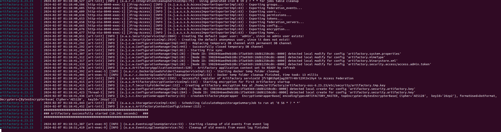
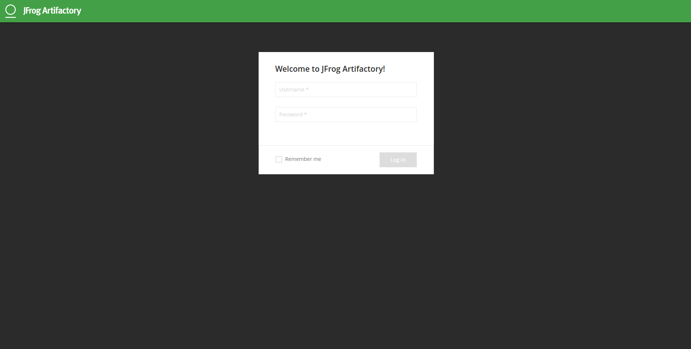
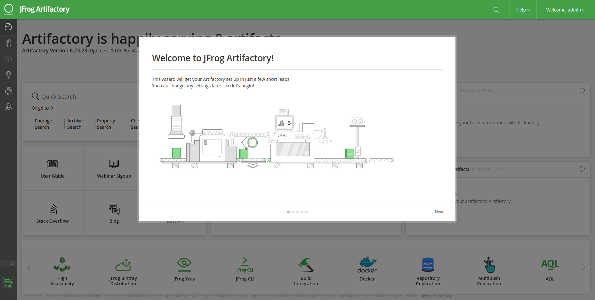
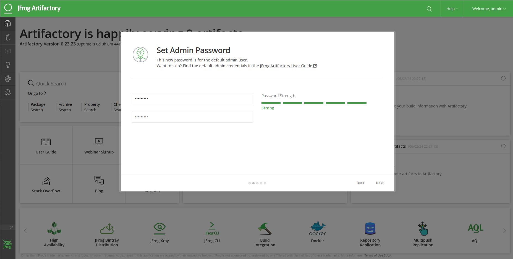
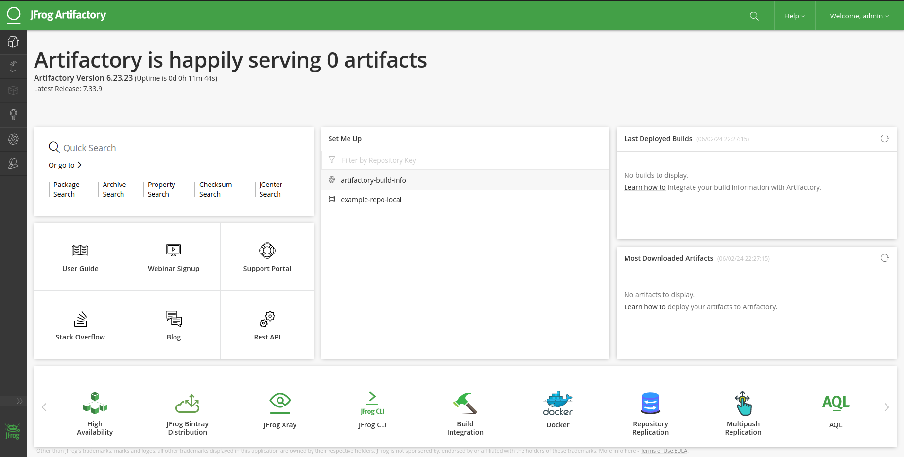

# ARTIFACTORY 6.23.23 (by Amazonlinux 2)

> NOTE: At moment the port 8081 is not be working well

- How to run artifactory 6.23.23 by Ubuntu 22.04 from this project use

<pre>
user@host:/home/user$ git clone https://github.com/huntercodexs/docker-series.git .
user@host:/home/user$ cd docker-series/self-containers/java/artifactory/6.23.23
user@host:/home/user/docker-series/self-containers/java/artifactory/6.23.23$ docker network create open_network
user@host:/home/user/docker-series/self-containers/java/artifactory/6.23.23$ docker-compose up --build
user@host:/home/user/docker-series/self-containers/java/artifactory/6.23.23$ docker-compose start
</pre>

The expected result should be like below

- Access

<pre>
http://localhost:38081
</pre>

You will be redirected to http://localhost:38081/artifactory/webapp/#/login

- Login

<pre>
Username: admin
Password: password
</pre>

- Configure

Below is the first screen that will be presented for us after login (click em Get Started)

Now, you need define or reset a ADMIN password according image below

The next screen can be skipped (click in Skip button), after that you can see the Welcome page from Artifactory

- Execute

To execute Artifactory manually

<pre>
/bin/bash /home/artifactory/artifactory-oss-6.23.23/app/bin/artifactory.sh
</pre>

- Log

<pre>
tail -f /var/opt/jfrog/artifactory/log/artifactory-service.log
</pre>
