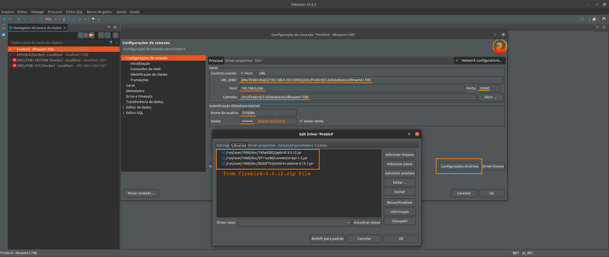

# FIREBIRD

# Run firebird from this project use

<pre>
git clone https://github.com/huntercodexs/docker-series.git .
cd self-containers/firebird
docker-compose up --build (in first time)
docker-compose start (in others case)
</pre>

# How to use Firebird

- VERSION

<pre>3.0.1</pre>

- SETTINGS

Before build the firebird container, use the firebird/data folder path (in this project) to set up the configurations 
that should be used in the Server:

<pre>
databases.conf
fbintl.conf
fbtrace.conf
firebird.conf
plugins.conf
SYSDBA.password
</pre>

- Sample data connection

<pre>
host: 192.168.0.174
port: 33050
path: /etc/firebird/3.0/databases/dbname1.fdb
username: sysdba
password: ${FIREBIRD_PASSWORD} or masterkey
jdbc-url: jdbc:firebirdsql://192.168.0.174:33050//etc/firebird/3.0/databases/dbname1.fdb
Reference library file: Jaybird-3.0.12-JDK_1.8.zip (https://firebirdsql.org/en/jdbc-driver/)
  jaybird-3.0.12.jar
  connector-api-1.5.jar
  antlr-runtime-4.7.jar
</pre>

- Connect using terminal

<pre>
# isql-fb
</pre>

- Create a database and table

<pre>
SQL>CREATE DATABASE '/etc/firebird/3.0/databases/dbname1.fdb'
CON>user 'SYSDBA' password 'masterkey';

CREATE TABLE users (
id INT NOT NULL PRIMARY KEY,
name VARCHAR(250) NOT NULL
);

INSERT INTO users (id, name) VALUES ('94734987', 'John Smith Suisse');

SELECT * FROM users;
</pre>

- Install correct driver in your SGDB tool (example: DBeaver) get the driver in the follow address:

<pre>
https://firebirdsql.org/en/jdbc-driver/
</pre>

- Below is the visual sample to Firebird Connection from DBeaver using a correct driver

  