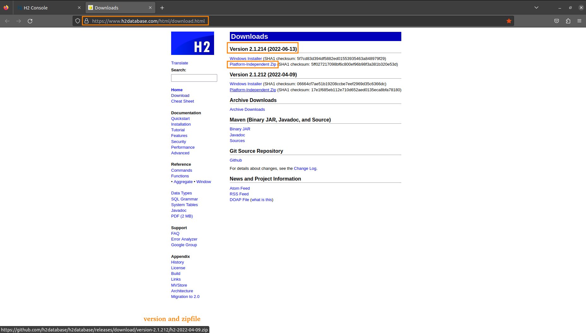
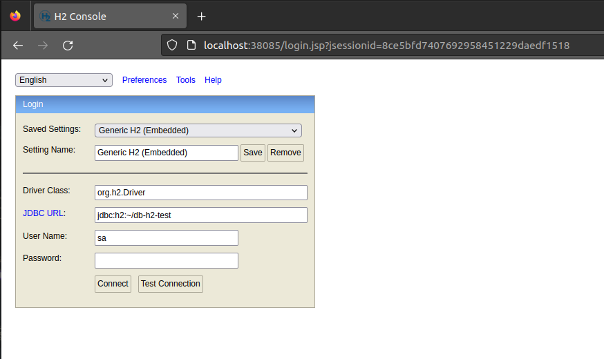

# H2 DATABASE (JAVA)

- How to run h2-database from this project use

> To use more easily this project you can use together the Spring H2 Database Demo from 
> https://github.com/huntercodexs/spring-h2-database-demo

<pre>
user@host:/home/user$ git clone https://github.com/huntercodexs/docker-series.git .
user@host:/home/user$ cd docker-series/self-containers/h2-database
user@host:/home/user/docker-series/self-containers/h2-database$ docker-compose up --build (in first time)
user@host:/home/user/docker-series/self-containers/h2-database$ docker-compose start (in the next times)
</pre>

- Settings to do before run this project

Configure the file .env as shown bellow

> NOTE: Check the version and zip filename in the https://www.h2database.com/html/download.html

<pre>
H2DATABASE_VERSION=version-2.1.214
H2DATABASE_ZIPFILE=h2-2022-06-13.zip
</pre>

- Set up the ports

<pre>
H2DATABASE_HOST_PORT=35900
H2DATABASE_HOST_ADDITIONAL_PORT=35900

H2DATABASE_HOST_TCP_PORT=39095
H2DATABASE_TCP_SERVER_PORT=9095

H2DATABASE_HOST_HTTP_PORT=38085
H2DATABASE_HTTP_SERVER_PORT=8085
</pre>

- Access the H2 Database via HTTP (console)

<pre>
http://{server-address}:38085
</pre>

> TIP: Weather occurs any error, try again !

- Access the H2 Database via TCP/IP

<pre>
tcp://localhost:39095/~/db-h2-test
</pre>

- Access the H2 Database via Java Application

<pre>
spring.datasource.url=jdbc:h2:tcp://localhost:39095/~/db-h2-test
spring.datasource.jdbcUrl=jdbc:h2:tcp://localhost:39095/~/db-h2-test
</pre>

> TIP: You can customize the script bin/start-h2-database-server to gain more effects in your environment

> TIP: You can also create an initializer sql commands into bin/db-init.sql to charge database from tests in your
> application as showed bellow

<pre>
spring.datasource.url=jdbc:h2:tcp://localhost:39095/~/db-h2-test;INIT=RUNSCRIPT FROM '~/db-init.sql'
spring.datasource.jdbcUrl=jdbc:h2:tcp://localhost:39095/~/db-h2-test;INIT=RUNSCRIPT FROM '~/db-init.sql'
</pre>
 