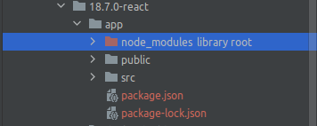

# NODEJS + REACT

> NOTE: The current version used in this repository is 18.7.0

- Before run this project (nodejs + react)

Ensure that all files from the React Project has been generated and placed in the app folder, mainly the 
node_modules folder library, as showed below:

!!! You can get the folder node_modules inside the container after the container build !!!

- Set up the file .env

<pre>
##############################################################################
#### NODEJS SETTINGS
##############################################################################
NODEJS_PORT1=33000
NODEJS_PORT2=39000
REACT_PROJECT_NAME=sample-react-project
</pre>

- Run nodejs + react from this project use

<pre>
user@host:/home/user$ git clone https://github.com/huntercodexs/docker-series.git .
user@host:/home/user$ cd docker-series/self-containers/nodejs/18.7.0-react
user@host:/home/user/docker-series/self-containers/nodejs/18.7.0-react$ docker network create open_network
user@host:/home/user/docker-series/self-containers/nodejs/18.7.0-react$ docker-compose up --build
user@host:/home/user/docker-series/self-containers/nodejs/18.7.0-react$ [Ctrl+C]
user@host:/home/user/docker-series/self-containers/nodejs/18.7.0-react$ docker-compose start
</pre>

- Access and test application

<pre>
http://${SERVER_IP}:33000
</pre>

