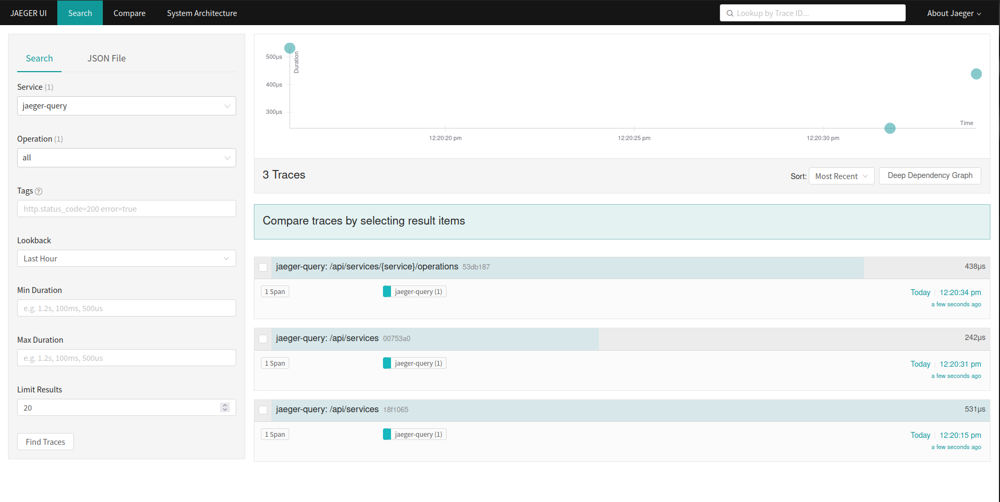

# JAEGER V1

- How to run opentelemety from this project use

<pre>
user@host:/home/user$ git clone https://github.com/huntercodexs/docker-series.git .
user@host:/home/user$ cd docker-series/self-containers/opentelemetry/jaeger-v1
user@host:/home/user/docker-series/self-containers/opentelemetry$ docker-compose up --build
user@host:/home/user/docker-series/self-containers/opentelemetry$ docker-compose start
</pre>

- Access the Jaeger application

```text
http://localhost:16686
```


- Tip

You can use some java application to run together this jaeger sample repository, for example using a Java Agent.
The command below show us how to do it

```shell
java -javaagent:otel/opentelemetry-javaagent-1.32.1.jar -Dotel.service.name=opentelemetry-reactive-sample-v2.0.0 -Dotel.traces.exporter=jaeger -Dotel.metrics.exporter=none -Dotel.exporter.jaeger.endpoint=http://localhost:14250 -jar target/*.jar
```

- Java Agent Releases

https://github.com/open-telemetry/opentelemetry-java-instrumentation/releases

- Application Sample - Java

https://github.com/huntercodexs/spring-boot-opentelemetry-reactive/tree/v2.0.0

