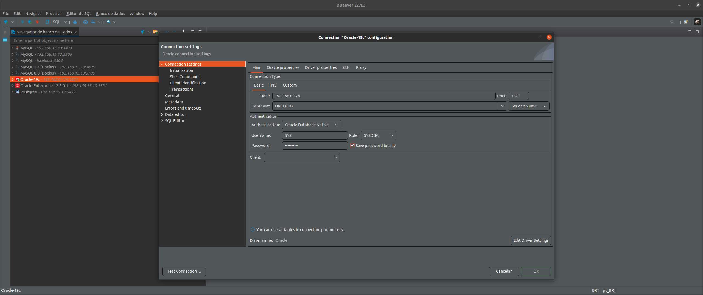

# ORACLE-LINUX 19c

# How to use Oracle

> 
IMPORTANT

- The builder of this container is very long and need a long time to finish correctly
- Use the command docker-compose up --build to run in first time
- After the first build use docker-compose up -d oraclelinux or docker-compose start oraclelinux

>** VERY IMPORTANT **
- The path oracle/oradata in current container instance "should be empty"
- Have sure that the oracle/oradata is empty or just have the dbconfig/ and ORCLCDB/ folders

> ORACLE EDITION (see .env file):

<pre>
ee - Enterprise Edition
se2 - Standard Edition
xe - Express Edition
</pre>

> 
REQUIRED

- Database file: LINUX.X64_193000_db_home.zip
- This file can be downloaded in https://www.oracle.com/database/technologies/oracle-database-software-downloads.html
- Put the LINUX.X64_193000_db_home.zip inside oracle/database before run the docker-compose

> STEPS BEFORE BUILD

- Unzip the oraclelinux-database-scripts-19c.tar.bz2 file inside the oracle/database folder:
<pre>
tar -xvf oraclelinux-database-scripts-19c.tar.bz2
</pre>
- Check if oracle/oradata is empty or just have the dbconfig/ and ORCLCDB/ folders

> STEPS AFTER BUILD

- HOST(your machine):

Set Password Administration
<pre>
docker exec -it oraclelinux ./setPassword.sh ${YOUR_ORACLE_PASSWORD}
</pre>

- Access the database container
<pre>
docker exec -it oraclelinux /bin/bash
</pre>

- GUEST(inside oraclelinux):

Create User
<pre>
sqlplus sys/${YOUR_ORACLE_PASSWORD_@ORCLPDB1 as sysdb}
CREATE USER DEVEL IDENTIFIED BY ${YOUR_ORACLE_PASSWORD_}
GRANT CREATE SESSION, CREATE TABLE TO DEVEL;
ALTER USER DEVEL QUOTA 50m ON SYSTEM;
CREATE SMALLFILE TABLESPACE DEVEL DATAFILE '/opt/oracle/oradata/ORCLCDB/ORCLPDB1/devel.dbf' SIZE 1G;
ALTER DATABASE DEFAULT TABLESPACE DEVEL;
SELECT * FROM ALL_USERS au;
SELECT * FROM ALL_USERS au WHERE au.USERNAME = 'DEVEL';
EXIT;
</pre>

Connect on database using the new user
<pre>
sqlplus devel/${YOUR_ORACLE_PASSWORD_@ORCLPDB1}
</pre>

- Access the microservice Oracle Linux:

<pre>
http://${WEBSERVER_ADDRESS}:38080/microservice-oraclelinux/
</pre>

> Database Connection Sample

> Enterprise Manager

- Access the Enterprise Manager:

<pre>
https://${WEBSERVER_ADDRESS}:5500/em
  > username: sys
  > password: ${YOUR_ORACLE_PASSWORD}
  > container name: ORCLPDB1
  ** to get this value exec in the current terminal:
  SQL> show pdbs;
  
  CON_ID CON_NAME			  OPEN MODE  RESTRICTED
  ---------- ------------------------------ ---------- ----------
   3 ORCLPDB1			  READ WRITE NO
  SQL> 
  
</pre>

* All rights reserved to ORACLE - https://www.oracle.com/

-------------