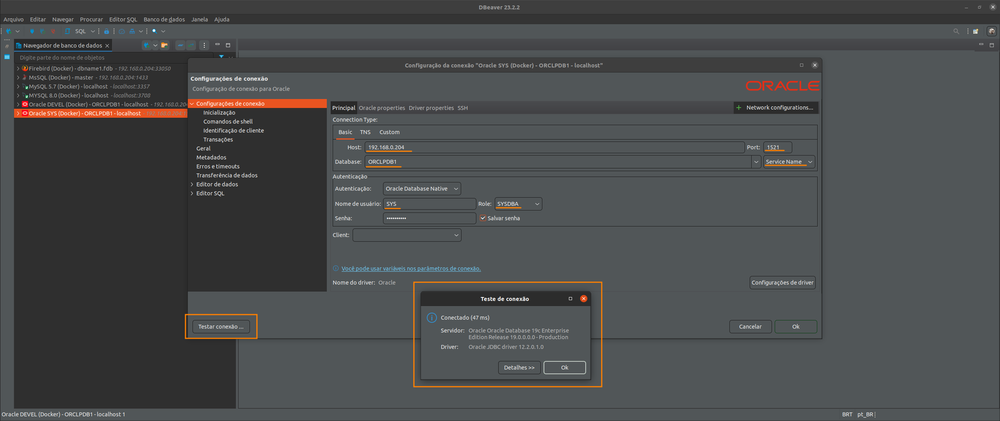

# ORACLE-LINUX 19c

- How to run oraclelinux from this project use

> NOTE: Read the documentation below before run this project

<pre>
user@host:/home/user$ git clone https://github.com/huntercodexs/docker-series.git .
user@host:/home/user$ cd docker-series/self-containers/oraclelinux
user@host:/home/user/docker-series/self-containers/oraclelinux$ docker-compose up --build
user@host:/home/user/docker-series/self-containers/oraclelinux$ [Ctrl+C]
user@host:/home/user/docker-series/self-containers/oraclelinux$ docker-compose start
</pre>

- The result from build command should be look like as below

<pre>
oraclelinux    | Version 19.3.0.0.0
oraclelinux    | The Oracle base remains unchanged with value /opt/oracle
oraclelinux    | The Oracle base remains unchanged with value /opt/oracle
oraclelinux    | #########################
oraclelinux    | DATABASE IS READY TO USE!
oraclelinux    | #########################
oraclelinux    | The following output is now a tail of the alert.log:
oraclelinux    | ORCLPDB1(3):Completed: ALTER DATABASE DEFAULT TABLESPACE "USERS"
oraclelinux    | 2023-10-12T14:59:47.143786+00:00
oraclelinux    | ALTER SYSTEM SET control_files='/opt/oracle/oradata/ORCLCDB/control01.ctl' SCOPE=SPFILE;
oraclelinux    | 2023-10-12T14:59:47.148098+00:00
oraclelinux    | ALTER SYSTEM SET local_listener='' SCOPE=BOTH;
oraclelinux    |    ALTER PLUGGABLE DATABASE ORCLPDB1 SAVE STATE
oraclelinux    | Completed:    ALTER PLUGGABLE DATABASE ORCLPDB1 SAVE STATE
oraclelinux    | 2023-10-12T14:59:47.721280+00:00
oraclelinux    | 
oraclelinux    | XDB initialized.
</pre>

- Definitions and Variables

<pre>
ORACLELINUX_USERNAME: DEVEL (if any error occurs, try SYS or SYSTEM user)
ORACLELINUX_USERNAME_LOWERCASE: devel
ORACLELINUX_PDB: ORCLPDB1
ORACLELINUX_PASSWORD: oracle1Ipw
ORACLELINUX_DATABASE_ROLE: Normal (in many cases can be SYSDBA)
ORACLELINUX_DATABASE_AUTH_MODE: Oracle Database Native
ORACLELINUX_DATABASE_PORT: 1521
ORACLELINUX_TABLESPACE_NAME: DEVEL
ORACLELINUX_DATABASE_TABLESPACE: /opt/oracle/oradata/ORCLCDB/{{ORACLELINUX_PDB}}/{{ORACLELINUX_USERNAME_LOWERCASE}}.dbf
</pre>

- BEFORE BUILD

> IMPORTANT

- The builder of this container is too long and take a long time to finish all
- Use the command docker-compose up --build to run on first time
- After the first build use docker-compose up -d oraclelinux or docker-compose start oraclelinux

> ** VERY IMPORTANT **

- The path oraclelinux/oradata in current container instance "should be empty"
- Ensure that the oraclelinux/oradata is empty or just have the dbconfig/ and ORCLCDB/ folders
- Whether path oraclelinux/oradata does not exist, create it !

- ORACLE EDITION (see the .env file):

<pre>
ee - Enterprise Edition
se2 - Standard Edition
xe - Express Edition
</pre>

> REQUIRED

<pre>
Database file: LINUX.X64_193000_db_home.zip (in this case)
This file can be downloaded in https://www.oracle.com/database/technologies/oracle-database-software-downloads.html
</pre>

Put the LINUX.X64_193000_db_home.zip inside oraclelinux/database before run the docker-compose up --build

Set up the .env file on section ORACLELINUX SETTINGS

> TIP: Use the script pre-requisites.sh to save time

Unzip the oraclelinux-database-scripts-19c.tar.bz2 file inside the oracle/database folder:
<pre>
user@host:/home/user/docker-series/self-containers/oraclelinux/database$ tar -xvf oraclelinux-database-scripts-19c.tar.bz2
</pre>
Create the oradata folder in oracle path
Check if oraclelinux/oradata is empty or just have the dbconfig/ and ORCLCDB/ folders

- AFTER BUILD

Make the follow commands in the HOST(the machine where is installed the instance oraclelinux via docker):

Set Password Administration
<pre>
user@host:/home/user/docker-series/self-containers/oraclelinux$ docker-compose start oraclelinux
user@host:/home/user/docker-series/self-containers/oraclelinux$ docker exec -it oraclelinux ./setPassword.sh {{YOUR_ORACLE_PASSWORD}}
</pre>

Result
<pre>
user@host:/home/user/docker-series/self-containers/oraclelinux$ docker exec -it oraclelinux ./setPassword.sh oracle1Ipw
The Oracle base remains unchanged with value /opt/oracle

SQL*Plus: Release 19.0.0.0.0 - Production on Thu Oct 12 15:09:12 2023
Version 19.3.0.0.0

Copyright (c) 1982, 2019, Oracle.  All rights reserved.

Connected to:
Oracle Database 19c Enterprise Edition Release 19.0.0.0.0 - Production
Version 19.3.0.0.0

SQL> 
User altered.

SQL> 
User altered.

SQL> 
Session altered.

SQL> 
User altered.

SQL> Disconnected from Oracle Database 19c Enterprise Edition Release 19.0.0.0.0 - Production
Version 19.3.0.0.0
</pre>

Access the database container
<pre>
user@host:/home/user/docker-series/self-containers/oraclelinux$ docker exec -it oraclelinux /bin/bash
</pre>

- Make the follow commands inside oraclelinux instance via docker (GUEST):

Create User
<pre>
sqlplus sys/{{ORACLELINUX_PASSWORD}}@{{ORACLELINUX_PDB}} as sysdba
CREATE USER {{ORACLELINUX_USERNAME}} IDENTIFIED BY {{ORACLELINUX_PASSWORD}};
GRANT CREATE SESSION, CREATE TABLE TO {{ORACLELINUX_USERNAME}};
ALTER USER {{ORACLELINUX_USERNAME}} QUOTA 50m ON SYSTEM;
CREATE SMALLFILE TABLESPACE {{ORACLELINUX_USERNAME}} DATAFILE '{{ORACLELINUX_DATABASE_TABLESPACE}}' SIZE 1G;
ALTER DATABASE DEFAULT TABLESPACE {{ORACLELINUX_USERNAME}};
ALTER USER {{ORACLELINUX_USERNAME}} QUOTA UNLIMITED ON SYSTEM;
ALTER USER {{ORACLELINUX_USERNAME}} QUOTA UNLIMITED ON {{ORACLELINUX_TABLESPACE_NAME}};
SELECT * FROM ALL_USERS au;
SELECT * FROM ALL_USERS au WHERE au.USERNAME = '{{ORACLELINUX_USERNAME}}';
EXIT;
</pre>

> TIP: User the script init.sql to make a test in the current oraclelinux instance via docker

[init.sql](./scripts/init.sql)

Get ORACLELINUX_PDB available from oracle
<pre>
** to get this value exec in the current terminal:
SQL> show pdbs;

    CON_ID CON_NAME			  OPEN MODE  RESTRICTED
---------- ------------------------------ ---------- ----------
	 3 ORCLPDB1			  READ WRITE NO

SQL>EXIT;
</pre>

Connect on database using the new user
<pre>
sqlplus {{ORACLELINUX_USERNAME}}/{{ORACLELINUX_PASSWORD}}@{{ORACLELINUX_PDB}}
</pre>

- Configuration to access the Database Oracle Linux:

<pre>
Host: {{DATABASE_ORACLE_SERVER_IP}}
Port: {{ORACLELINUX_DATABASE_PORT}}
Database: {{ORACLELINUX_PDB}} [Service Name]
Authentication:{{ORACLELINUX_DATABASE_AUTH_MODE}}
Username: {{ORACLELINUX_USERNAME}}
Role: {{ORACLELINUX_DATABASE_ROLE}}
Password: {{ORACLELINUX_PASSWORD}}
</pre>

- Database Connection Sample (User: SYS, SYSDBA)

- Database Connection Sample (User: DEVEL)

- Enterprise Manager

- Access the Enterprise Manager:

<pre>
https://{{WEBSERVER_ADDRESS}}:5500/em
  > username: sys
  > password: {{ORACLELINUX_PASSWORD}}
  > container name: {{ORACLELINUX_PDB}}
</pre>

* All rights reserved to ORACLE - https://www.oracle.com/

# Step by Step

Follow the steps below to quick and easy environment creation

> NOTE: This process take a long time

> NOTE: Check the permissions in the current directory and sub folders

1- Clone the repository
<pre>
user@host:/home/user$ git clone https://github.com/huntercodexs/docker-series.git .
</pre>

2- Access the repository folder
<pre>
user@host:/home/user$ cd docker-series
</pre>

3- Access the container folders
<pre>
user@host:/home/user/docker-series cd self-containers
</pre>

4- Access the oraclelinux folder
<pre>
user@host:/home/user/docker-series$ cd oraclelinux
</pre>

5- Set up the .env file on section ORACLELINUX SETTINGS

6- Put the LINUX.X64_193000_db_home.zip inside oraclelinux/database before run the docker-compose
6.1- The path oraclelinux/oradata in current container instance "should be empty"
6.2- Ensure that the oraclelinux/oradata is empty or just have the dbconfig/ and ORCLCDB/ folders
6.3- Whether path oraclelinux/oradata does not exist, create it !

7- Access the oraclelinux database path
<pre>
user@host:/home/user/docker-series/self-containers/oraclelinux cd database
</pre>

8- Unzip source file
<pre>
user@host:/home/user/docker-series/self-containers/oraclelinux/database$ tar -xvf oraclelinux-database-scripts-19c.tar.bz2
</pre>

9- Back in the oraclelinux root folder
<pre>
user@host:/home/user/docker-series/self-containers/oraclelinux/database$ cd ../
</pre>

10- Create a network open type
<pre>
user@host:/home/user/docker-series/self-containers/oraclelinux$ docker network create open_network
</pre>

11- Run the docker-compose to build the project

> IMPORTANT NOTE: This step will be taken a long time to finish it

<pre>
user@host:/home/user/docker-series/self-containers/oraclelinux$ docker-compose up --build
</pre>

12- Quit the docker runner
<pre>
user@host:/home/user/docker-series/self-containers/oraclelinux$ [Ctrl+C]
</pre>

13- Start the docker container using docker compose
<pre>
user@host:/home/user/docker-series/self-containers/oraclelinux$ docker-compose start oraclelinux
</pre>

14- Set up the password for oracle administration with SYS user
<pre>
user@host:/home/user/docker-series/self-containers/oraclelinux$ docker exec -it oraclelinux ./setPassword.sh {{YOUR_ORACLE_PASSWORD}}
</pre>

15- Access the oraclelinux container
<pre>
user@host:/home/user/docker-series/self-containers/oraclelinux$ docker exec -it oraclelinux /bin/bash
</pre>

16- Create User in oracle database
<pre>
root@host# sqlplus sys/{{ORACLELINUX_PASSWORD}}@{{ORACLELINUX_PDB}} as sysdba
> CREATE USER {{ORACLELINUX_USERNAME}} IDENTIFIED BY {{ORACLELINUX_PASSWORD}};
> GRANT CREATE SESSION, CREATE TABLE, CREATE SEQUENCE TO {{ORACLELINUX_USERNAME}};
> ALTER USER {{ORACLELINUX_USERNAME}} QUOTA 50m ON SYSTEM;
> CREATE SMALLFILE TABLESPACE {{ORACLELINUX_USERNAME}} DATAFILE '{{ORACLELINUX_DATABASE_TABLESPACE}}' SIZE 1G;
> ALTER DATABASE DEFAULT TABLESPACE {{ORACLELINUX_USERNAME}};
> ALTER USER {{ORACLELINUX_USERNAME}} QUOTA UNLIMITED ON SYSTEM;
> ALTER USER {{ORACLELINUX_USERNAME}} QUOTA UNLIMITED ON {{ORACLELINUX_TABLESPACE_NAME}};
> SELECT * FROM ALL_USERS au;
> SELECT * FROM ALL_USERS au WHERE au.USERNAME = '{{ORACLELINUX_USERNAME}}';
> EXIT;
root@host# [Ctrl+D]
</pre>

17- Insert Data: oraclelinux/scripts/init.sql (TIP: Use the SGDB to do it), see more details in the documentation above

