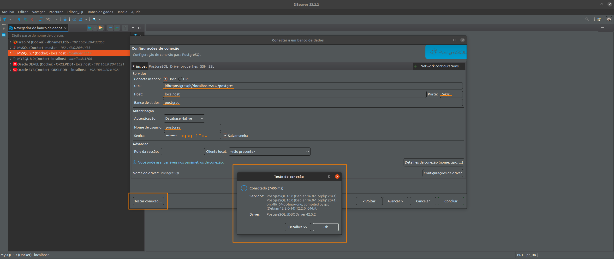
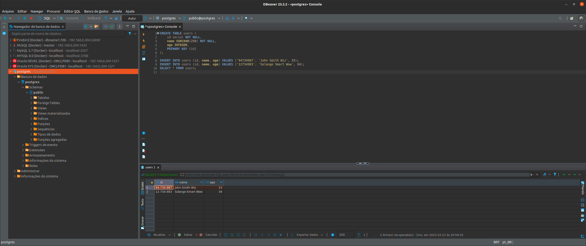

# POSTGRES

> NOTE: The current version was 14.4 for postgres

- Fist of all, check the path self-containers/postgres/PostgresSQL, it should be empty

- How to run postgres from this project use

<pre>
user@host:/home/user$ git clone https://github.com/huntercodexs/docker-series.git .
user@host:/home/user$ cd docker-series/self-containers/postgres
user@host:/home/user/docker-series/self-containers/postgres$ docker-compose up --build
user@host:/home/user/docker-series/self-containers/postgres$ [Ctrl+C]
user@host:/home/user/docker-series/self-containers/postgres$ docker-compose start
</pre>

- Get the superuser postgres in CLI container postgres, and open the postgres database terminal:

<pre>
user@host:/home/user/docker-series/self-containers/postgres$ docker exec -it postgres /bin/bash
root@c63de647b32a:/# su - postgres
postgres@c63de647b32a:~$ psql 
psql (14.4 (Debian 14.4-1.pgdg110+1))
Type "help" for help.

postgres=# 
</pre>

- Create one user to manager the database:

<pre>
CREATE USER devel SUPERUSER INHERIT CREATEDB CREATEROLE;
ALTER USER devel PASSWORD '${POSTGRES_PASSWORD}';
</pre>

- List all users

<pre>
\du
</pre>

<pre>
postgres=# \du
                                   List of roles
 Role name |                         Attributes                         | Member of 
-----------+------------------------------------------------------------+-----------
 devel     | Superuser, Create role, Create DB                          | {}
 postgres  | Superuser, Create role, Create DB, Replication, Bypass RLS | {}
</pre>

- Connect to postgres database with DBeaver

<pre>
Host: ${DATABASE_SERVER_ADDRESS}
Port: 5432
Database: postgres
Authentication: Database Native
Username: postgres
Password: ${POSTGRES_PASSWORD}
</pre>

- Create a table sample:

<pre>
CREATE TABLE users (
    id serial NOT NULL,
    name VARCHAR(250) NOT NULL,
    age INTEGER,
    PRIMARY KEY (id)
);

INSERT INTO users (id, name, age) VALUES ('94734987', 'John Smith Wiz', 33);
INSERT INTO users (id, name, age) VALUES ('12734983', 'Solange Smart Wow', 34);
SELECT * FROM users;
</pre>

- Result

