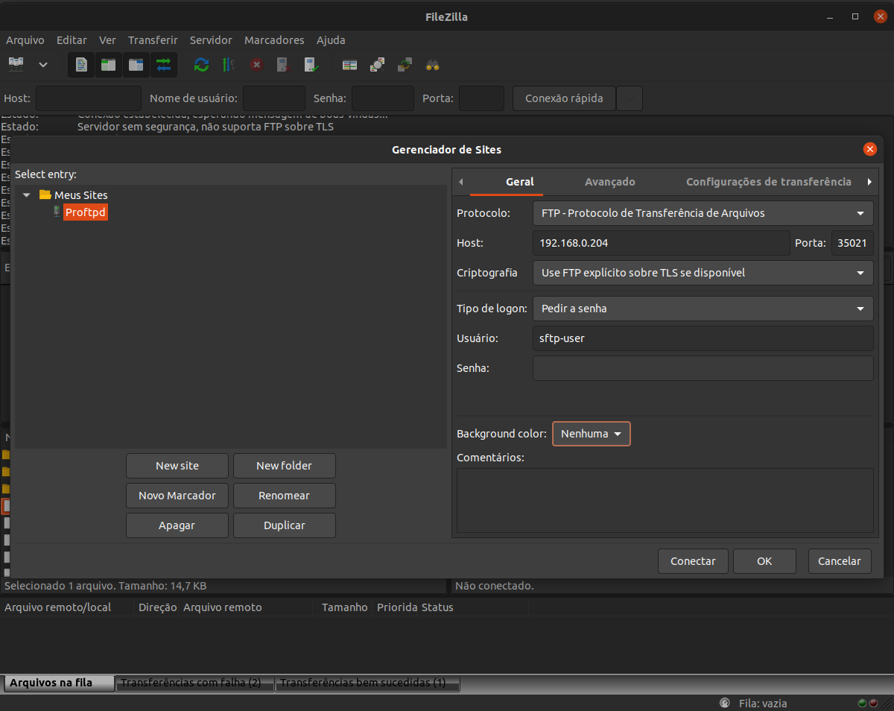
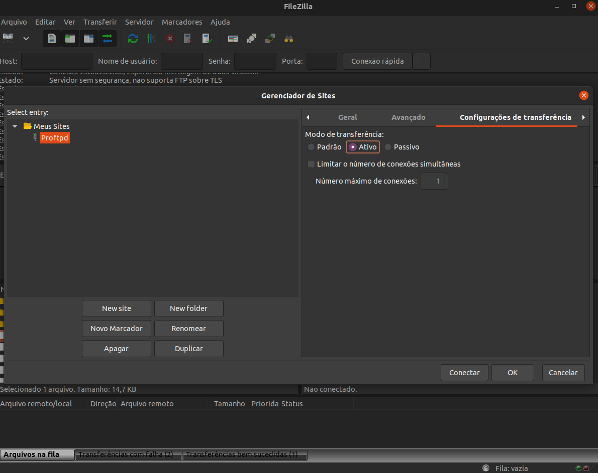
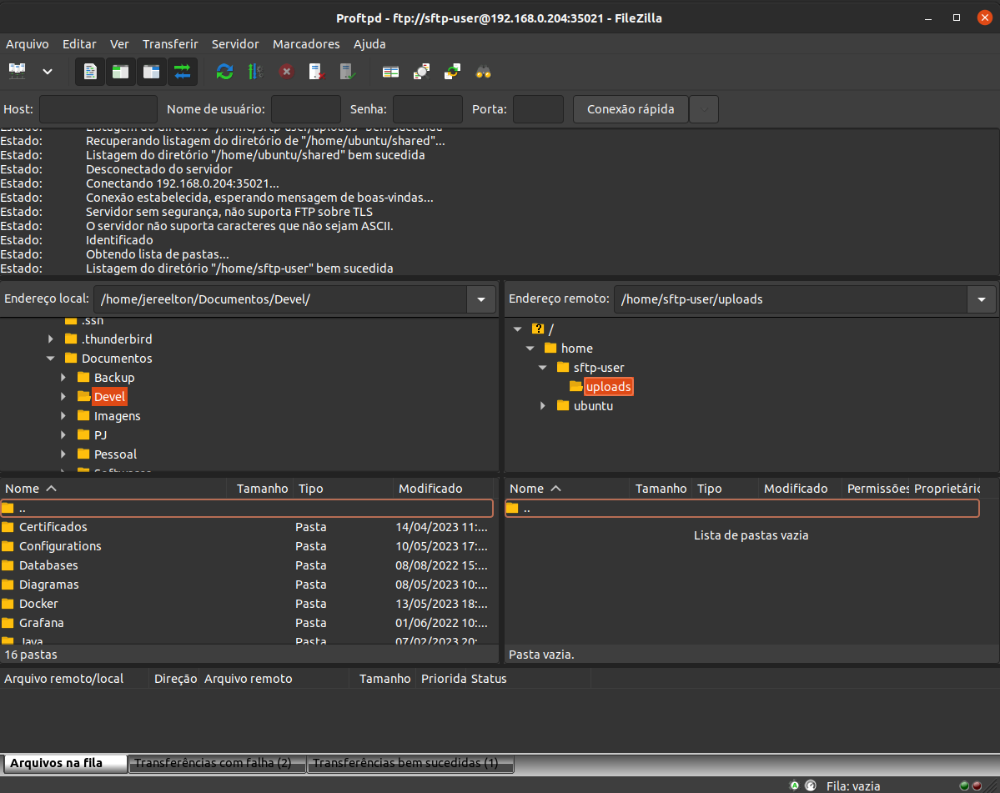

# PROFTPD SERVER

- Set up the environment before run the project

Access the .env file and change the following parameters

<pre>
PROFTPD_HOST_PORT=35021
PROFTPD_SERVER_NAME=PROFTPD-SERVER-LOCAL
PROFTPD_PORT=21
PROFTPD_GROUP=sftp-group
PROFTPD_USER=sftp-user
PROFTPD_PASS=sftp-pass
PROFTPD_UID=1001
PROFTPD_PATH=/home/sftp-user/uploads/
PROFTPD_SHELL=/bin/bash
</pre>

> All parameters are required

- Run the proftpd from this project using

<pre>
git clone https://github.com/huntercodexs/docker-series.git .
cd self-containers/ubuntu/proftpd
docker-compose up --build (in first time)
docker-compose start (in the next times)
</pre>

- Output from command "docker-compose up --build"

<pre>
Successfully built 4d2614d1e2a1
Successfully tagged proftpd_proftpd-server:latest
Creating proftpd-server ... done
Attaching to proftpd-server
proftpd-server    |  [DEBUG] HOST PORT  >>> 35021
proftpd-server    |  [DEBUG] PROFTPD PORT  >>> 21
proftpd-server    |  [DEBUG] GROUP >>> sftp-group
proftpd-server    |  [DEBUG] USER  >>> sftp-user
proftpd-server    |  [DEBUG] PASS  >>> sftp-pass
proftpd-server    |  [DEBUG] UID   >>> 1001
proftpd-server    |  [DEBUG] PATH  >>> /home/sftp-user/uploads/
proftpd-server    |  [DEBUG] SHELL >>> /bin/bash
proftpd-server    | Group created successfully
proftpd-server    | User created successfully
proftpd-server    | PROFTPD STARTING...
proftpd-server    |  * Starting ftp server proftpd                              2023-05-20 22:59:03,224 97f82253ec9d proftpd[42]: processing configuration directory '/etc/proftpd/conf.d/'
proftpd-server    |                                                      [ OK ]
proftpd-server    | PROFTPD IS UP
</pre>

- Output from command "docker-compose start" and "docker-compose ps"

<pre>
     Name            Command        State                   Ports                 
----------------------------------------------------------------------------------
proftpd-server   create-sftp-user   Up      0.0.0.0:35021->21/tcp,:::35021->21/tcp
</pre>

- Connect to Proftpd Server using FileZilla

Bellow follow the pictures to illustrate the configuration that should be make to access the FTP Server

- Tips

> If any problem occurs check the file proftpd.conf, it is placed on proftpd/config from this project