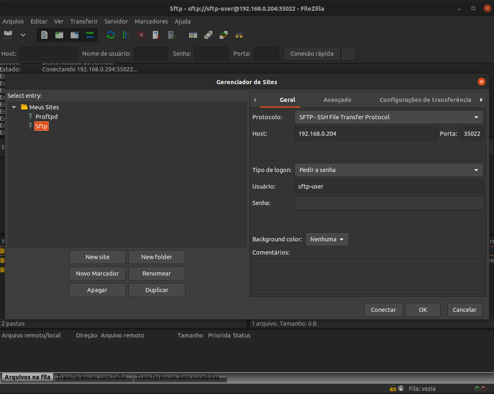
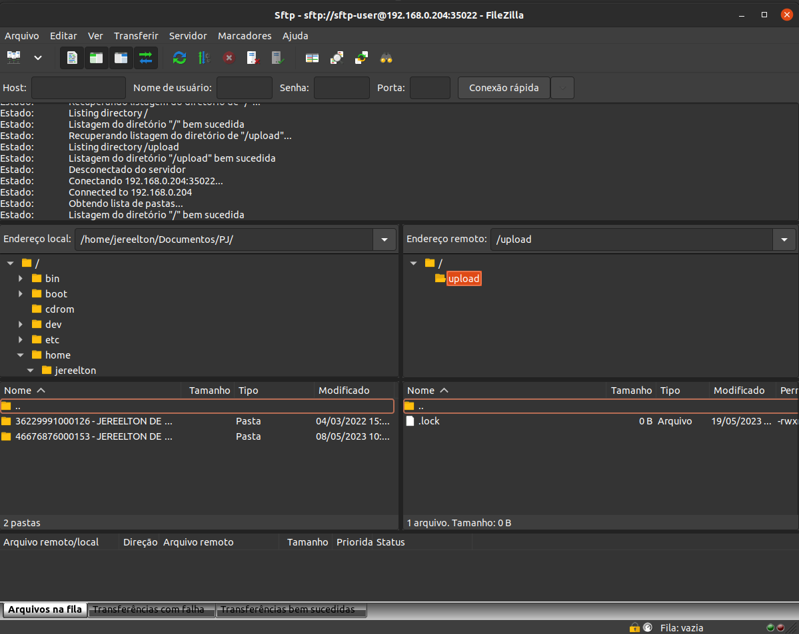

# SFTP SERVER

- How to run sftp from this project use

<pre>
user@host:/home/user$ git clone https://github.com/huntercodexs/docker-series.git .
user@host:/home/user$ cd docker-series/self-containers/sftp
user@host:/home/user/docker-series/self-containers/sftp$ docker-compose up --build
user@host:/home/user/docker-series/self-containers/sftp$ docker-compose start
</pre>

- Filezilla Connection Example

